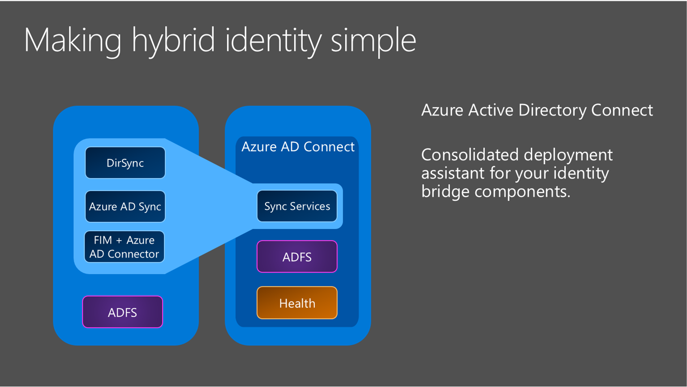

<properties 
	pageTitle="How Azure AD Connect Works" 
	description="Learn about how Azure AD Connect Works." 
	services="active-directory" 
	documentationCenter="" 
	authors="billmath" 
	manager="stevenpo" 
	editor="curtand"/>

<tags 
	ms.service="active-directory" 
	ms.date="08/24/2015" 
	wacn.date=""/>

# How Azure AD Connect works

Azure Active Directory Connect is made up of three primary parts.  They are the synchronization services, the optional Active Directory Federation Services piece, and the monitoring piece which is done using [Azure AD Connect Health](https://msdn.microsoft.com/library/azure/dn906722.aspx).

- Synchronization - This part is made up of the the components and functionality previously released as Dirsync and AAD Sync.  This is the part that is responsible for creating users and groups.  It is also responsible for making sure that the information on users and groups in your on-premises environment, matches the cloud.
- AD FS - This is an optional part of Azure AD Connect and can be used to setup a hybrid environment using an on-premises AD FS infrastructure.  This part can be used by organizations to address complex deployments that include such things as domain join SSO, enforcement of AD login policy and smart card or 3rd party MFA.  For additional information on configuring SSO see [DirSync with Single-Sign On](https://msdn.microsoft.com/library/azure/dn441213.aspx).
- Health Monitoring - For complex deployments using AD FS, Azure AD Connect Health can provide robust monitoring of your federation servers and provide a central location in the Azure portal to view this activity.  For additional information see [Azure Active Directory Connect Health](https://msdn.microsoft.com/library/azure/dn906722.aspx).

## Azure AD Connect supporting components

The following is a list of per-requisites and supporting components that Azure AD Connect will install on the server that you set Azure AD Connect up on.  This list is for a basic Express installation.  If you choose to use a different SQL Server on the Install synchronization services page then, the SQL Server 2012 components listed below are not installed. 

- Azure AD Connect Azure AD Connector
- Microsoft SQL Server 2012 Command Line Utilities
- Microsoft SQL Server 2012 Native Client
- Microsoft SQL Server 2012 Express LocalDB
- Azure Active Directory Module for Windows PowerShell
- Microsoft Online Services Sign-In Assistant for IT Professionals
- Microsoft Visual C++ 2013 Redistribution Package

 
