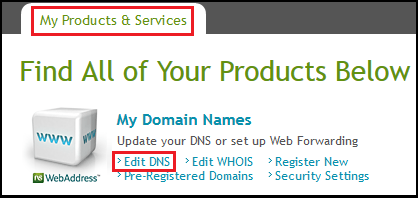
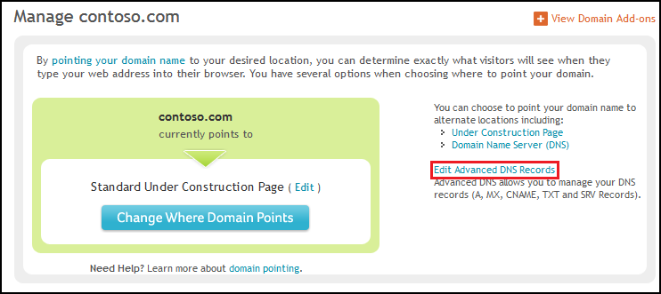
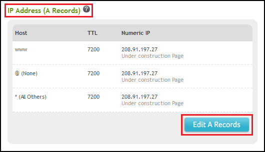
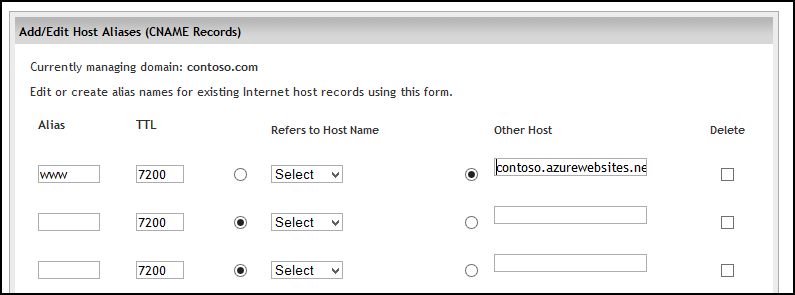
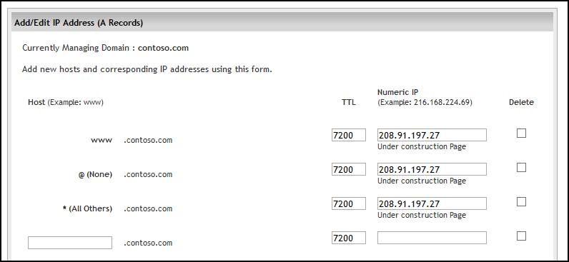

<properties title="Learn how to configure an Azure  Website to use a domain name registered with Network Solutions" pageTitle="Configure a Network Solutions domain name for an Azure  Website" metaKeywords="Azure, Azure  Websites, domain name" description="" services="web-sites" documentationCenter="" authors="larryfr, jroth" />

#Configuring a custom domain name for an Azure Website (Network Solutions)

<a href="/documentation/articles/web-sites-custom-domain-name" title="Custom Domain">Custom Domain</a><a href="/documentation/articles/web-sites-godaddy-custom-domain-name" title="GoDaddy">GoDaddy</a><a href="/documentation/articles/web-sites-network-solutions-custom-domain-name" title="Network Solutions" class="current">Network Solutions</a><a href="/documentation/articles/web-sites-registerdotcom-custom-domain-name" title="Register.com">Register.com</a><a href="/documentation/articles/web-sites-enom-custom-domain-name" title="Enom">Enom</a><a href="/documentation/articles/web-sites-moniker-custom-domain-name" title="Moniker">Moniker</a><a href="/documentation/articles/web-sites-dotster-custom-domain-name" title="Dotster">Dotster</a><a href="/documentation/articles/web-sites-domaindiscover-custom-domain-name" title="DomainDiscover">DomainDiscover</a><a href="/documentation/articles/web-sites-directnic-custom-domain-name" title="Directnic">Directnic</a>

<a href="/documentation/articles/web-sites-network-solutions-custom-domain-name/" title="Websites" class="current">Website</a> | <a href="/documentation/articles/web-sites-network-solutions-traffic-manager-custom-domain-name/" title="Website using Traffic Manager">Website using Traffic Manager</a>

[WACOM.INCLUDE [websites-cloud-services-css-guided-walkthrough](../includes/websites-cloud-services-css-guided-walkthrough.md)]

[WACOM.INCLUDE [intro](../includes/custom-dns-web-site-intro.md)]

This article provides instructions on using a custom domain name purchased from [Network Solutions](https://www.networksolutions.com) with Azure Websites.

[WACOM.INCLUDE [introfooter](../includes/custom-dns-web-site-intro-notes.md)]

In this article:

-   [Understanding DNS records](#understanding-records)
-   [Configure your web sites for basic, shared or standard mode](#bkmk_configsharedmode)
-   [Add a DNS record for your custom domain](#bkmk_configurecname)
-   [Enable the domain on your web site](#enabledomain)

<h2>Understanding DNS records</h2>

[WACOM.INCLUDE [understandingdns](../includes/custom-dns-web-site-understanding-dns-raw.md)]

<h2>Configure your websites for basic, shared or standard mode</h2>

[WACOM.INCLUDE [modes](../includes/custom-dns-web-site-modes.md)]

<h2>Add a DNS record for your custom domain</h2>

To associate your custom domain with an Azure Website, you must add a new entry in the DNS table for your custom domain by using tools provided by Network Solutions. Use the following steps to locate and use the DNS tools for networksolutions.com

1. Log on to your account at networksolutions.com, and select **My Account** in the upper right corner.

3. From the **My Products and Services** tab, select **Edit DNS**.

	

2. From the **Manage <yourdomainname>** section of the **Domain Names** page, select **Edit Advanced DNS Records**.

	

4. The **Update Advanced DNS** page contains a section for each record type, with an **Edit** button below each section.
	
	* For A records, use the **IP Address (A Records)** section.
	* For CNAME records, use the **Host Alias (CNAME Records)** section.

	

5. When you click the **Edit** button, you will be presented with a form that you can use to modify existing records, or add new ones. 

	> [AZURE.NOTE] Before adding new entries, note that Network Solutions has already created some default DNS records for things like the root domain ('@') and a wildcard record ('*') for subdomains. If the record you wish to use already exists, please modify it instead of creating a new one.

	* When adding a CNAME record, you must set the **Alias** field to the sub-domain you wish to use. For example, **www**. You must select the circle field beside the **Other host** field, and set **Other host** to the **.chinacloudsites.cn** domain name of your Azure  Website. For example, **contoso.chinacloudsites.cn**. Leave the **Refers to Host Name** as **Select**, as this field is not required when creating a CNAME record for use with Azure  Websites.
	
		

		> [AZURE.NOTE] If you will be using an A record, you must also add a CNAME record with one of the following configurations:
		> 
		> * An **Alias** value of **www** with an **Other host** value of **&lt;your Websitename&gt;.chinacloudsites.cn**.
		> 
		> OR
		> 
		> * An **Alias** value of **awverify.www** with an **Other host** value of **awverify.&lt;your Websitename&gt;.chinacloudsites.cn**.
		> 
		> This CNAME record is used by Azure to validate that you own the domain described by the A record.

	* When adding an A record, you must set the **Host** field to either **@** (this represents root domain name, such as **contoso.com**,) * (a wildcard for matching multiple sub-domains,) or the sub-domain you wish to use (for example, **www**.) You must set the **Numeric IP** field to the IP address of your Azure Website.

		

5. When you have finished adding or modifying records, click **Continue** to review the changes. Select **Save changes only** to save the changes.

<h2>Enable the domain name on your website</h2>

[WACOM.INCLUDE [modes](../includes/custom-dns-web-site-enable-on-web-site.md)]
