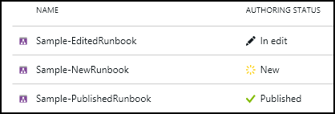
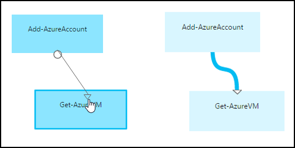
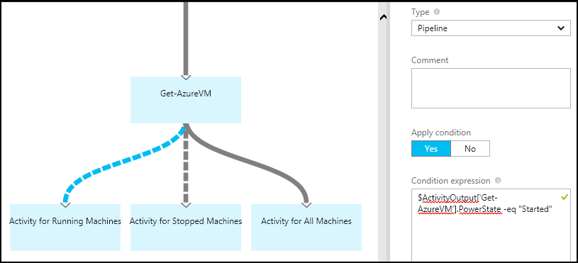
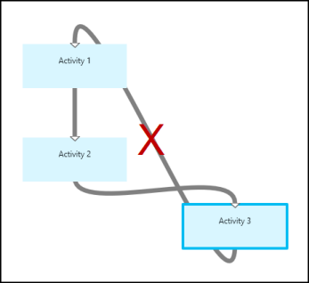
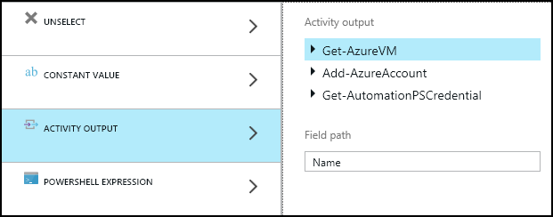

<!-- not suitable for mooncake -->

<properties 
   pageTitle="Graphical Authoring in Azure Automation"
   description="Graphical authoring allows you to create runbooks for Azure Automation without working with code.   This article provides an introduction to graphical authoring and all the details needed to start creating a graphical runbook."
   services="automation"   
   documentationCenter=""
   authors="bwren"
   manager="stevenka"
   editor="tysonn" />
<tags 
   ms.service="automation"
   ms.date="09/04/2015"
   wacn.date="" />

# Graphical authoring in Azure Automation

## Introduction

Graphical Authoring allows you to create runbooks for Azure Automation without the complexities of the underlying Windows PowerShell Workflow code.  You add activities from a library of cmdlets and other activities to a canvas and link them together to form a workflow.

This article provides an introduction to graphical authoring and the concepts you need to get started in creating a graphical runbook.

## Graphical runbooks

All runbooks in Azure Automation are Windows PowerShell Workflows.  Graphical runbooks generate PowerShell code that is run by the Automation workers, but you are not able to view it or directly modify it.  Graphical runbooks cannot be converted to textual runbooks, nor can an existing textual runbook be imported into the graphical editor.

## Overview of graphical editor

You can open the graphical editor in the Azure preview portal by creating or editing a graphical runbook.

The following sections describe the controls in the graphical editor.

### Canvas
The Canvas is where you design your runbook.  You add activities from the nodes in the Library control to the runbook and connect them with links to define the logic of the runbook.

### Library control

The Library control is where you select [activities](#activities) to add to your runbook.  You add them to the canvas where you connect them to other activities.  It includes four sections described in the following table.

| Section | Description |
|:---|:---|
| Cmdlets | Includes all the cmdlets that can be used in your runbook.  Cmdlets are organized by module.  All of the modules that you have installed in your automation account will be available.  |
| Runbooks |  Includes the runbooks in your automation account organized by tag.  Since a runbook can have more than one tag, it may be listed under multiple tags  These runbooks can be added to the canvas to be used as a child runbook. The runbook currently being edited is displayed but cannot be added to the canvas since a runbook cannot call itself.
| Assets | Includes the [automation assets](http://msdn.microsoft.com/zh-cn/library/dn939988.aspx) in your automation account that can be used in your runbook.  When you add an asset to a runbook, it will add a workflow activity that gets the selected asset.  In the case of variable assets, you can select whether to add an activity to get the variable or set the variable.
| Runbook Control | Includes runbook control activities that can be used in your current runbook. A *junction* takes multiple inputs and waits until all have completed before continuing the workflow. A *workflow script* runs one or more lines of PowerShell Workflow code.  You can use this activity for custom code or for functionality that you cannot achieve with other activities.|

### Configuration control

The Configuration control is where you provide details for an object selected on the canvas The properties available in this control will depend on the type of object selected.  When you select an option in the Configuration control, it will open additional blades in order to provide additional information.

### Test control

The Test control is not displayed when the graphical editor is first started. It is opened when you interactively [test a graphical runbook](#graphical-runbook-procedures).  

## Graphical runbook procedures 

### Exporting and importing a graphical runbook

You can only export the published version of a graphical runbook.  If the runbook has not yet been published, then the **Export published** button will be disabled.  When you click the **Export published** button, the runbook is downloaded to your local computer.  The name of the file matches the name of the runbook with a *graphrunbook* extension.

You can import a graphical runbook file by selecting the **Import** option when adding a runbook.   When you select the file to import, you can keep the same **Name** or provide a new one.

### Testing a graphical runbook

You can test the Draft version of a runbook in the Azure preview portal while leaving the published version of the runbook unchanged, or you can test a new runbook before it has been published. This allows you to verify that the runbook is working correctly before replacing the published version. When you test a runbook, the Draft runbook is executed and any actions that it performs are completed. No job history is created, but output is displayed in the Test Output Pane. 

Open the Test control for a runbook by opening the runbook for edit and then click on the **Test pane** button.

The Test control will prompt for any input parameters, and you can start the runbook by clicking on the **Start** button.

### Publishing a graphical runbook

Each runbook in Azure Automation has a Draft and a Published version. Only the Published version is available to be run, and only the Draft version can be edited. The Published version is unaffected by any changes to the Draft version. When the Draft version is ready to be available, then you publish it which overwrites the Published version with the Draft version.

You can publish a graphical runbook by opening the runbook for editing and then clicking on the **Publish** button.

When a runbook has not yet been published, it has a status of **New**.  When it is published, it has a status of **Published**.  If you edit the runbook after it has been published, and the Draft and Published versions are different, the runbook has a status of **In edit**.

 

You also have the option to revert to the Published version of a runbook.  This throws away any changes made since the runbook was last published and replaces the Draft version of the runbook with the Published version.

## Activities

Activities are the building blocks of a runbook.  An activity can be a PowerShell cmdlet, a child runbook, or a workflow activity.  You add an activity to the runbook by right clicking it in the Library control and selecting **Add to canvas**.  You can then click and drag the activity to place it anywhere on the canvas that you like.  The location of the of the activity on the canvas does not effect the operation of the runbook in any way.  You can layout your runbook however you find it most suitable to visualize its operation. 

Select the activity on the canvas to configure its properties and parameters in the Configuration blade.  You can change the **Label** of the activity to something that is descriptive to you.  The original cmdlet is still being run, you are simply changing its display name that will be used in the graphical editor.  The label must be unique within the runbook. 

### Parameter sets

A parameter set defines the mandatory and optional parameters that will accept values for a particular cmdlet.  All cmdlets have at least one parameter set, and some have multiple.  If a cmdlet has multiple parameter sets, then you must select which one you will use before you can configure parameters.  The parameters that you can configure will depend on the parameter set that you choose.  You can change the parameter set used by an activity by selecting **Parameter Set** and selecting another set.  In this case, any parameter values that you configured are lost.

In the following example, the Get-AzureVM cmdlet has two parameter sets.  You cannot configure parameter values until you select one of the parameter sets.  The ListAllVMs parameter set is for returning all virtual machines and has a single optional parameter.  The GetVMByServiceand VMName is for specifying the virtual machine you want to return and has one mandatory and two optional parameters.

#### Parameter values

When you specify a value for a parameter, you select a data source to determine how the value will be specified.  The data sources that are available for a particular parameter will depend on the valid values for that parameter.  For example, Null will not be an available option for a parameter that does not allow null values.

| Data Source | Description |
|:---|:---|
|Constant Value|Type in a value for the parameter.  This is only available for the following data types: Int32,Int64,String,Boolean,DateTime,Switch. |
|Activity Output|Output from an activity that precedes the current activity in the workflow.  All valid activities will be listed.  Select just the activity to use its output for the parameter value.  If the activity outputs an object with multiple properties, then you can type in the name of the property after selecting the activity.|
|Runbook Input Parameter|Select a runbook input parameter as input to the activity parameter.|  
|Automation Variable Asset|Select an Automation Variable as input.|  
|Automation Credential Asset|Select an Automation Credential as input.|  
|Automation Certificate Asset|Select an Automation Certificate as input.|  
|Automation Connection Asset|Select an Automation Connection as input.| 
|PowerShell Expression|Specify simple PowerShell expression.  The expression will be evaluated before the activity and the result used for the parameter value.  You can use variables to refer to the output of an activity or a runbook input parameter.|
|Empty String|An empty string value.|
|Null|A Null value.|
|Unselect|Clears any value that was previously configured.|

#### Optional additional parameters

All cmdlets will have the option to provide additional parameters.  These are PowerShell common parameters or other custom parameters.  You are presented with a text box where you can provide parameters using PowerShell syntax.  For example, to use the **Verbose** common parameter, you would specify **"-Verbose:$True"**.

### Workflow Script control

A Workflow Script control is a special activity that accepts PowerShell Workflow code in order to provide functionality that may otherwise not be available.  This is not a complete workflow but must contain valid lines of PowerShell Workflow code.  It cannot accept parameters, but it can use variables for activity output and runbook input parameters.  Any output of the activity is added to the databus unless it has no outgoing link in which case it is added to the output of the runbook.

For example the following code performs date calculations using a runbook input variable called $NumberOfDays.  It then sends a calculated date time as output to be used by subsequent activities in the runbook.

    $DateTimeNow = InlineScript{(Get-Date).ToUniversalTime()}
    $DateTimeStart = InlineScript{($using:DateTimeNow).AddDays(-$using:NumberOfDays)}
	$DateTimeStart

## Links and workflow

A **link** in a graphical runbook connects two activities.  It is displayed on the canvas as an arrow pointing from the source activity to the destination activity.  The activities run in the direction of the arrow with the destination activity starting after the source activity completes.  

### Create a link

Create a link between two activities by selecting the source activity and clicking the circle at the bottom of the shape.  Drag the arrow to the destination activity and release.

Select the link to configure its properties in the Configuration blade.  This will include the link type which is described in the following table.

| Link Type | Description |
|:---|:---|
| Pipeline | The destination activity is run once for each object output from the source activity.  The destination activity does not run if the source activity results in no output.  Output from the source activity is available as an object.  |
| Sequence | The destination activity runs only once.  It receives an array of objects from the source activity.  Output from the source activity is available as an array of objects. |

### Starting activity

A graphical runbook will start with any activities that do not have an incoming link.  This will often be only one activity which would act as the starting activity for the runbook.  If multiple activities do not have an incoming link, then the runbook will start by running them in parallel.  It will then follow the links to run other activities as each completes.

### Conditions

When you specify a condition on a link, the destination activity is only run if the condition resolves to true.  You will typically use an $ActivityOutput variable in a condition to retrieve the output from the source activity.  

For a pipeline link, you specify a condition for a single object, and the condition is evaluated for each object output by the source activity.  The destination activity is then run for each object that satisfies the condition.  For example, with a source activity of Get-AzureVM, the following syntax could be used for a conditional pipeline link to retrieve only virtual machines that are currently running.  

	$ActivityOutput['Get-AzureVM'].PowerState -eq 'Started'

For a sequence link, the condition is only evaluated once since a single array is returned containing all objects output from the source activity.  Because of this, a sequence link cannot be used for filtering like a pipeline link but will simply determine whether or not the next activity is run.  The following code shows the same example of evaluating output from Get-AzureVM to determine virtual machines that are running.  In this case, the code walks through each object in the array and resolves to true if at least one virtual machine is running.  The destination activity would be responsible for parsing this data.

	$test = $false
	$VMs = $ActivityOutput['Get-AzureVm']
	Foreach ($VM in VMs)
	{
		If ($VM.PowerState –eq 'Started')
			{
				$test = $true
			}
	}
	$test

When you use a conditional link, the data available from the source activity to other activities in that branch will be filtered by the condition.  If an activity is the source to multiple links, then the data available to activities in each branch will depend on the condition in the link connecting to that branch.

For example, the source activity in the runbook below gets all virtual machines.  It has two conditional links and a link without a condition.  The first conditional link uses the expression *$ActivityOutput['Get-AzureVM'].PowerState -eq 'Started'* to filter only virtual machines that are currently running.  The second uses the expression *$ActivityOutput['Get-AzureVM'].PowerState -eq 'Stopped'* to filter only virtual machines that are currently stopped.  

Any activity that follows the first link and uses the activity output from Get-AzureVM will only get the virtual machines that were started at the time that Get-AzureVM was run.  Any activity that follows the second link will only get the the virtual machines that were stopped at the time that Get-AzureVM was run.  Any activity following the third link will get all virtual machines regardless of their running state.

### Junctions

A junction is a special activity that will wait until all incoming branches have completed.  This allows you to run multiple activities in parallel and ensure that all have completed before moving on.

While a junction can have an unlimited number of incoming links, not more than one of those links can be a pipeline.  The number of incoming sequence links is not constrained.  You will be allowed to create the junction with multiple incoming pipeline links and save the runbook, but it will fail when it is run.

The example below is part of a runbook that starts a set of virtual machines while simultaneously downloading patches to be applied to those machines.  A junction is used to ensure that both processes are completed before the runbook continues.

### Cycles

A cycle is when a destination activity links back to its source activity or to another activity that eventually links back to its source.  Cycles are currently not allowed in graphical authoring.  If your runbook has a cycle, it will save properly but will receive an error when it runs.

### Loops

A loop is when you repeat an activity a specified number of times or keep repeating it until a particular condition is met.  Loops are currently not supported in graphical runbooks.   

### Sharing data between activities

Any data that is output by an activity with an outgoing link is written to the *databus* for the runbook.  Any activity in the runbook can use data on the databus to populate parameter values or include in script code.  An activity can access the output of any previous activity in the workflow.     

How the data is written to the databus depends on the type of link on the activity.  For a **pipeline**, the data is output as multiples objects.  For a **sequence** link, the data is output as an array.  If there is only one value, it will be output as a single element array.

You can access data on the databus using one of two methods.  First is using an **Activity Output** data source to populate a parameter of another activity.  If the output is an object, you can specify a single property.

You can also retrieve the output of an activity in a **PowerShell Expression** data source or from a **Workflow Script** activity with an ActivityOutput variable.  If the output is an object, you can specify a single property.  ActivityOutput variables use the following syntax.

	$ActivityOutput['Activity Label']
	$ActivityOutput['Activity Label'].PropertyName 

### Checkpoints

The same guidance for setting [checkpoints](/documentation/articles/automation-powershell-workflow#checkpoints) in your runbook applies to graphical runbooks.  You can add an activity for the Checkpoint-Workflow cmdlet where you need to set a checkpoint.  You should then follow this activity with an Add-AzureAccount in case the runbook starts from this checkpoint on a different worker. 

## Authenticating to Azure resources

Most runbooks in Azure Automation will require authentication to Azure resources.  The typical method used for this authentication is the Add-AzureAccount cmdlet with a [credential asset](http://msdn.microsoft.com/zh-cn/library/dn940015.aspx) that represents an Active Directory user with access to the Azure account.  This is discussed in [Configuring Azure Automation](/documentation/articles/automation-configuring).

You can add this functionality to a graphical runbook by adding a credential asset to the canvas followed by an Add-AzureAccount activity.  Add-AzureAccount uses the credential activity for its input.  This is illustrated in the following example.

You have to authenticate at the start of the runbook and after each checkpoint.  This means adding an addition Add-AzureAccount activity after any Checkpoint-Workflow activity. You do not need an addition credential activity since you can use the same 

## Runbook input and output

### Runbook input

A runbook may require input either from a user when they start the runbook through the Azure preview portal or from another runbook if the current one is used as a child.
For example, if you have a runbook that creates a virtual machine, you may need to provide information such as the name of the virtual machine and other properties each time you start the runbook.  

You accept input for a runbook by defining one or more input parameters.  You provide values for these parameters each time the runbook is started.  When you start a runbook with the Azure preview portal, it will prompt you to provide values for the each of the runbook's input parameters.

You can access input parameters for a runbook by clicking the **Input and output** button on the runbook toolbar.  

 

This opens the **Input and Output** control where you can edit an existing input parameter or create a new one by clicking **Add input**. 

Each input parameter is defined by the properties in the following table.

|Property|Description|
|:---|:---|
| Name | The unique name of the parameter.  This can only contain alpha numeric characters and cannot contain a space. |
| Description | An optional description for the input parameter.  |
| Type | Data type expected for the parameter value.  The Azure preview portal will provide an appropriate control for the data type for each parameter when prompting for input. |
| Mandatory | Specifies whether a value must be provided for the parameter.  The runbook cannot be started if you do not provide a value for each mandatory parameter that does not have a default value defined. |
| Default Value | Specifies what value is used for the parameter if one is not provided.  This can either be Null or a specific value. |

### Runbook output

Data created by any activity that does not have an outgoing link will be added to the [output of the runbook](http://msdn.microsoft.com/zh-cn/library/azure/dn879148.aspx).  The output is saved with the runbook job and is available to a parent runbook when the runbook is used as a child.  

## Related articles

- [Learning Windows PowerShell Workflow](/documentation/articles/automation-powershell-workflow)
- [Automation assets](http://msdn.microsoft.com/zh-cn/library/azure/dn939988.aspx)
 
