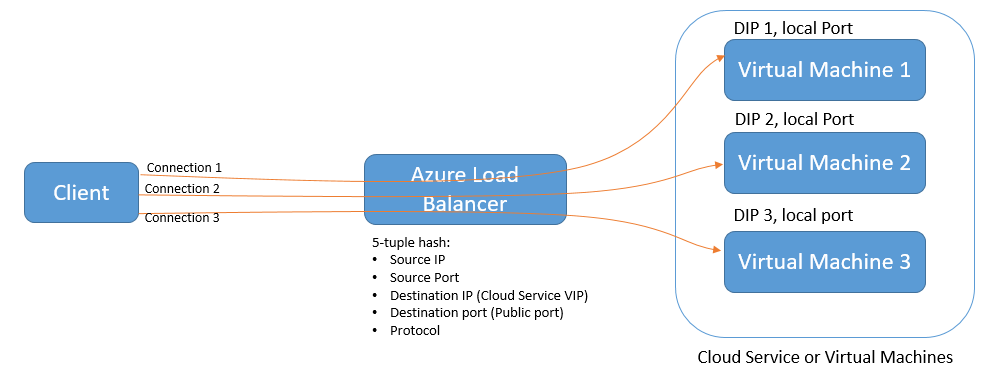

# Microsoft Azure IaaS 用户手册
##目录
1.	[前言](#section_1)
2.	[读者](#section_2)
3.	[Azure IaaS 相关技术](#section_3)
4.	[Azure IaaS 相关服务](#section_4)
	- 4.1 [Azure 虚拟机的带宽问题](#section_4_1)
	- 4.2 [Azure 虚拟网络 (Azure Virtual Network)](#section_4_2)
	- 4.3 [Azure 存储服务](#section_4_3)
		- [4.3.1 Azure 存储服务的冗余](#section_4_3_1)
		- [4.3.2 Azure 存储服务的类型](#section_4_3_2)
			- 4.3.2.1 [Blob](#section_4_3_2_1)
			- 4.3.2.2 [Queue](#section_4_3_2_2)
			- 4.3.2.3 [Table](#section_4_3_2_3)
			- 4.3.2.4 [File](#section_4_3_2_4)
	- 4.4 [Azure 虚拟机](#section_4_4)
		- 4.4.1 [Azure 虚拟机操作系统](#section_4_4_1)
		- 4.4.2 [Azure 虚拟机类型](#section_4_4_2)
			- 4.4.2.1 [A 系列虚拟机](#section_4_4_2_1)
			- 4.4.2.2 [D 系列虚拟机](#section_4_4_2_2)
			- 4.4.2.3 [标准类型 vs 基本类型](#section_4_4_2_3)
	- 4.5 [Azure 成本分析](#section_4_5)
		- 4.5.1 [虚拟网络成本分析](#section_4_5_1)
		- 4.5.2 [存储服务成本](#section_4_5_2)
		- 4.5.3 [虚拟机成本](#section_4_5_3)
		- 4.5.4 [流量成本](#section_4_5_4)
		- 4.5.5 [存储事务](#section_4_5_5)
		- 4.5.6 [其他成本](#section_4_5_6)
		- 4.5.7 [成本分析案例](#section_4_5_7)
5.	[开始创建 Azure 虚拟机](#section_5)
	- 5.1 [模拟场景](#section_5_1)
	- 5.2 [规划](#section_5_2)
		- 5.2.1 [如何选择 Azure 数据中心](#section_5_2_1)
		- 5.2.2 [Azure 是如何解决大并发](#section_5_2_2)
		- 5.2.3 [选择最合适的虚拟机配置](#section_5_2_3)
		- 5.2.4 [规划好高可用(非常重要)](#section_5_2_4)
		- 5.2.5 [规划好 Azure 订阅(非常重要)](#section_5_2_5)
		- 5.2.6 [选择订阅(非常重要)](#section_5_2_6)
		- 5.2.7 [查看该订阅中可使用的 Azure 资源](#section_5_2_7)
	- 5.3 [创建 Azure 虚拟机](#section_5_3)
		- 5.3.1 [说明](#section_5_3_1)
		- 5.3.2 [规划](#section_5_3_2)
	- 5.4 [使用 Azure 管理界面创建虚拟机](#section_5_4)
		- 5.4.1 [创建虚拟网络(非常重要)](#section_5_4_1)
		- 5.4.2 [创建存储账号](#section_5_4_2)
		- 5.4.3 [创建虚拟机说明](#section_5_4_3)
		- 5.4.4 [使用管理界面创建 Azure 虚拟机](#section_5_4_4)
			- 5.4.4.1 [注意事项(非常重要)](#section_5_4_4_1)
			- 5.4.4.2 [创建第一台 AD Server](#section_5_4_4_2)
			- 5.4.4.3 [创建第二台 AD Server](#section_5_4_4_3)
			- 5.4.4.4 [观察 AD Server](#section_5_4_4_4)
			- 5.4.4.5 [创建 Web Server](#section_5_4_4_5)
			- 5.4.4.6 [创建 SQL Server 虚拟机(非常重要)](#section_5_4_4_6)
			- 5.4.4.7 [总结(非常重要)](#section_5_4_4_7)
	- 5.5 [使用 Azure PowerShell 创建虚拟机](#section_5_5)
		- 5.5.1 [说明](#section_5_5_1)
		- 5.5.2 [配置 PowerShell](#section_5_5_2)
		- 5.5.3 [使用 PowerShell 创建 Windows VM(非常重要)](#section_5_5_3)
		- 5.5.4 [使用 PowerShell 创建 Linux VM](#section_5_5_4)
	- 5.6 [管理 Azure 虚拟机](#section_5_6)
		- 5.6.1 [远程桌面连接 WindowsVM (非常重要)](#section_5_6_1)
		- 5.6.2 [Linux SSH](#section_5_6_2)
		- 5.6.3 [挂载磁盘](#section_5_6_3)
		- 5.6.4 [存储账号中查看磁盘](#section_5_6_4)
		- 5.6.5 [Azure 临时磁盘(非常重要)](#section_5_6_5)
		- 5.6.6 [卸载磁盘](#section_5_6_6)
		- 5.6.7 [虚拟机关机(非常重要)](#section_5_6_7)
		- 5.6.8 [删除 Azure 虚拟机](#section_5_6_8)
		- 5.6.9 [虚拟机监控](#section_5_6_9)
6.	[高级内容](#section_6)
	- 6.1 [设置虚拟机端口映射](#section_6_1)
	- 6.2 [设置虚拟机端口负载均衡](#section_6_2)
	- 6.3 [设置负载均衡器规则](#section_6_3)
	- 6.4 [设置Web服务器固定 IP](#section_6_4)
	- 6.5 [超过 1TB 容量的磁盘](#section_6_5)
7.	[后续运维及开发测试](#section_7)
8.	[注意事项](#section_8)

版本变更：

<table border="1">
<thead>
<tr>
<th>日期</th>		<th>版本号</th>	<th>变更内容</th>						<th>作者</th>
</tr>
</thead>
<tbody>
<tr>
<td>2015-7-2	</td>	<td>1.00</td>	<td>文档创建，设置文档目录结构</td>			<td>leizha</td>
</tr>
<tr>
<td>2015-11-10</td>	<td>1.01</td>	<td>增加了开发测试的内容，增加高级存储</td>	<td>leizha</td>
</tr>
<tr>
<td>2015-12-27</td>	<td>1.02</td>	<td>增加了高级存储的计费内容</td>			<td>leizha</td>
</tr>
</tbody>
</table>

## 1.	前言
**<mark>个人分享，仅作为参考资料，非官方解答。</mark>**

**Demo 不给力？请访问我的个人博客 [http://www.cnblogs.com/threestone/archive/2012/01/06/2382322.html](http://www.cnblogs.com/threestone/archive/2012/01/06/2382322.html)**

## 2.	读者
Azure 是平台产品，本章只详细介绍如何创建和管理 Azure 虚拟机。本文适合开发人员、IT 运维人员阅读。

另外本文会牵涉到部分 Azure 订阅相关内容，请读者先阅读 《Azure 管理手册》。[http://www.cnblogs.com/threestone/p/4627388.html](http://www.cnblogs.com/threestone/p/4627388.html)

## 3.	Azure IaaS相关技术
1.	**Azure 底层是否由 System Center 和Hyper-V 构成?**

	Azure 虽然支持 Hyper-V 的 VHD 直接上传至 Azure 云端进行管理，但是 Azure 底层技术是微软自己研发的、独有的技术，且不对外提供。如果客户想构建属于自己的私有云平台，可以使用 Azure Stack，采用微软的 System Center + Windows Server 产品，构建自己的私有云平台。

2.	**我是否可以在 Azure 虚拟机中再创建虚拟机呢？**

	Azure 数据中心是由成千上万台 RACK 组成的，每个 RACK 都安装了 Windows Server 2012 的操作系统，我们称为 Host OS，即物理服务器的操作系统。

	这些 Windows Server 2012 采用特殊版本的 Hyper-V 虚拟化技术，虚拟出了若干虚拟机，称为 Guest OS。

	Host OS 内含一个 Fabric Agent 中控软件，以监控目前虚拟机各项信息给 Fabric Controller。

	Azure 的最终用户只能接触到 Guest OS，而无法接触到 Host OS。用户无法在 Guest OS 中再创建虚拟机。

3.	**如果 Azure 所在的服务器宕机了，Azure 虚拟机怎么恢复？**

	在传统 IDC 机房托管中，如果物理服务器发生了宕机，那所有的虚拟机都会宕机，需要人工或者监控软件来进行重新部署。

	从文件高可用来说，Azure 虚拟机是以 VHD 格式保存的，并且在同一个数据中心做了三重冗余(支持跨数据中心的异地冗余)，保证 Azure 虚拟机底层 VHD 文件的99.9% SLA。

	从数据中心架构来说，Azure 具有自我管理的功能。Azure Fabric Controller 是管理 Azure 数据中心的中控管理系统，你可以认为他是Azure 数据中心的大脑。Azure Fabric Controller 本身是融合了很多微软系统管理技术的总成，包含对虚拟机的管理 (System Center Virtual Machine Manager)，对作业环境的管理 (System Center Operation Manager)等，在 Fabric Controller 中被发挥得淋漓尽致。

	Azure Fabric Controller 负责自动化的管理数据中心内所有的实体服务器，包含由用户要求的 Azure Guest OS 的部署工作，定时的 Hotfix 修补，机器状态的监控，以及管理不同版本的VM镜像等重要核心工作。Fabric Controller 本身也具有高可用性。

	Fabric Controller 也处理虚拟机的健康管理工作 (Health Management) 工作，当 Azure Guest OS 发生死机时，<mark>会由 Fabric Controller 自动选择不同的实体机器重新部署与启动</mark>。

	在单台 Guest OS的 情况下，当 Guest OS 宕机的时候，<mark>重新部署与启动 Guest OS 会需要花费一定的时间，会引起客户应用的短暂离线</mark>，所以 Azure 没有单个实例的 SLA。

4.	**微软有没有单个实例的 SLA?**

	<mark>微软没有单个实例的 SLA</mark>。举个例子，客户有一个应用部署在传统 IDC 机房中，一台 AD Server，一台 Web Server，一台 SQL Server。

	在 Azure Virtual Machine 中，用户也可以选择使用一台 Azure Virtual Machine 部署 AD Server，一台 Azure Virtual Machine 部署 Web Application，使用另一台 Virtual Machine 部署 SQL Server。但是这样的场景是没有 SLA 保障的。

	<mark>Azure Virtual Machine 承诺的 99.95% 的 SLA 是需要 2 台或者 2 台以上的 Azure Virtual Machine 同时运行，且所有的 Virtual Machine 都需要在同一个可用性集中</mark>。对于上面实例，用户如果想在 Azure 中实现 99.95% 的 SLA，需要同时部署：

	-	两台 AD Server，放在同一个可用性集 A 中。
	-	两台 Virtual Machine 部署 Web Application，且 Web Application 所在的 Virtual Machine 需要放在另外一个可用性集 B 中。
	-	两台 Virtual Machine 部署 SQL Server，采用 SQL Server 2012 Enterprise 提供的 Always-On 功能，实现 High Availability。且 SQL Server 所在的 Virtual Machine 需要在另外一个可用性集 C 中。

	补充一点，微软没有单个实例的 SLA 主要原因有以下两点：

	-	从基础设施角度来说，无法预测单台物理服务器的硬件在何时发生故障，即单台物理服务器的 CPU 故障、网络故障、电源故障等是无法预测的。
	-	从物理服务器的维护来说。微软在每个月都会给 Azure Virtual Machine 做升级和维护，维护期一般是在周五凌晨和周六凌晨(北京、上海数据中心分别维护)。维护期窗口一般为 6-8 小时左右，在维护期内的虚拟机实例都会被重启，重启时间一般在 10 分钟左右。

		<mark>即该维护期是由微软定义的，用户没有办法拒绝维护过程，用户也没办法指定微软在具体哪个时间点，维护哪些虚拟机<\mark>。在维护期窗口内，任何一台 Azure Virtual Machine 都会被重启。但是只会影响单个实例的 Azure Virtual Machine。

		在 Azure 维护期内，会影响单个实例的 Azure Virtual Machine。但是不会影响两个或者两个以上的实例(需要正确配置可用性集)。

5.	**微软在维护 Azure Virtual Machine 时会不会影响我的业务？微软是如何来保证 99.95% 的 SLA 的?**

	Azure Virtual Machine 承诺的 99.95% 的 SLA 是需要 2 台或者 2 台以上的 Azure Virtual Machine 同时运行，且所有的 Virtual Machine 都需要在同一个可用性集中。

	在这种情况下，从基础设施角度来说，微软有机制可以保证同时运行的 2 台 Azure Virtual Machine 不会同时宕机。

	从服务服务器的维护来说。微软在给 Azure Virtual Machine 做维护的时候，会监控到这 2 台 Azure Virtual Machine 在同一个可用性集中，就知道客户需要这 2 台 Azure Virtual Machine 做高可用。微软在重启 Azure Virtual Machine，的时候，就不会同时重启。而是先重启其中的一台，等到这台 Virtual Machine 重启完毕后，再重启另外一台。这样保证在维护期窗口内，同一个时刻至少有一台 Virtual Machine 在线。

	如果客户部署了 2 台 Azure Virtual Machine 但是没有设置可用性集。微软在给 Azure Virtual Machine 做维护的时候，发现这 2 台 Azure Virtual Machine 没有关联，就会同时重启这 2 台 Azure Virtual Machine，造成服务 off-line。

6.	**什么是可用性集?**

	这里有两个非常重要的概念：故障域 (Fault Domain) 和更新域 (Update Domain)。

	[http://blogs.technet.com/b/yungchou/archive/2011/05/16/window-azure-fault-domain-and-update-domain-explained-for-it-pros.aspx](http://blogs.technet.com/b/yungchou/archive/2011/05/16/window-azure-fault-domain-and-update-domain-explained-for-it-pros.aspx)

	
 
	我们先说说故障域。先举个例子，笔者的书房有一个插线板，插线板上接了我的笔记本电脑，手机充电器，电视机等电器。如果这个插线板断电了，那这个插线板上的所有电器都会断电。这个插线板和上面的电器组成了一个故障域。

	Azure 数据中心基础设施由很多的 RACK 组成，每一个 RACK 都被称为故障域。当 RACK 出现硬件故障时候，在 RACK 上的服务，不管是 Azure 的计算服务、存储服务等等都会宕机。

	当客户部署了 2 台 Azure Virtual Machine，但是没有设置可用性集的时候，Azure 可能会把这 2 个 Azure Virtual Machine 部署在同一个 RACK 上，这样就可能会出现单点故障。因为这 1 个 RACK 宕机了，上面运行的 2 个 Azure Virtual Machine 都会宕机。两个 Azure Virtual Machine 宕机的概率和一个 Azure Virtual Machine 的概率是一样。

	而设置了可用性集的情况下，Azure 就会把这 2 台 Azure Virtual Machine 部署在 2 个不同的 RACK 上。微软从数据中心底层设计上，可以保证这 2 个不同的 RACK 不会同时宕机。

	-	用户同时更新这 2 台 Azure Virtual Machine 的软件版本。但是这样如果有客户端发起请求，会造成服务器端的无法响应。
	-	Azure Fabric Controller 监控这 2 台 Azure Virtual Machine。首先更新 Update Domain 0 中的虚拟机软件。更新完毕后再更新 Update Domain 1 中的虚拟机软件，一直到所有的 Azure Virtual Machine 中的 Web Application 更新完毕，这样保证在同一时刻至少有 1 台 Azure Virtual Machine 能够响应客户端的请求。

	以下是故障域 (Fault Domain) 和更新域 (Update Domain) 的截图：
 
	

7.	**Microsoft Azure 如何保证 CPU、内存、硬盘的性能?**

	传统的 Hyper-V 技术，CPU 是共享的。比如笔者的 ThinkPad T430S 是 4Core/8GB，安装了 Windows Server 2012 R2 操作系统，并且使用 Hyper-V 虚拟出 3 台虚拟机。那该笔记本的物理操作系统 + 3 台虚拟机操作系统本质上都是共享 4Core CPU 的。

	在 Azure 提供的虚拟机分为 A 系列和 D 系列，我们以 A 系列举例：

	<table border="1">
	<thead>
	<tr>
	<th>虚拟机类型</th>			<th>CPU</th>	<th>RAM</th>	<th>外挂磁盘数</th>	<th>MAX IOPS</th>
	</tr>
	</thead>
	<tbody>
	<tr>
	<td>Extra Small (A0)</td>	<td>共享</td>	<td>768MB</td>	<td>1</td>			<td>500</td>
	</tr>
	<tr>
	<td>Small (A1)</td>			<td>1</td>		<td>1.75GB</td>	<td>2</td>			<td>2 X 500</td>
	</tr>
	<tr>
	<td>Medium (A2)</td>		<td>2</td>		<td>3.5GB</td>	<td>4</td>			<td>4 X 500</td>
	</tr>
	<tr>
	<td>Large (A3)</td>			<td>4</td>		<td>7GB</td>	<td>8</td>			<td>8 X 500</td>
	</tr>
	<tr>
	<td>Extra Large (A4)</td>	<td>8</td>		<td>14GB</td>	<td>16</td>			<td>16 X 500</td>
	</tr>
	<tr>
	<td>A5</td>					<td>2</td>		<td>14GB</td>	<td>4</td>			<td>4 X 500</td>
	</tr>
	<tr>
	<td>A6</td>					<td>4</td>		<td>28GB</td>	<td>8</td>			<td>8 X 500</td>
	</tr>
	<tr>
	<td>A7</td>					<td>8</td>		<td>56GB</td>	<td>16</td>			<td>16 X 500</td>
	</tr>
	</tbody>
	</table>

	除了 A0 的虚拟机类型，它的 CPU 是和别的用户共享的。其他类型的虚拟机，比如 A1-A7，它的 CPU 是独占的，不是和别的用户共享的。比如物理服务器是 20Core，那这个物理服务器只能虚拟出 2 台 A7 的 Azure Virtual Machine (8Core/56GB)，另外多余的 4Core 要预留给物理服务器。

	关于硬盘的性能保证，微软是保证磁盘的 IOPS。

	<mark>注意：Azure 虚拟机 CPU 和 RAM 是固定搭配的，不可以按照用户的想法随意更改。</mark>

## 4.	Azure IaaS相关服务
### 4.1 Azure 虚拟机的带宽问题
这个问题长话短说，请参考我的博客：[http://www.cnblogs.com/threestone/p/4497625.html](http://www.cnblogs.com/threestone/p/4497625.html)

### 4.2 Azure 虚拟网络 (Azure Virtual Network)
Azure Virtual Network 是非常重要的概念，其主要作用有以下几点：

1.	**将多台 Azure Virtual Machine 整合在统一网段或者子网里**

	Azure Virtual Machine 具有两个IP地址，Public IP (VIP，<mark>注意其实是负载均衡器的 IP 地址，在这里近似认为是公网 IP</mark>) 和 Private IP。Public IP 是公网 IP，Azure China 的公网 IP 段请参考: [http://www.microsoft.com/en-us/download/details.aspx?id=42064](http://www.microsoft.com/en-us/download/details.aspx?id=42064)

	Private IP 是内网 IP。Azure 数据中心的基础架构是非常强大的，通过 Private IP 我们可以实现数据中心内网的快速通信。

	在没有 Azure Virtual Network 的情况下，多台 Azure 虚拟机想通过 Private IP 进行通信是不可能的，因为 Azure 从安全性考虑， VM 与 VM 之间的 VLAN 是做了隔离的。

	一般企业级的应用，都会有多台服务器来实现复杂的业务逻辑。比如一般 B/S 应用需要 Web Server，SQL Server 等。通过 Azure 虚拟机实现 Web Server 与 SQL Server，并且放在统一个 Virtual Network 里，就可以实现多台 Azure 虚拟机通过 Private IP 来互相通信。

2.	**固定内网 IP 地址 (Private IP)**

	在某些情况下，我们需要对 Azure 虚拟机固定内网IP地址，比如 AD 服务器，比如 Windows Server Cluster 集群，都需要依赖固定内网 IP 地址。这时候也需要使用 Azure 虚拟机网络。

### 4.3 Azure 存储服务
Azure 存储服务是云端的文件存储服务，简单理解是用户可以将本地的文件、图片、照片、虚拟机的 VHD (虚拟磁盘)等二进制文件保存在云端的存储服务中。

在传统的 IDC 数据中心，存储是某个机器名、或者保存在某个服务器的某个磁盘下，或者是某个存储的网络位置。

在 Azure 存储服务，其实是一个 http / https 的网络路径，可以进行权限控制。Azure 存储服务并不依赖于任何一个 IP 地址或者主机。

#### 4.3.1 Azure 存储服务的冗余
在传统数据中心是通过使用 RAID 技术等来实现存储的冗余。

Azure 存储服务本身提供 99.9% 的 SLA，它提供三种高冗余方式:

1.	**本地数据中心的三重冗余 (Local Redundant Storage, LRS)。**比如客户可以选择将存储服务在同一个数据中心做三重冗余，比如在上海的数据中心做三重冗余。任意一个保存在上海存储服务的文件，都有一个主文件和二个子副本。

	比如客户上传了 10 GB 电影，其实 Azure 存储服务在同一个数据中心保存了 30GB。但是 Azure 收费只会收取用户实际上传的 10GB 费用。

	对于 LRS 来说，事务在同一个数据中心的三重冗余是同步执行的。

2.	**跨数据中心的三重冗余 (Geo Redundant Storage, GRS)。**细心的用户会发现，微软在国外和国内的数据中心建设都是成对的，比如北京数据中心和上海数据中心。这是因为微软充分考虑了异地冗余的能力。在北京和上海数据中心之间会有专线连接，这个专线是内网数据中心之前数据同步专用的。

	比如用户在上海数据中心(主要位置)创建了存储账号，并且开启了跨数据中心同步的能力。<mark>则上海数据中心是主节点，北京数据中心是备份节点。</mark>当用户往上海数据中心上传10GB电影，该电影文件不仅在上海数据中心做了三重冗余，在北京的数据中心(辅助位置)也会做三重冗余，文件一共做了六重冗余。举个例子，即使上海数据中心因为地震、战争、洪水完全被摧毁了，用户的数据还是安全的保存在北京的数据中心，文件真正做到了万无一失。

	在 GRS 情况下，对于上海数据中心在来说，事务在同一个数据中心的三重冗余是同步执行的。

	对于北京数据中心来说，事务是异步从上海发送到北京的数据中心。

	下表显示了当前的主要位置和辅助位置配对：

	<table border="1">
	<thead>
	<tr>
	<th>主要位置</th>	<th>辅助位置</th>
	</tr>
	</thead>
	<tbody>
	<tr>
	<td>中国东部</td>	<td>中国北部</td>
	</tr>
	<tr>
	<td>中国北部</td>	<td>中国东部</td>
	</tr>
	</tbody>
	</table>

3.	**读取访问地域冗余 (Read Access – Geo Redundant Storage, RA-GRS)**

	简单的来说，如果用户在上海数据中心(主要位置)创建了存储账号，并且开启了 RA-GRS，事务就会异步的复制到北京的数据中心。RA-GRS 提供了对复制到北京数据中心(辅助位置)的”只读”访问权，实现对存储账户的更高读取可用性。

	请注意：
	- **(1)	跨数据中心的三重冗余 (Geo Redundant Storage, GRS) 的情况下，备份节点的数据是不可读的。**
	- **(2)	读取访问地域冗余 (Read Access – Geo Redundant Storage, RA-GRS) 的情况下，备份节点的数据是可读的。**

	这样用户可以指定对于 Azure Storage 的访问是指向上海数据中心(主要位置，还是北京数据中心(辅助位置)，提高读取的高可用性。

	启用该功能后，在主要区域无法读取数据时，可使用辅助位置读取更高可用性。该功能为”选择使用”，要求存储账户进行跨地域冗余复制。

	举个例子，假设我在上海数据中心(主要位置)创建了Azure Storage，Storage Name为leizhangstorage，并且开启了**读取访问地域冗余 (Read Access – Geo Redundant Storage, RA-GRS)。**
	- (1)	我就可以通过 http://leizhangstorage.blob.core.chinacloudapi.cn 访问主要位置的 Azure Storage Account。
	- (2)	然后还可以通过 http://leizhangstorage-secondary.blob.core.chinacloudapi.cn 访问辅助位置的 Azure Storage Account
	- (3)	在发生上海数据中心(主要位置)无法读取数据的时候，可以使用辅助位置的数据读取来提供高可用性。

#### 4.3.2 Azure存储服务的类型
Azure存储服务提供三种不同类型的存储服务: Blob, Table, Queue。

##### 4.3.2.1 Blob
Blob 就是保存大型二进制对象，比如用来存储文件、图片、文档等二进制格式的文件。

Blob 分为两种类型:

1.	Block Blob。这种类型适合存储二进制文件，支持断点续传，可以最大以 4M 为一个区块单位，单一文件最大可以存储 200GB，且区块不会连续存储，可能会在不同的存储服务器分块存放。为了适应文件的上传和下载而专门进行了优化。

	Block 可以通过 2 种方式创建。不超过 64MB 的 Block Blobs 可以通过调用 PutBlob 操作进行上传。大于 64M 的 Block Blobs 必须分块上传，且每块的大小不能超过 4MB。

	<mark>Block Blob 可以近似理解为网盘。</mark>

2.	Page Blob。这类存储优化了随机访问。它会在存储区中划分一个连续的区域供应用程序存放数据，<mark>可以用来存放 VHD</mark>，单一文件最大可以存储1TB。

Blob 服务由 Blob 本身以及其收纳容器 (Container) 构成，容器可以视为一般本机上的文件夹。

你可以通过 REST API 来访问 Blob

	http://<accountname>.blob.core.chinacloudapi.cn/<containername>/<blobname>

accountname 表示哪个 Azure 存储账号下的资源，是全局唯一的。

blob.core.chinacloudapi.cn 表示 azure china blob 存储资源，是固定的。

containername 表示容器的名字，可以认为是访问某一文件夹下的资源

blobname 表示我要访问的资源名称，你可以认为是一个 mp3 文件，或者是一个 jpg 文件。

举例说明：

我保存在 leizhangstorage 存储账号下，containername 为 photo，blobname 为myphoto.jpg。则这个 URL 地址为：

	http://leizhangstorage.blob.core.chinacloudapi.cn/photo/myphoto.jpg

我保存在 leizhangstorage 存储账号下，containername 为 vhd，blobname 为 myvm.vhd。则这个 URL 地址为：

	http://leizhangstorage.blob.core.chinacloudapi.cn/vhd/myvm.vhd

注意 Container 的命名规则:

1.	containername 只能是一级目录，没有办法在 containername 下再设置下一级别 containername
2.	必须以英文或数字开头，且名称内只能有英文、数字及 dash(-)
3.	不能以 dash(-) 开头或结尾，dash(-) 不能连续出现
4.	所有的英文的字符必须是小写
5.	长度为 3-63 之间

Blob 的命名规则：

1.	除了 url 的保留字符以外，其他的字符组合都可以使用
2.	长度为 1-1024 个字符
3.	尽量避免以 dot(.) 或者是 forward slash(/) 结尾。否则会造成 Blob Service 误判。

##### 4.3.2.2 Queue
Queue，队列，是一种先到先服务 (First-Come, First-Serve)，或者称为 FIFO (先入先出)的存储服务。队列可以是字符串或者是最长 64KB 的二进制数据。

在 Azure PaaS 中有一个非常重要的概念叫 Web Role/Worker Role。Queue 作为 Web Role/Worker Role 沟通的重要的桥梁。

有关 Azure PaaS 平台的 Web Role/Worker Role 的内容，请参考我的博客：[http://www.cnblogs.com/threestone/p/4201065.html](http://www.cnblogs.com/threestone/p/4201065.html)

##### 4.3.2.3 Table
这里的 Azure Storage Table 是非关系型数据表，不能与 SQL Server 的 Table 相混淆。用户可以近似认为 Azure Storage Table 是NoSQL。

Azure Table 中的每一行记录就是一个 Entity，单个 Entity 的最大容量是1M。

Azure Table 中表的所有记录最大容量是 200TB，每个 Azure Table 都必须有 Partition Key 和 Row Key。Azure Table 属性最多有 255 个。

Partition Key 的值可以设置记录的物理位置。在 Azure Table 中的 2 条数据，如果 Partition Key 值相同，则表示这 2 条数据存储的物理位置是相同的；如果 Partition Key 不同，则表示这 2 条数据可能存储在同一台物理介质上，或者不同的 2 台物理介质上。如下图:

Table 使用的场景，比较适合于日志文件存储，或者是需要非关系型数据库的场景。

##### 4.3.2.4 File
基于 SMB2.1 的 Azure 存储服务。可以在虚拟机里设置共享文件夹。

具体请参考我的博客：[http://www.cnblogs.com/threestone/p/4441388.html](http://www.cnblogs.com/threestone/p/4441388.html)

### 4.4 Azure 虚拟机
#### 4.4.1 Azure 虚拟机操作系统
Azure 虚拟机在创建的过程中，都需要用户选择操作系统的版本。创建完的虚拟机默认都安装好了操作系统。

微软 Azure 官方支持的操作系统为：

1.	Windows : Server 2008 R2, Server 2012, Server 2012 R2
2.	SQL Server：SQL Server 2008 R2, SQL Server 2012 SP1, SQL Server 2014 RTM  (Web, Standard, Enterprise)

Linux : 

1.	Ubuntu (12.04 LTS, 12.10, 13.10, 14.04 LTS),
2.	CentOS (6.5, 6.6, 7.0, 7.1), 
3.	SUSE (OpenSUSE 13.3, 13.2 SUSE Linux Enterprise Server 11 SP3, Server 12)

其他非 Azure 提供的虚拟机模板，比如 RedHat 或者红旗 Linux。客户可以自己在本地使用 Hyper-V 进行创建，然后上传至 Azure 云端，但是如果这个虚拟机出现问题，就没有办法获得微软官方的支持。

#### 4.4.2 Azure 虚拟机类型
Azure 提供不同大小的计算能力，Azure 目前支持的虚拟机类型为 A 系列和 D 系列。

<mark>注意：Azure 虚拟机 CPU 和 RAM 是固定搭配的，不可以按照用户的想法随意更改。</mark>

##### 4.4.2.1 A 系列虚拟机
A系列虚拟机的类型如下：

<table border="1">
<thead>
<tr>
<th>虚拟机类型</th>	<th>CPU</th>	<th>内存</th>		<th>外挂磁盘数</th>	<th>IOPS</th>
</tr>
</thead>
<tbody>
<tr>
<td>A0</td>			<td>共享</td>	<td>768 MB</td>		<td>1</td>			<td>500</td>
</tr>
<tr>
<td>A1</td>			<td>1</td>		<td>1.75 GB</td>	<td>2</td>			<td>2 * 500</td>
</tr>
<tr>
<td>A2</td>			<td>2</td>		<td>3.5GB</td>		<td>4</td>			<td>4 * 500</td>
</tr>
<tr>
<td>A3</td>			<td>4</td>		<td>7 GB</td>		<td>8</td>			<td>8 * 500</td>
</tr>
<tr>
<td>A4</td>			<td>8</td>		<td>14 GB</td>		<td>16</td>			<td>16 * 500</td>
</tr>
<tr>
<td>A5</td>			<td>2</td>		<td>14 GB</td>		<td>4</td>			<td>4 * 500</td>
</tr>
<tr>
<td>A6</td>			<td>4</td>		<td>28 GB</td>		<td>8</td>			<td>8 * 500</td>
</tr>
<tr>
<td>A7</td>			<td>8</td>		<td>56 GB</td>		<td>16</td>			<td>16 * 500</td>
</tr>
</tbody>
</table>

除了 A0 的虚拟机类型，它的 CPU 是和别的用户共享的。其他类型的虚拟机，比如 A1-A7，它的 CPU 是独占的，不是和别的用户共享的。

举例来说，A 系列虚拟机单个节点支持的最大计算能力为 A7，即 8Core/56GB 的计算能力。可以外挂 16 块磁盘，每块磁盘的最大容量为 1TB，即外挂 16TB 的存储。支持的最大的 IOPS 为 16*500=8000

##### 4.4.2.2 D 系列虚拟机
D 系列虚拟机的类型如下：

<table border="1">
<thead>
<tr>
<th>虚拟机类型</th>	<th>CPU</th>	<th>内存</th>	<th>临时磁盘</th>	<th>外挂磁盘数</th>	<th>IOPS</th>
</tr>
</thead>
<tbody>
<tr>
<td>D1</td>			<td>1</td>		<td>3.5 GB</td>	<td>50 GB</td>		<td>2</td>			<td>2 * 500</td>
</tr>
<tr>
<td>D2</td>			<td>2</td>		<td>7 GB</td>	<td>100 GB</td>		<td>4</td>			<td>4 * 500</td>
</tr>
<tr>
<td>D3</td>			<td>4</td>		<td>14 GB</td>	<td>200 GB</td>		<td>8</td>			<td>8 * 500</td>
</tr>
<tr>
<td>D4</td>			<td>8</td>		<td>28 GB</td>	<td>400 GB</td>		<td>16</td>			<td>16 * 500</td>
</tr>
<tr>
<td>D11</td>		<td>2</td>		<td>14 GB</td>	<td>100 GB</td>		<td>4</td>			<td>4 * 500</td>
</tr>
<tr>
<td>D12</td>		<td>4</td>		<td>28 GB</td>	<td>200 GB</td>		<td>8</td>			<td>8 * 500</td>
</tr>
<tr>
<td>D13</td>		<td>8</td>		<td>56 GB</td>	<td>400 GB</td>		<td>16</td>			<td>16 * 500</td>
</tr>
<tr>
<td>D14</td>		<td>16</td>		<td>112 GB</td>	<td>800 GB</td>		<td>32</td>			<td>32 * 500</td>
</tr>
</tbody>
</table>

相比A系列的 Azure Virtual Machine，D 系列的优势在于：

1.	**单台 VM 更多的 CPU Core**

	相比 A 系列单台VM最大 8Core/56GB RAM 的配置，D 系列虚拟机单台最大的配置为 16Core/112GB RAM

2.	**D 系列的 CPU 性能比 A 系列提升约 60%**

	我从后台得到的消息，Azure A 系列的虚拟机，Intel E5 的 CPU 是经过调试的，性能是人为降低的。

	因为 Azure 数据中心在建设的时候，有 AMD 的 CPU 和 Intel 的 CPU，为了让 Intel CPU 性能和 AMD CPU 性能接近，保证运算能力的一致性，人为降低了 Intel CPU 的计算能力。

	所以各位如果用 Super PI 等测试 A 系列的虚拟机，会发现性能与物理机是有差距的。

	最新的 D 系列虚拟机，是 100% 体现 Intel E5 的处理能力，CPU 性能比 A 系列提升 60%。

3.	**新增本地临时 SS D存储**

	注意是<mark>临时存储</mark>，这个存储在 Windows 里显示为 D 盘，在 Linux 系统里是 /dev/sdb1

	优点: IOPS 高；<mark>缺点：非持久化存储，文件会有丢失的风险，不能保留重要的文件。</mark>

4.	**更大的本地临时磁盘**

	如上面的表格所示，本地的临时磁盘最大为 800G。

##### 4.4.2.3 DS 系列虚拟机
不管是 A 系列VM还是 D 系列的 VM。本地持久化磁盘都是 SAS 盘，IOPS 是每块盘 500。

如果我们对于磁盘的性能要求更高，我们可以使用 DS 系列的 VM，DS 系列的虚拟机的 CPU/RAM 配置和 D 系列虚拟机一致，不同之处在于 DS 系列 VM 的本地持久化磁盘是 SSD 的，可以提供更高的磁盘 IOPS 性能。

<table border="1">
<thead>
<tr>
<th>虚拟机类型</th>		<th>CPU</th>	<th>内存</th>	<th>最大IOPS</th>	<th>最大磁盘吞吐量</th>
</tr>
</thead>
<tbody>
<tr>
<td>Standard_DS1</td>	<td>1</td>		<td>3.5 GB</td>	<td>3200</td>		<td>32 MB/S</td>
</tr>
<tr>
<td>Standard_DS2</td>	<td>2</td>		<td>7 GB</td>	<td>6400</td>		<td>64 MB/S</td>
</tr>
<tr>
<td>Standard_DS3</td>	<td>4</td>		<td>14 GB</td>	<td>12800</td>		<td>128 MB/S</td>
</tr>
<tr>
<td>Standard_DS4</td>	<td>8</td>		<td>28 GB</td>	<td>25600</td>		<td>256 MB/S</td>
</tr>
<tr>
<td>Standard_DS11</td>	<td>2</td>		<td>14 GB</td>	<td>6400</td>		<td>64 MB/S</td>
</tr>
<tr>
<td>Standard_DS12</td>	<td>4</td>		<td>28 GB</td>	<td>12800</td>		<td>128 MB/S</td>
</tr>
<tr>
<td>Standard_DS13</td>	<td>8</td>		<td>56 GB</td>	<td>25600</td>		<td>256 MB/S</td>
</tr>
<tr>
<td>Standard_DS14</td>	<td>16</td>		<td>112 GB</td>	<td>50000</td>		<td>512 MB/S</td>
</tr>
</tbody>
</table>

[http://www.azure.cn/documentation/articles/storage-premium-storage-preview-portal/](http://www.azure.cn/documentation/articles/storage-premium-storage-preview-portal/)

##### 4.4.2.4 修改 Azure 虚拟机配置
我们可以根据实际需求，设置 Azure 虚拟机的配置，比如对于 Web Server 设置为 A7(8Core/56GB)；MySQL VM 设置为 DS14 VM，本地的 SSD 磁盘吞吐量更高。

同时 Azure VM 配置是可以动态调整的，比如在开发测试阶段，可以按照最高标准的 Azure VM 来进行配置。

等待项目上线以后，如果业务需求并没有预期的那么高，可以将单台 Azure VM 的配置向下修改。这样每台 Azure VM 的每分钟单价会更加便宜，价格是动态调整的。

注意事项：

Azure 的数据中心建设是有先后顺序的，最早是落地了 A 系列的虚拟机，然后是 D 系列和 DS 系列的虚拟机。在一般情况下，客户在修改虚拟机配置大小的时候，会出现以下情况：

-	已经创建的 A0-A4 虚拟机，无法升级到 A5-A7 系列的虚拟机
-	已经创建的 A 系列的虚拟机，无法升级到 D 系列的虚拟机

这是由于在创建 A 系列的虚拟机的时候，虚拟机创建在老的 Compute Cluster 上，而不是新的 Compute Cluster 上。

遇到这种情况，只能把 DNS 删除，保留虚拟机的 VHD 并重新创建 Azure VM。这会产生虚拟机的临时下线。

<mark>从可配置的角度来说，建议用户在刚开始创建 Azure 虚拟机的时候，直接设置虚拟机配置为 D 系列。这样可以在 D 系列 VM 和 A 系列 VM 来回切换。</mark>

##### 4.4.2.5 标准类型 vs 基本类型
在创建 Azure 虚拟机的时候，虚拟机类型分为两种：基本和标准。如下图：

基本类型的虚拟机有以下特点：

1.	减少了部分功能：新的基本类型的虚拟机不包含负载均衡和自动扩展功能
2.	比较适合不需要上述功能的，单实例的应用程序，比如：开发用虚拟机、测试服务器等等
3.	价格比标准类型的虚拟机要便宜。

如果读者需要使用多台虚拟机，设置负载均衡器，请使用标准类型的虚拟机。

如果读者需要用一台机器做开发测试，请使用基本类型的虚拟机。

### 4.5 Azure 成本分析

请注意，现在面向企业级的 Azure 销售方式，即 MS-Led，需要客户预付费人民币 15 万(不含税)。**这<mark>并不是</mark>指客户预付费后，可以任意使用微软云计算平台上的任意资源。**

我举个例子，客户购买 Azure 服务，类似于购买了移动的套餐。在承诺每年最低消费 15 万元的基础上，根据用户使用 Azure 提供的不同的服务(比如话费按分钟计费，流量按 GB 收费，短信按每条收费等等)，从客户预付费的 15 万元里进行扣费。

如果客户实际使用的费用，接近或超过了预存的 15 万元。世纪互联会提前通知客户，进行话费充值。

客户要承诺每年至少消费 15 万元，且余额在年底不会返还给客户，即类似于移动流量在月底清零。

#### 4.5.1 虚拟网络成本分析
虚拟机网络默认是不收费的

如果客户需要使用虚拟机网路的 VPN Gateway 网管，则 VPN 网管需要按照小时收取费用。

#### 4.5.2 存储服务成本
##### 4.5.2.1 普通存储
<mark>对于 A 系列和 D 系列的虚拟机来说，使用的是普通存储。</mark>

普通存储的存储资源，是按照每 GB 每月计费的。<mark>Azure 普通存储资源是用多少算多少的</mark>，且按照平均使用计算。

[http://blogs.msdn.com/b/windowsazurestorage/archive/2010/07/09/understanding-windows-azure-storage-billing-bandwidth-transactions-and-capacity.aspx?PageIndex=2#comments](http://blogs.msdn.com/b/windowsazurestorage/archive/2010/07/09/understanding-windows-azure-storage-billing-bandwidth-transactions-and-capacity.aspx?PageIndex=2#comments)

For capacity, we currently sample it at least once a day for a storage account.  That capacity value is used to represent the capacity for each hour until the next sample is taken.   These samples are then incorporated into the monthly average for calculating billable capacity.

比如我在 1 月 1 日使用了 10GB 存储，在 1 月 2 日完全删除了该存储。整个 1 月，Azure 实际需要支付的费用 = 10GB * 每月单价/31 天。

比如某客户使用的 A2 虚拟机 (2Core/3.5GB)，可以挂载的磁盘 4 块(按上面的表格，每块磁盘最大 1TB，总计 4TB)。我们收取的存储总费用有以下几点:

1.	虚拟机操作系统的文件，对于 Windows 平台，C 盘系统盘容量 127GB，操作系统实际使用 30GB。<mark>只收取实际使用的 30GB 存储。这部分费用是必须支付的，因为虚拟机必须有操作系统文件才可以运行。</mark>
2.	挂载的 4 块磁盘，每块磁盘最大容量为 1TB，总计为 4TB。假设客户只使用 4TB 其中的 500GB。则只收取客户<mark>实际使用</mark>的 500GB存储。
3.	每月总的存储费用 = C 盘实际使用的存储的费用 (10GB)+ 挂载磁盘的实际存储费用 (500G)，即 510GB * 每 GB/月费用

##### 4.5.2.2 高级存储
对于 DS 系列的虚拟机来说，使用的是高级存储。

#### 4.5.3 虚拟机成本
<mark>虚拟机是按照分钟计费的，计费的单价为每小时。从单价来说，价格如下：</mark>

1.	Linux 操作系统最便宜
2.	Windows Server 操作系统比 Linux 操作系统要贵一些

	在同样操作系统情况下，虚拟机计算能力越强，小时价格越贵。比如虚拟机类型为 A7 一定比 A1 贵。(具体的单价请联系微软销售代表或参考微软 Azure 官方文档 [http://windowsazure.cn/zh-cn/pricing/overview](http://windowsazure.cn/zh-cn/pricing/overview)

3.	预装了 SQL Server 数据库的 Windows Server 虚拟机最贵(因为需要 Windows Server License + SQL Server License)，微软把一次性购买 SQL Server License 的费用平摊到 Azure 计算的小时费用中了。

	* a)	根据 SQL Server 数据库的不同版本，价格依次递增 (Web, Standard, Enterprise)，Enterprise 价格最贵。
	* b)	举例来说，预装了 SQL Server 2012 数据库的 Windows Server 虚拟机价格因素由以下几方面构成：
	* c)	虚拟机类型：A0 - A7，计算能力越强越贵，A7 最贵。
	* d)	数据库版本：Web, Standard, Enterprise
	* e)	比如，虚拟机类型为 A7，且安装了 SQL Server Enterprise 的虚拟机价格最贵。
	* f)	如果客户已经采购了 on-premise 的 SQL Server 的 SA 服务，客户可以选择只使用 Windows Server VM，然后在 VM 安装 SQL Server License，可以把本地的 License 移动到云端，即 License Mobility。这样 Azure 只会收取 Windows Server 的小时费用，而不会收取 SQL Server License 的小时费用。

虚拟机运行的时候就收费计算费用。关闭虚拟机后，不收取计算费用。

举例来说，比如某个券商采用了微软的公有云服务，在 9：30 开市的高峰期时使用 300 台虚拟机进行运算，一直运行到下午 15：30 休市。休市后的非高峰期关闭其中的280台，使用剩余的 20 台虚拟机进行运算。那么这个券商<mark>每天</mark>需要支付的**计算总费用 = 300 (高峰期虚拟机数量) X 每台小时费用 X 6 小时(高峰期时间) + 20 (非高峰期虚拟机数量) X 每台小时费用 X 18 小时(非高峰期时间)。**

**<mark>注意：无论虚拟机是开机还是关机，虚拟机的VHD都是需要收取存储费用的。</mark>**

**直到用户把虚拟机的VHD删除了，就不再收取存储费用。(当然计算费用也不会收取，因为虚拟机没有了)**

#### 4.5.4 流量成本
网络流量包括上行流量(从客户端到 Azure 公有云)和下行流量(从 Azure 公有云到客户端)。对于网络流量，针对每个客户的付费情况，是不同的。

1.	对于企业级用户 (OSPA)，Azure 每个月提供 20TB 的免费流量(所有订阅一共 20TB)。而对于使用量超过 20TB 的部分，我们收取的费用仅仅是 0.6RMB/GB，上行和下行都收取费用。
2.	对于个人用户 (OSSA)，Azure 每个月提供 1TB 的免费流量。而对于使用量超过 1TB 的部分，我们收取的费用仅仅是 0.6RMB/GB，上行和下行都收取费用。
3.	对于客户来说，这是十分优惠的。以阿里云的报价来看，同样的流量，阿里云收取的费用非常昂贵。阿里云流量每 GB 需要 0.8 元，按照 Azure 每月提供免费 20TB 流量来算，单流量费用，客户每月需要支付 1.6 万元。

#### 4.5.5 存储事务
读、写云端存储是需要收费的，比如虚拟机本地的 C 盘，外挂的 E 盘，F 盘，是需要支付事务的费用的。针对每个客户，我们每个月提供 100 亿次免费的事务。超过 100 亿次的部分，每 10 万个存储事务为 3 元。存储事务包括对存储区的读操作和写操作。这部分的费用非常小，可以忽略不计。

关于存储事务的深层次研究，请参考MSDN文章：[http://blogs.msdn.com/b/windowsazurestorage/archive/2010/07/09/understanding-windows-azure-storage-billing-bandwidth-transactions-and-capacity.aspx?PageIndex=2#comments](http://blogs.msdn.com/b/windowsazurestorage/archive/2010/07/09/understanding-windows-azure-storage-billing-bandwidth-transactions-and-capacity.aspx?PageIndex=2#comments)

Is the IaaS VM disk be charged for storage transactions?  Every VM disk is a VHD file in the blob storage, every access to the drive will be billed storage transaction?

you will need to pay for the OS disk and Data disk because they are actually page blobs. Both the capacity and transactions will be billed just like ordinary page blobs. For temporary disk, it is local and included in the VM price. No capacity/transactions cost will be charged. Hope this answers your question.

#### 4.5.6 其他成本
如果用户使用 Azure 其他服务，比如 CDN，SQL Database 等，也会按照一定的费率进行计费。

#### 4.5.7 成本分析案例
<mark>最后举个完整的例子(只考虑计算费用 + 存储费用)，不考虑数据传输和事务的费用</mark>

某个客户的 Azure 使用情况是这样的:

<table border="1">
<thead>
<tr>
<th>时间</th>	<th>描述</th>	<th>计算费用</th>	<th>存储费用</th>
</tr>
</thead>
<tbody>
<tr>
<td>May 1</td>	<td>使用1台Azure A2虚拟机，C盘总容量127GB，操作系统使用10GB，运行24小时。同时挂载4块1TB磁盘，实际使用其中500GB容量。</td>	<td>A2虚拟机单价*24小时运行时间</td>	<td>510GB*每月单价/31天</td>
</tr>
<tr>
<td>May 2</td>	<td>关闭A2虚拟机，但不删除虚拟机的磁盘。</td>	<td>0</td>	<td>510GB*每月单价/31天</td>
</tr>
<tr>
<td>May 3</td>	<td>将虚拟机类型改为<mark>A3</mark>，重新开启虚拟机，运行24小时。</td>	<td><mark>A3</mark>虚拟机单价*24小时运行时间</td>	<td>510GB*每月单价/31天</td>
</tr>
<tr>
<td>May 4</td>	<td>关闭虚拟机并且删除相关的磁盘文件。</td>	<td>0</td>	<td>0</td>
</tr>
<tr>
<td>总计	</td>	<td></td>	<td>以上合计</td>	<td>以上合计</td>
</tr>
</tbody>
</table>

## 5.	开始创建Azure虚拟机
### 5.1 模拟场景
Contoso 公司已经采购了 Azure China 服务，计划把现有托管在 IDC 的企业官网迁移到 Azure 云平台。该企业官网面向的用户群主要是华东地区的用户。

该企业官网部署需要服务器列表如下：

1.	1 台 AD 服务器
2.	1 台 Web 服务器
3.	1 台 SQL Server 服务器

### 5.2 规划
#### 5.2.1 如何选择 Azure 数据中心
世纪互联运维的 Azure 在中国大陆有两个数据中心:

1.	中国北部，即位于北京的数据中心
2.	中国东部，即位于上海的数据中心

当我们在选择 Azure 数据中心的时候，需要从以下两方面进行考虑：

1.	**选择的 Azure 数据中心离最终用户越近越好**

	考虑到 Contoso 的企业官网主要的用户群是华东地区，建议 Contoso 公司将应用部署到 Azure 在中国东部的数据中心。

2.	**如果需要在 Azure 部署多台应用服务器，则需要将所有的应用服务器放在同一个数据中心**

	建议用户将 Web 服务器和 SQL Server 服务器都部署在 Azure 中国东部数据中心，不要将 Web 服务器和 SQL 服务器部署在不同的数据中心，会产生内部通信的延时。

3.	**利用 CDN**

	CDN 能将静态内容缓存到离用户最近的 CDN 节点服务器，提高应用程序的用户体验。

#### 5.2.2 Azure 是如何解决大并发
我们建议使用多台 Azure 虚拟机，利用横向扩展的方式来解决大量的并发。

单个节点向上扩展是有限的，这是因为受限于现有的 CPU 制造技术，我们无法将大量的计算资源都堆积到 1 台 300 Core 甚至 400 Core 的计算节点上。对于需要大量的计算资源的情况下，我们可以通过横向扩展的方法来解决。

所谓横向扩展，就是由 1 个计算节点，横向扩展到多个计算节点上并行计算，比如 50 个、100 个计算节点。比如一个互联网业务需要大量的计算资源，那可以将这些计算需求由 100 台 4 Core 的计算节点进行并行计算。

架构图如下：

#### 5.2.3 选择最合适的虚拟机配置
<mark>首先请读者注意，传统的虚拟机化技术，CPU 是共享的。Azure 虚拟机，除了 A0 的虚拟机类型，它的 CPU 是和别的用户共享的。其他类型的虚拟机，比如 A1-A7，它的 CPU 是独占的，不是和别的用户共享的。</mark>

如[第 4.4.2 章](#section_4_4_2)，Azure 虚拟机分为 A 系列和 D 系列，并且拥有不同的 CPU 和内存配置。

如果客户在传统 IDC 托管中已经部署了硬件服务器。则在 Azure 平台选择最接近的 Azure 虚拟机配置即可。

如果客户需要部署新的应用，则需要根据并发、性能等多个因素，选择最合适的 Azure 虚拟机配置。

另外说明一下 A 系列虚拟机和 D 系列虚拟机的区别：

1.	相比 A 系列单台 VM 最大 8Core/56GB RAM 的配置，D 系列虚拟机单台最大的配置为 16Core/112GB RAM
2.	D 系列的 CPU 性能比 A 系列提升约 60%

其他内容，请参考[第 4.4.2 章](#section_4_4_2)。

#### 5.2.4 规划好高可用(非常重要)
在 Azure 虚拟机中，用户也可以选择使用一台 Azure Virtual Machine 部署 AD Server，一台 Azure Virtual Machine 部署 Web Application，使用另一台 Virtual Machine 部署 SQL Server。<mark>但是这样的场景是没有 SLA 保障的。</mark>

Azure Virtual Machine 承诺的 99.95% 的 SLA 是需要 2 台或者 2 台以上的 Azure Virtual Machine 同时运行，且所有的 Virtual Machine 都需要在同一个可用性集中。对于上面实例，用户如果想在 Azure 中实现 99.95% 的 SLA，需要同时部署：

1.	两台 AD Server 虚拟机，放在同一个<mark>可用性集 A</mark> 中。
2.	两台 Web Server 虚拟机，放在另外一个<mark>可用性集 B</mark> 中。
3.	两台 SQL Server 虚拟机，采用 SQL Server 2012 Enterprise 提供的 Always-On 功能，实现 High Availability。且 SQL Server 所在的 Virtual Machine 需要在另外一个<mark>可用性集C</mark>中。
4.	将具有相同功能的多台VM放置在同一个可用性集下。

这边还需要强调一下:

1.	<mark>可用性集 A</mark> 中的两台 AD Server 中的内容配置必须完全一致，并且需要进行 AD 的同步。
2.	<mark>可用性集 B</mark> 中的两台 Web Server 中的网站在部署的时候，内容必须完全一致。
3.	<mark>可用性集 C</mark> 中的两台 SQL Server 必须配置 SQL Server Always-On 或者 SQL Mirroring，保证数据库之间的<mark>日志同步</mark>

对于 DB Server，比如 SQL Server 或者 MySQL，需要在两台 DB Server 进行日志同步：

1.	SQL Server 需要在两台 VM 配置 Always-On 或者 SQL Mirroring，使用<mark>日志同步</mark>
2.	My SQL 可以配置 Master-Slave，使用 Replication 进行复制。
3.	<mark>这样的目的是保证在其中一台 Server 宕机的情况下，另外一台 Server 可以正常运行，因为配置了日志同步，可以保证日志不会丢。</mark>
4.	<mark>另外还要强调一下，客户端如果调用 SQL Server 服务的时候，需要正确配置 AG Listener，这样保证在一台 SQL Server 宕机的情况下，AG Listener 可以将请求自动发送到另外一台 SQL Server 上。</mark>

#### 5.2.5 规划好 Azure 订阅(非常重要)
订阅是进行 Azure 账单分拆的最小单位。

如果企业内部需要进行内部成本核算，例如 IT 部门、销售部门、市场部门均需要使用 Azure，并且根据不同的部门的 Azure 实际使用量进行内部成本核算，就需要实现规划好三个不同的 Azure 订阅。在创建 Azure IaaS 相关资源的时候，将这些资源创建在不同的订阅下。

笔者之前写了一篇 《Azure 企业门户管理手册》，具体请参考 [http://www.cnblogs.com/threestone/p/4627388.html](http://www.cnblogs.com/threestone/p/4627388.html)

#### 5.2.6 选择订阅(非常重要)
我们登陆 Azure 管理界面 ([http://manage.windowsazure.cn](http://manage.windowsazure.cn))，输入账户和密码。

点击右上角的订阅按钮，如下图:

我们就可以筛选一个或者多个订阅。

在一般情况下，笔者建议选择一个订阅，这样就可以把所有的 Azure 源创建到这个订阅下。

本文所有的 demo 内容，就会创建到 Marketing_Subscription 这个订阅下。

#### 5.2.7 查看该订阅中可使用的 Azure 资源
如果您使用的是<mark>测试账户</mark>，只能有一个订阅，该订阅默认情况下可以使用的 Azure 资源为

1.	计算能力：20 Core
2.	Host Service： 即 DNS 地址，4个
3.	存储账号：4个

如果<mark>测试账户</mark>在测试过程中，需要的 Azure 资源超出测试账号默认提供的资源，请通过微软销售团队，<mark>联系 Azure PMM Bill Jin</mark>。在 Bill 批准的情况下，再联系世纪互联支持团队 [http://www.windowsazure.cn/support/contact/](http://www.windowsazure.cn/support/contact/)，请世纪互联在后台将测试账户的订阅进行扩大。

如果您使用的是正式账户，可以创建无限多个订阅。新创建的 Azure 订阅默认可以使用的 Azure 资源为：

1.	计算能力：100 Core
2.	Host Service： 即 DNS 地址，20 个
3.	存储账号：20 个

如果<mark>正式账户</mark>在使用过程中，需要的Azure资源超出订阅默认的 Azure 资源，<mark>请不要联系 PMM Bill Jin</mark>。请直接联系世纪互联支持团队，世纪互联会先审核相关请求，然后会将该订阅的相关资源进行扩大。

举个例子，比如 Contoso 公司需要在月底进行一次大型的 Digital Campaign 促销活动，需要使用 300个CPU Core，则可以提前联系世纪互联支持团队，让世纪互联运维团队将默认的 100 CPU Core 提升到 300个。

[http://www.windowsazure.cn/support/contact/](http://www.windowsazure.cn/support/contact/)

上图中，我们登陆 Azure 管理界面 ([http://manage.windowsazure.cn](http://manage.windowsazure.cn))，点击上图中的”设置”，”使用情况”，”选择订阅”，就可以查看到该订阅可以使用的Azure资源情况。

上图中，订阅名称为 ”Marketing_Subscription” 可以使用的 Azure 资源为

1.	100 个 CPU Core
2.	20 个 Cloud Service
3.	20 个 Storage Account

### 5.3 创建 Azure 虚拟机
#### 5.3.1 说明
我们在创建 Azure 服务的时候，可以通过以下两种方式来创建

1.	使用 Azure 管理界面 ([https://manage.windowsazure.cn](https://manage.windowsazure.cn))

	优势：
	* (1)	可以通过用户界面的方式，创建相应的 Azure 虚拟机，方便简单。

	劣势：
	* (1)	某些 Azure 虚拟机的高级功能，比如固定内网 IP，固定公网 IP，设置虚拟机时区等，都需要借助于 Azure PowerShell。Azure 管理界面不具备相应的功能。
	* (2)	当用户需要批量创建 Azure 虚拟机，批量配置虚拟机端口等，通过 Azure 管理界面就非常麻烦。

2.	我们可以使用 Azure PowerShell，创建 Azure 虚拟机。

	Azure PowerShell 可以批量创建虚拟机，其他高级功能也需要通过 Azure PowerShell 来进行配置。

	关于 Azure PowerShell 的详细内容，请参考[第 5.5 章](#section_5_5)内容。

#### 5.3.2 规划
在我们创建 Azure 虚拟机之前，首先需要对 Azure 虚拟机进行规划。规划主要分为：

1.	创建虚拟网络，规划虚拟机的内网 IP 地址和 IP Rang
2.	创建存储账号
3.	选择虚拟机的操作系统及配置

针对这次模拟场景，我们需要规划以下内容:

1.	数据中心选择中国东部
2.	虚拟网络

	* (1)	我们创建 Azure 虚拟网络，命名为 ContosoVNet，同时设置虚拟网络的 IP Rang 为10.0.0.0 - 10.0.3.255
	* (2)	设置 3 个 Sub-net

		<mark>AD-Subnet，IP Rang为10.0.0.0 – 10.0.0.255</mark>

		<mark>Web-Subnet，IP Rang为10.0.1.0 – 10.0.1.255</mark>

		<mark>DB-Subnet，IP Rang为10.0.2.0 – 10.0.2.255</mark>

3.	在中国东部创建 2 个存储账号 <mark>contosostor1</mark> 和 <mark>contosostor2</mark>
4.	创建 6 台 Azure 虚拟机

<table border="1">
<tr>
<td>角色	AD</td>	<td>Server</td>	<td>Web Server</td>	<td>DB Server</td>
</tr>
<tr>
<td>操作系统</td>	<td>Server 2012 Eng</td>	<td>Server 2012 Eng</td>	<td>Server 2012 Eng with SQL Enterprise</td>
</tr>
<tr>
<td>虚拟机类型</td>	<td>D2</td>	<td>D2</td>	<td>D2</td>
</tr>
<tr>
<td>虚拟机数量</td>	<td>2台</td>	<td>2台</td>	<td>2台</td>
</tr>
<tr>
<td>虚拟机名称</td>	<td>ContosoAD01 ContosoAD02</td>	<td>ContosoWeb01 ContosoWeb02</td>	<td>ContosoDB01 ContosoDB02</td>
</tr>
<tr>
<td>云服务名称</td>	<td>ContosoADCS</td>	<td>ContosoWebCS</td>	<td>ContosoDBCS</td>
</tr>
<tr>
<td>存储账号</td>	<td><mark>contosostor1</mark></td>	<td>c<mark>ontosostor1</mark></td>	<td><mark>contosostor2</td>
</tr>
<tr>
<td>虚拟网络子网</td>	<td><mark>AD-Subnet</mark></td>	<td><mark>Web-Subnet</mark></td>	<td><mark>DB-Subnet</mark></td>
</tr>
<tr>
<td>内网IP</td>	<td>10.0.0.4 10.0.0.5</td>	<td>10.0.1.4 10.0.1.5</td>	<td>10.0.2.4 10.0.2.5</td>
</tr>
<tr>
<td>可用性集</td>	<td>ADAvbSet</td>	<td>WebAvbSet</td>	<td>DBAvbSet</td>
</tr>
<tr>
<td>用户名</td>	<td>AzureAdmin</td>	<td>AzureAdmin</td>	<td>AzureAdmin</td>
</tr>
<tr>
<td>密码</td>	<td>Contoso!000</td>	<td>Contoso!000</td>	<td>Contoso!000</td>
</tr>
</table>

我们会在接下来几章详细介绍如何创建 Azure 虚拟机。

### 5.4 使用 Azure 管理界面创建虚拟机
我们登陆 Azure 管理界面 ([https://manage.windowsazure.cn/](https://manage.windowsazure.cn/))，输入相应的 Azure 账户名称和密码。

#### 5.4.1 创建虚拟网络(非常重要)
1.	在 Azur e管理界面的左下角，点击”新建”按钮。如下图:

	

2.	在弹出的窗口中，点击”网络服务”，”虚拟网络”，”自定义创建”。如下图:

	

3.	在弹出的窗口中，将名称命名为 ContosoVNet，位置我们选择”中国东部”

	

4.	下一步，设置 DNS 地址：

	

	注意，因为我们需要使用 AD Server，这里的 DNS 就是 AD Server 的内网IP地址。

	<mark>注意: 在 Azure 云环境，Azure 虚拟机的 Private IP，DNS Server 都必须通过虚拟网络来设置。我们不可以通过远程桌面连接 (Remote Desktop)，来修改 Azure 虚拟机的本地 TCP/IP 地址。如果这样操作的话，Azure 虚拟机会运行不正常。</mark>

	<mark>如果用户场景不需要设置 AD 服务器，则 DNS 服务器配置页面可以不输入任何信息，直接选择下一步。</mark>

5.	最后，我们设置虚拟网络的 IP Rang 和 Subnet。如下图：

	

	上图中：
	* (1)	IP Range 为 10.0.0.0 – 10.0.3.255
	* (2)	子网 AD-Subnet 的 IP Range 为 10.0.0.0 – 10.0.0.255。<mark>注意每个子网的前 4 个 IP 是 Azure 系统保留的，对于 AD-Subnet 来说，可用的 IP Range 为 10.0.0.4 – 10.0.0.255</mark>
	* (3)	子网 Web-Subnet 的 IP Range 为 10.0.1.0 – 10.0.1.255。同上，<mark>该子网实际可用的 IP Range 为 10.0.1.4 – 10.0.1.255</mark>。
	* (4)	子网 DB-Subnet 的 IP Rang 为 10.0.2.0 – 10.0.3.255。同上，<mark>该子网的实际可用 IP Rang 为 10.0.2.0 – 10.0.3.255</mark>。
	* (5)	定义了虚拟网络以后，我们创建的 Azure 虚拟机的内网 IP 地址，就是在虚拟网络中定义的可用地址范围和子网来定义的。

6.	创建完毕后，我们就可以在 Azure 管理界面上查看到我们创建成功的虚拟网络 ContosoVNet。如下图：

	

#### 5.4.2 创建存储账号
我们需要创建 2 个存储账号：contosostor1 和 contosostor2。注意存储账号的名称只能是小写英文字符。

1.	首先，在 Azure 管理界面的左下角，点击”新建”按钮。如下图:

	

2.	创建存储账号 contostor1，位置选择<mark>中国东部</mark>

	

	复制选项中，我们可以根据自身的需求，选择本地冗余或者地域冗余。

	<mark>注意: 从成本角度来说，地域冗余的成本会比本地冗余要贵。</mark>

3.	创建另外一个存储账号 contostor2，位置选择<mark>中国东部</mark>

	

	复制选项中，我们可以根据自身的需求，选择本地冗余或者地域冗余。

4.	这样我们在存储栏目里，就可以看到创建成功的两个存储账号，如下图:

	

	<mark>注意：一个 Azure 存储账号的 IOPS 上限为 20000，考虑到每块磁盘的最大 IOPS 为 500，笔者建议不要在同一个存储账号保存超过40块磁盘。</mark>

#### 5.4.3 创建虚拟机说明
在上面的章节中，我们创建了如下内容：

1.	虚拟网络，设置了虚拟内网的 IP Rang 和 DNS 地址
2.	存储账号，设置了虚拟机所在的 VHD 文件保存的数据中心的物理位置及文件的冗余性
接下来的内容，就是创建相应的虚拟机了。
我们会依次创建如下虚拟机：
1.	2 台 AD 服务器，2 台服务器使用同一个云服务，名称为 ContosoADCS
2.	2 台 Web 服务器，使用同一个云服务，名称为 ContosoWebCS
3.	2 台 SQL Server 服务器，使用同一个云服务，名称为 ContosoDBCS

从 Azure 虚拟机的角度来说，云服务只是一个 DNS，概念上可以理解为一个容器。这个容器可以同时容纳一个或者多个虚拟机。如下图:

当我们新建一个虚拟机的时候，因为不存在容纳这个虚拟机的容器，所以 Azure 会默认创建一个新的 Cloud Service，然后将虚拟机加入到这个容器当中去。

当我们创建第 2 个虚拟机的时候，可以复用这个 Cloud Service，然后将第 2 个虚拟机加入到这个 Cloud Service 里。

<mark>从负载均衡和高可用两个角度来说，笔者强烈建议，将 2 台或者 2 台以上具有同样功能的虚拟机，创建在同一个 Cloud Service云服务下。</mark>

#### 5.4.4 使用管理界面创建 Azure 虚拟机

##### 5.4.4.1 注意事项(非常重要)
我们在开始创建 Azure 虚拟机之前，已经定义了虚拟机网络。在虚拟机网络配置页面里，我们创建了 3 个子网 (Subnet)。并且定义了每个子网的 IP Rang。如下图：

接下来，我们需要创建不同的 Azure 虚拟机，并且将虚拟机加入上面定义的虚拟网络。

注意：

1.	上图中，IP Rang 为 10.0.0.0 – 10.0.0.255
2.	子网 AD-Subnet 的 IP Range 为 10.0.0.0 – 10.0.0.255。<mark>注意每个子网的前 4 个 IP 是 Azure 系统保留的，对于 AD-Subnet 来说，可用的 IP Range 为 10.0.0.4 – 10.0.0.255</mark>
3.	子网 Web-Subnet 的 IP Range 为 10.0.1.0 – 10.0.1.255。<mark>同上，该子网实际可用的 IP Range 为 10.0.1.4 – 10.0.1.255。</mark>
4.	子网 DB-Subnet 的 IP Rang 为 10.0.2.0 – 10.0.3.255。<mark>同上，该子网的实际可用 IP Rang 为 10.0.2.0 – 10.0.3.255。</mark>
5.	定义了虚拟网络以后，我们创建的 Azure 虚拟机的内网 IP 地址，就是在虚拟网络中定义的可用地址范围和子网来定义的。

请注意，使用 Azure 管理界面创建的虚拟机，是无法固定内网 IP 地址的。必须通过 Azure PowerShell，才能固定虚拟机的内网 IP 地址。

在 Azure 云平台是没有 DHCP 这个概念的。如果我们将第一台虚拟机 VM01，<mark>通过管理界面进行创建</mark>，加入到 AD-Subnet 的话，这台虚拟机 VM01 会自动获得第一个可用的内网 IP (Private IP)，为 10.0.0.4。

如果我们在第一台虚拟机 VM01 不关机的情况下。再次通过<mark>管理界面</mark>继续创建第 2 台虚拟机 VM02，同样加入到 AD-Subnet。因为 10.0.0.4 这个 IP 被第一台虚拟机 VM01 占用。所以第 2 台虚拟机 VM02 自动获得下一个可用的内网 IP 地址，为 10.0.0.5。

如果 VM01, VM02 都不关机的情况下，则第 3 台新创建的虚拟机 VM03 加入到 AD-Subnet 的 Azure 虚拟机自动获得下一个可用的内网 IP 地址为 10.0.0.6。

还有一个问题需要读者注意。如果我们在上面创建的 3 台虚拟机，<mark>通过管理界面关机了，则这些内网IP地址会被释放</mark>。经过一段时间后，第一个通过管理界面开机的虚拟机(无论是 VM01，VM02，VM03)，会自动获得第一个可用的 IP 地址。

假设笔者将虚拟机通过管理界面关机。经过一段时间后，将 VM03 首先通过管理界面开机，则 VM03 会自动获得第一个可用的内网 IP 地址，为 10.0.0.4。

这个问题非常重要。如果您通过管理界面创建 Azure 虚拟机，通过管理界面开关虚拟机，内网 IP 地址会变化。

如果读者需要固定内网 IP 地址，请直接阅读[第 5.5 章](#section_5_5)，<mark>只有通过 PowerShell 创建的虚拟机，内网 IP 地址才是固定的</mark>。

另外，使用管理界面创建的 Azure 虚拟机，默认时区是 UTC 时区。而我们平时使用的市区是 UTC+8 (北京时区)。

##### 5.4.4.2 创建第一台 AD Server
根据我们在 [5.3.2 节](#section_5_3_2)的规划，我们需要创建 2 台 Azure AD Server，配置如下：

<table border="1">
<tr>
角色	AD Server
</tr>
<tr>
<td>操作系统</td>	<td>Server 2012 Eng</td>
</tr>
<tr>
<td>虚拟机类型</td>	<td>A2</td>
</tr>
<tr>
<td>虚拟机数量</td>	<td>2台</td>
</tr>
<tr>
<td>虚拟机名称</td>	<td>ContosoAD01 ContosoAD02</td>
</tr>
<tr>
<td>云服务名称</td>	<td>ContosoADCS</td>
</tr>
<tr>
<td>存储账号</td>	<td><mark>contosostor1</mark></td>
</tr>
<tr>
<td>虚拟网络子网</td>	<td><mark>AD-Subnet</mark></td>
</tr>
<tr>
<td>内网IP</td>	<td>10.0.0.4 10.0.0.5</td>
</tr>
<tr>
<td>可用性集</td>	<td>ADAvbSet</td>
</tr>
<tr>
<td>用户名</td>	<td>AzureAdmin</td>
</tr>
<tr>
<td>密码</td>	<td>CONTOSO!000</td>
</tr>
</table>

我们首先创建第一台 AD Server。步骤如下：

1.	在 Azure 管理界面 ([https://manage.windowsazure.cn/](https://manage.windowsazure.cn/))。选择新建，计算，虚拟机，从库中。如下图：

	

2.	镜像我们选择 Windows Server 2012 R2 Datacenter (en-us)

	

3.	设置虚拟机配置

	

	上图中，我们设置虚拟机名称为 ContosoAD01，虚拟机类型为标准。虚拟机配置为 D2 (2Core/7GB)。用户名密码按照之前的规划进行设置。

4.	在接下来配置文件里，我们输入以下信息：

	

	在上面的图片中，我们需要注意以下内容
	* (1)	因为我创建的是第一台 AD 服务器，所有选择<mark>创建新的云服务</mark>
	* (2)	在 DNS 名称中，输入自定义的 DNS 名称 <mark>ContosoADCS</mark>
	* (3)	在虚拟网络中，选择我们之前创建的虚拟机网络名称 <mark>ContosoVNet</mark>
		 选择对应的虚拟网络子网 <mark>AD-Subnet</mark>
	* (4)	存储账户，我们选择之前创建的存储账号 <mark>contosostor1</mark>
	* (5)	可用性集，因为我们创建新云服务，所以我们创建新的可用性集，命名为 <mark>ADAvbSet</mark>

	在配置页面的下方，还会指定终节点，我们使用系统默认设置。

	

	关于终结点的内容，我们会在[第 6 章](section_6)做详细的介绍。

5.	最后我们点击确认，这样就完成创建第一个 AD Server。在虚拟机创建列表中就会显示”正在启动(正在配置)”

	

	<mark>注意：在客户点击创建的时间点，Azure 就开始计费。而不是等到虚拟机创建完毕才开始计费。</mark>

 

1.	我们等待 ContosoAD01 这台虚拟机创建完毕，状态为”正在运行”。

	然后点击虚拟机名称，如下图红色区域：

	

2.	点击后，页面会进行跳转。我们可以查看到 ContosoAD01 这个虚拟机的配置信息。如下图:

	

	里面的 DNS 名称，主机名称和虚拟机大小，就是我们在创建虚拟机的配置页面里进行配置的。

	注意：内部 IP 地址是从 AD-Subnet 子网中获得第一个有效 IP，为 10.0.0.4

##### 5.4.4.3 创建第二台AD Server
我们创建完第一台 AD Server 之后，从高可用的角度来说，我们需要创建第 2 台 AD Server。步骤如下：

1.	选择新建，计算，虚拟机，从库中。如下图：

	

2.	镜像我们选择 Windows Server 2012 R2 Datacenter (en-us)

	

3.	设置虚拟机配置。注意虚拟机名称命名为 ContosoAD02

	

4.	在接下来配置文件里，我们输入以下信息：

	

	注意，我们创建的第 2 台 AD Server 中，与第一台配置稍有不同:
	* (1)	复用之前我们已经创建的云服务 ContosoADCS
	* (2)	选择对应的虚拟网络和存储账户
	* (3)	选择我们之前已经创建的可用性集 ADAvbSet。

##### 5.4.4.4 观察 AD Server
我们等待第 2 台虚拟机创建完毕，状态变为”正在运行”。然后我们观察一下 Azure 管理界面。

上图中，我们可以发现：

1.	在初始状态，虚拟机和云服务的数量都是 0
2.	我们创建第 1 台 AD Server 的时候，新建了一个云服务，同时新建了一个虚拟机。此时虚拟机和云服务的数量都是 1
3.	然后我们创建第 2 台 AD Server，复用之前创建的云服务。所以虚拟机数量为 2，云服务数量是 1。

笔者在[第 5.4.3 章](#section_5_4_3)中说明过，我们再复习一下：

从 Azure 虚拟机的角度来说，云服务只是一个 DNS，概念上可以理解为一个容器。这个容器可以同时容纳一个或者多个虚拟机。如下图:

<mark>从高可用的角度来说明，我们在创建虚拟机的时候，创建并指定了高可用集。如下图的红色部分区域 3 的内容。</mark>

我们必须把在同一个 Cloud Service 下的多台 Azure 虚拟机，保存在同一个可用性集下。

这样，多台 Azure 虚拟机是部署在不同的 RACK 上的。

我们点击云服务，选择之前创建的云服务 ContosoADCS，然后选择实例。如下图:

上图中，ContosoAD01 和 ContosoAD02 是在不同的容错域上，分别是 0 和 1。则这 2 台虚拟机是不是在不同的 RACK 上，保证高可用。

##### 5.4.4.5 创建 Web Server
我们创建的 Web Server 信息如下：

<table border="1">
<tr>
<td>角色</td>	<td>Web Server</td>
</tr>
<tr>
<td>操作系统</td>	<td>Server 2012 Eng</td>
</tr>
<tr>
<td>虚拟机类型</td>	<td>D2</td>
</tr>
<tr>
<td>虚拟机数量</td>	<td>2台</td>
</tr>
<tr>
<td>虚拟机名称</td>	<td>ContosoWeb01 ContosoWeb02</td>
</tr>
<tr>
<td>云服务名称</td>	<td><mark>ContosoWebCS</mark></td>
</tr>
<tr>
<td>存储账号</td>	<td><mark>contosostor1</mark></td>
</tr>
<tr>
<td>虚拟网络子网</td>	<td>Web-Subnet</td>
</tr>
<tr>
<td>内网IP</td>	<td>10.0.1.4 10.0.1.5</td>
</tr>
<tr>
<td>可用性集</td>	<td>WebAvbSet</td>
</tr>
<tr>
<td>用户名</td>	<td>AzureAdmin</td>
</tr>
<tr>
<td>密码</td>	<td>Contoso!000</td>
</tr>
</table>

注意：

1.	我们在<mark>创建第一台 Web Server</mark> 的时候，需要创建新的云服务。如下图:

	

2.	我们在创建<mark>第 2 台 Web Server</mark> 的时候，需要注意:

	* (1)	复用之前我们已经创建的云服务ContosoWebCS
	* (2)	选择对应的虚拟网络和存储账户，注意子网为Web-Subnet
	* (3)	选择我们之前已经创建的可用性集WebAvbSet。

	如下图：

	

注意创建 Web Server 的先后顺序，第1个创建成功的 Web Server ContosoWeb01，会从子网 Web-Subnet 中，自动获得第一个可用的内网 IP，为 10.0.1.4。第 2 个创建成功的 ContosoWeb02，会自动获得第 2 个可用的内网 IP，地址为 10.0.1.5。

##### 5.4.4.6 创建 SQL Server 虚拟机(非常重要)
然后我们快速创建 SQL Server。配置信息如下表:

<table border="1">
<tr>
<td>角色</td>	<td>DB Server</td>
</tr>
<tr>
<td>操作系统</td>	<td>Server 2012 Eng with SQL Enterprise</td>
</tr>
<tr>
<td>虚拟机类型</td>	<td>D2</td>
</tr>
<tr>
<td>虚拟机数量</td>	<td>2台</td>
</tr>
<tr>
<td>虚拟机名称</td>	<td>ContosoDB01 ContosoDB02</td>
</tr>
<tr>
<td>云服务名称</td>	<td>ContosoDBCS</td>
</tr>
<tr>
<td>存储账号</td>	<td><mark>contosostor2</mark></td>
</tr>
<tr>
<td>虚拟网络子网</td>	<td><mark>DB-Subnet</mark></td>
</tr>
<tr>
<td>内网IP</td>	<td>10.0.2.4 10.0.2.5</td>
</tr>
<tr>
<td>可用性集</td>	<td>DBAvbSet</td>
</tr>
<tr>
<td>用户名</td>	<td>AzureAdmin</td>
</tr>
<tr>
<td>密码</td>	<td>Contoso!000</td>
</tr>
</table>

第 1 台 Web Server 的截图信息：

注意，上图中，我们用的存储账户和之前的 AD Server，Web Server 不同。我们指定的 contosostor2，这个新的存储账号。

<mark>笔者建议用户在创建 Azure 虚拟机的时候，不要把所有的虚拟机都保存在同一个存储账号里。因为 1 个存储账号是有 IOPS 上限为 20000。</mark>

<mark>以笔者个人经验来说，我建议每 3 台虚拟机使用同一个存储账号，第 4 台虚拟机使用另外一个存储账号。</mark>

第 2 台 Web Server 的截图信息，如下图：

有关 SQL Server 虚拟机配置 Always-On 的文档，请参考 [https://msdn.microsoft.com/library/azure/dn249504.aspx](https://msdn.microsoft.com/library/azure/dn249504.aspx)

##### 5.4.4.7 总结(非常重要)
一般情况下，创建 Azure 虚拟机之前需要做如下准备:

1.	创建虚拟机网络，设置 IP Rang 和 Subnet
2.	创建存储账号

使用管理界面创建 Azure 虚拟机的过程中，需要注意

1.	<mark>在创建过程中，具将 2 台或者 2 台以上具有同样功能的虚拟机，创建在同一个 Cloud Service 云服务下。</mark>
2.	<mark>同样功能的虚拟机在创建的时候，需要指定子网 Subnet 和存储账号</mark>
3.	<mark>每 3 台虚拟机使用同一个存储账号</mark>
4.	<mark>需要指定可用性集</mark>
5.	<mark>管理界面创建的 Azure 虚拟机，内网 IP(Private IP) 不是固定的</mark>
6.	<mark>管理界面创建的 Azure 虚拟机，默认时区为 UTC 时区。</mark>

### 5.5 使用 Azure PowerShell 创建虚拟机
#### 5.5.1 说明
掌握好 Azure PowerShell 是非常重要的。主要原因有以下几点：

1.	某些 Azure 虚拟机的高级功能，比如固定内网 IP，固定公网 IP，设置虚拟机时区等，都需要借助于 Azure PowerShell。Azure 管理界面不具备相应的功能。
2.	当用户需要批量创建 Azure 虚拟机，批量配置虚拟机端口等，通过 Azure 管理界面就非常麻烦。

#### 5.5.2 配置PowerShell
1.	我们在 Azure China 官方网站 [http://www.azure.cn/downloads/](http://www.azure.cn/downloads/)，安装 Azure PowerShell。如下图：

	

2.	安装完毕后，我们以管理员身份运行Azure PowerShell。如下图：

	

3.	<mark>如果你是第一次运行 Azure PowerShell</mark>，需要在本地创建证书文件。以便本地计算机和 Azure 建立可靠的安全连接。请在 Azure PowerShell 输入以下命令：

		Get-AzurePublishSettingsFile -Environment AzureChinaCloud

	输入命令后，计算机会弹出新的 IE 窗口，导航至 Azure China 网站，并要求我们输入 Org ID 和密码进行登陆

4.	如果在运行 Azure PowerShell 之后报错，错误信息为系统上禁止运行脚本，请在 PowerShell 中执行

		Set-ExecutionPolicy -ExecutionPolicy Unrestricted

5.	登陆完毕后，系统会要求我们保存扩展名为 publishsettings 的文件，我们保存至本地计算机 (这里笔者保存在 D 盘上)。如下图:

	

6.	然后我们回到 Azure PowerShell 窗口，继续输入以下命令

		Import-AzurePublishSettingsFile <PathToFile>

	PathToFile 就是我们保存步骤 4 中扩展名为 publishsettings 的文件位置(文件路径+文件名)，比如我将该文件保存至 D 盘根目录，我们就输入以下命令：

		Import-AzurePublishSettingsFile 'D:\内部使用-6-2-2014-credentials.publishsettings'

	上面的命令实际上是将本地的 publishsettings 文件上传至 Azure China 的 Management Certificates。我们可以打开 Azure China Management Portal ([http://manage.windowsazure.cn](http://manage.windowsazure.cn))。点击设置，并选择管理证书，查看上传的publishsettings文件。如下图：

	

7.	这样，本地计算机就和 Azure China 建立了可靠安全的链接了。在不删除上传的 Management Certificates 情况下，下次运行 Azure PowerShell 将不必再次运行上面的运行。接下来可以运行我们的命令了。

	比如笔者输入命令 Get-AzureSubscription，可以查看到当前的订阅

	

#### 5.5.3 使用 PowerShell 创建 Windows VM (非常重要)
注意：本节所有的 Azure PowerShell，在执行的时候请不要用换行符。请复制到记事本后，根据自己的情况，修改相应的参数。

首先，请读者<mark>预先准备</mark>以下内容：

1.	创建虚拟网络并配置 IP Rang，Subnet
2.	创建存储账号
3.	如果已经通过Azure管理界面创建虚拟机，请先<mark>删除所有的虚拟机和云服务。释放相关的资源。</mark>

读者还必须了解以下内容：

1.	了解订阅的相关知识
2.	云服务 Cloud Service
3.	虚拟机名称
4.	虚拟网络、子网

首先假设账户存在多个订阅的情况下，我们需要浏览订阅：

1.	使用命令 Get-AzureSubscription，通过 PowerShell 查看多个订阅，如下图:

	

	上图中，可以查看到，笔者的Azure PowerShell已经关联两个订阅，分为别POC和Internal Billing。

2.	在某些情况下，我们要设置默认的订阅。比如笔者最近一直在某个项目上，需要经常使用某个订阅，那么我们可以执行以下命令：

		Select-AzureSubscription "<SubscriptionName>" –Default

	比如设置 POC 这个订阅为默认订阅，我们就执行以下命令：

		Select-AzureSubscription "POC" –Default

	然后我们重新执行 Get-AzureSubscription，可以看到 POC 这个订阅，IsDefault 属性为 True。
　
	即 POC 这个订阅被设置为了默认的订阅

	

3.	在某些时候，我们需要在多个订阅之前进行切换。我们可以执行以下命令

		Select-AzureSubscription "<SubscriptionName>" –Current

	这样，可以把某个订阅设置为当前的订阅。

我们以 AD Server 为例，使用 Azure PowerShell 创建 AD01 和 AD02

<table border="1">
<tr>
角色	AD Server
</tr>
<tr>
<td>操作系统</td>	<td>Server 2012 Eng</td>
</tr>
<tr>
<td>虚拟机类型</td>	<td>D2</td>
</tr>
<tr>
<td>虚拟机数量</td>	<td>2台</td>
</tr>
<tr>
<td>虚拟机名称</td>	<td>ContosoAD01 ContosoAD02</td>
</tr>
<tr>
<td>云服务名称</td>	<td>ContosoADCS</td>
</tr>
<tr>
<td>存储账号</td>	<td><mark>contosostor1</mark></td>
</tr>
<tr>
<td>虚拟网络子网</td>	<td><mark>AD-Subnet</mark></td>
</tr>
<tr>
<td>内网IP</td>	<td>10.0.0.4 10.0.0.5</td>
</tr>
<tr>
<td>可用性集</td>	<td>ADAvbSet</td>
</tr>
<tr>
<td>用户名</td>	<td>AzureAdmin</td>
</tr>
<tr>
<td>密码</td>	<td>Contoso!000</td>
</tr>
</table>

我们在按照上面的配置，通过 PowerShell 创建 2 台 AD Server，同时指定这 2 台 AD Server 的时区为 UTC+8 北京时区。

1.	设置当前订阅的存储账号

	<pre><code>Set-AzureSubscription -SubscriptionName '<mark>[SubscriptionName]</mark>' -CurrentStorageAccount '<mark>[StorageName]</mark>'</code></pre>

	以本文为例，实际的 PowerShell 命令为

		Set-AzureSubscription -SubscriptionName 'Marketing_Subscription' -CurrentStorageAccount 'contosostor1'

2.	设置当前订阅

	<pre><code>Select-AzureSubscription -SubscriptionName '<mark>[SubscriptionName]</mark>' –Current</code></pre>

	以本文为例，我们设置当前订阅的名称为：

	<pre><code>Select-AzureSubscription -SubscriptionName '<mark>Marketing_Subscription</mark>' –Current</code></pre>

3.	通过精确查询，查询到 Azure 虚拟机镜像

		$imageList = Get-AzureVMImage | where {$_.ImageName -eq "55bc2b193643443bb879a78bda516fc8__Windows-Server-2012-Datacenter-201506.01-en.us-127GB.vhd"}
		$image=$imageList[0]

	或者使用模糊查询，查询到某个虚拟机镜像

		$imageList = Get-AzureVMImage | where {$_.ImageName -like "*Windows-Server-2012-Datacenter*"}
		$image=$imageList[0]

4.	根据实际情况，修改下面黄色的参数

		$ServiceName= "[虚拟机名称]"
		$VMSize= "[虚拟机大小]"
		$AvbSetName="[可用性集名称]"
		$adminusername="[虚拟机登录名]"
		$adminpassword="[虚拟机密码]"
		$SubnetName="[子网名称]"
		$PrivateIP="[内网IP地址]"
		$CloudServiceName="[云服务名称]"
		$VNetName="[虚拟网络名称]"
		$Location="[Azure数据中心]"

		New-AzureVMConfig -Name $ServiceName -InstanceSize $VMSize -ImageName $image.ImageName -AvailabilitySetName $AvbSetName ` | Add-AzureProvisioningConfig -Windows -AdminUsername $adminusername -Password $adminpassword -TimeZone 'China Standard Time' | Set-AzureSubnet -SubnetNames $SubnetName | Set-AzureStaticVNetIP -IPAddress $PrivateIP | New-AzureVM -ServiceName $CloudServiceName -VNetName $VNetName -Location $Location

	以创建第一台 ContosoAD01 为例，实际的 PowerShell 如下：

		$ServiceName= "ContosoAD01"
		$VMSize= "Standard_D2"
		$AvbSetName="ADAvbSet"
		$adminusername="AzureAdmin"
		$adminpassword="Contoso!000"
		$SubnetName="AD-Subnet "
		$PrivateIP="10.0.0.4"
		$CloudServiceName="ContosoADCS"
		$VNetName="ContosoVNet "
		$Location="China East"
		
		New-AzureVMConfig -Name $ServiceName -InstanceSize $VMSize -ImageName $image.ImageName -AvailabilitySetName $AvbSetName ` | Add-AzureProvisioningConfig -Windows -AdminUsername $adminusername -Password $adminpassword -TimeZone 'China Standard Time' | Set-AzureSubnet -SubnetNames $SubnetName | Set-AzureStaticVNetIP -IPAddress $PrivateIP | New-AzureVM -ServiceName $CloudServiceName -VNetName $VNetName -Location $Location

执行上面的 PowerShell，Azure PowerShell 会显示执行成功 Success，如下图:

我们打开 Azure Management Portal，会发现新创建的 ContosoAD01 显示为正在启动，如下图:

这样第一台 ContosoAD01 就算创建完毕了。

不同于使用 Azure 管理界面创建，使用 PowerShell 创建 Azure 虚拟机，内网 IP 是固定的，而且创建的时候指定了时区为 UTC+8 北京时间。

我们可以创建第 2 台 ContosoAD02，使用相同的 Cloud Service，命令如下：

<pre><code>New-AzureVMConfig -Name '<mark>ContosoAD02</mark>' -InstanceSize '<mark>Standard_D2</mark>' -ImageName $image.ImageName -AvailabilitySetName '<mark>ADAvbSet</mark>' ` | Add-AzureProvisioningConfig -Windows -AdminUsername '<mark>AzureAdmin</mark>' -Password '<mark>Contoso!000</mark>' -TimeZone 'China Standard Time' | Set-AzureSubnet -SubnetNames '<mark>AD-Subnet</mark>' | Set-AzureStaticVNetIP -IPAddress '<mark>10.0.0.5</mark>' | New-AzureVM -ServiceName '<mark>ContosoADCS</mark>' -VNetName '<mark>ContosoVNet</mark>'</code></pre>

注意上面的黄色部分需要修改，而且创建第 2 台 ContosoAD02 的时候，复用 Cloud Service，所以最后的 Location 参数就不需要了。

这样 ContosoAD02 也创建好了，如下图：

#### 5.5.4 使用 PowerShell 创建 Linux VM
请参考我的博客：[http://www.cnblogs.com/threestone/p/4360198.html](http://www.cnblogs.com/threestone/p/4360198.html)

### 5.6 管理 Azure 虚拟机
#### 5.6.1 远程桌面连接 WindowsVM (非常重要)
我们选中在之前创建成功的 ContosoAD01 这台虚拟机，如下图：

点击上图中的按钮，系统就会提示我们输入相应的用户名和密码进行登陆。我们输入用户名 AzureAdmin 和密码 Contoso!000。就会登陆到部署到Azure 数据中心的这台虚拟机上去了。如下图:

我们就可以通过远程桌面连接，在这台 Azure 虚拟机上安装和配置软件。

另外，我们在 ContosoAD01 这台虚拟机上，通过 CMD 执行 ipconfig /all 命令，可以看到如下信息：

<mark>虽然 ContosoAD01 这台虚拟机的 TCP/IPv4 的属性是自动获取，但是在 ipconfig 命令中，看到的 DNS 服务器是 10.0.0.4 和 10.0.0.5，这 2 个地址，恰恰是我们在 Azure 虚拟网络中预先设置好的。</mark>

<mark>而且其 IPV4 地址，是 10.0.0.4，这也是我们通过 PowerShell 创建 Azure 虚拟机时指定的。</mark>

<mark>这里笔者再次强调一下，在 Azure 云环境，Azure 虚拟机的 Private IP，DNS Server 都必须通过虚拟网络来设置。我们不可以通过远程桌面连接 (Remote Desktop)，来修改 Azure 虚拟机的本地 TCP/IP 地址。如果这样操作的话，Azure 虚拟机会运行不正常。</mark>

#### 5.6.2 Linux SSH
假设 ContosoAD01 这台是 Linux 虚拟机，我们可以通过在本地安装 putty，通过 SSH 登陆。

我们点击下图的区域。如下图:

页面跳转到仪表板，然后我们查看相应的信息，如下图:

在上面的 SSH 详细信息中，获得 SSH 的地址。通过 Putty 工具，就可以 SSH 链接到该 Linux 虚拟机上。

#### 5.6.3 挂载磁盘
在 Windows 平台，Azure 虚拟机默认有两块磁盘：

1.	C 盘，操作系统盘，默认为 127GB
2.	D 盘，临时磁盘。只能用来保存临时文件，数据会有丢失的风险。

假设我们要挂载更多的磁盘，我们可以在 Azure 管理界面 ([http://manage.windowsazure.cn](http://manage.windowsazure.cn))，选中某一台虚拟机，然后点击附加空磁盘。如下图

会弹出附加空磁盘信息，我们可以在这台虚拟机上，挂载新的 1-1023GB 的空磁盘。如下图：

<mark>考虑到 Azure 磁盘空间是用多少算多少。笔者强烈建议用户直接挂载 1023GB 的空磁盘。</mark>

磁盘挂载完毕后，我们通过远程桌面连接，计算管理中的磁盘管理，来重新格式化和分配相应的磁盘空间，如下图：

对于 A 系列虚拟机来说，可以挂载的磁盘数量如下:

<table border="1">
<thead>
<tr>
<th>虚拟机类型</th>	<th>CPU</th>	<th>内存</th>	<th>外挂磁盘数</th>	<th>IOPS</th>
</tr>
</thead>
<tbody>
<tr>
<td>A0</td>	<td>共享</td>	<td>768MB</td>	<td>1</td>	<td>500</td>
</tr>
<tr>
<td>A1</td>	<td>1</td>	<td>1.75GB</td>	<td>2</td>	<td>2 * 500</td>
</tr>
<tr>
<td>A2</td>	<td>2</td>	<td>3.5GB</td>	<td>4</td>	<td>4 * 500</td>
</tr>
<tr>
<td>A3</td>	<td>4</td>	<td>7GB</td>	<td>8</td>	<td>8 * 500</td>
</tr>
<tr>
<td>A4</td>	<td>8</td>	<td>14GB</td>	<td>16</td>	<td>16 * 500</td>
</tr>
<tr>
<td>A5</td>	<td>2</td>	<td>14GB</td>	<td>4</td>	<td>4 * 500</td>
</tr>
<tr>
<td>A6</td>	<td>4</td>	<td>28GB</td>	<td>8</td>	<td>8 * 500</td>
</tr>
<tr>
<td>A7</td>	<td>8</td>	<td>56GB</td>	<td>16</td>	<td>16 * 500</td>
</tr>
</tbody>
</table>

也就是说，A7 虚拟机可以挂载最多 16 块磁盘。每块磁盘最大容量为 1TB。

#### 5.6.4 存储账号中查看磁盘
从上面的图片中，我们可以看到，ContosoAD01 这台虚拟机在 Windows 远程桌面中可以查看到三块磁盘：

1.	C 盘，容量为 127GB
2.	D 盘，容量为 100GB
3.	未分配的磁盘，容量为 1023GB

我们又知道，ContosoAD01 这台虚拟机使用的存储账号为 <mark>contosostor1</mark>，我们实际上可以在这个存储账号里，查看到虚拟机所使用的 VHD 文件。

我们在 Azure 管理界面(http://)，选择存储，点击存储账号 contosostor1，如下图

页面跳转后，选择容器，点击 vhds。如下图:

点击 vhds 以后，页面跳转。我们可以看到保存在该存储账号下面的 vhd 文件。文件是名称是按照<mark>[云服务]-[虚拟机名称]-[创建时间]</mark>来命名的。如下图:

上图中，127GB 这个 VHD 就是虚拟机 ContosoAD01 的 C 盘，1023GB 的 VHD 就是我们在上一步骤中，挂载的 1023GB 的磁盘。

注意：<mark>虚拟机所在的 D 盘 100GB 是临时磁盘，不会保存在存储账号中。</mark>保存在 D 盘的文件会有丢失的风险。

#### 5.6.5 Azure 临时磁盘(非常重要)
当我们执行完新挂载的磁盘的格式化操作后，在本地计算机就可以看到三块磁盘。如下图:

1.	C 盘，操作系统盘。默认为 127GB。重启数据不会丢失。
2.	D 盘，临时磁盘。只能用来保存临时文件，<mark>数据会有丢失的风险。这块盘的 IOPS 会比较高，我们可以把临时文件保存在这块盘上。</mark>
3.	E 盘，我们通过管理界面挂载上去的磁盘。最大容量为 1023GB。重启数据不会丢失。

#### 5.6.6 卸载磁盘
在某些情况下，我们需要卸载虚拟机的磁盘。这时候我们可以通过 Azure 管理界面，选择这台虚拟机。然后点击分离磁盘。如下图:

这样就可以把挂载的磁盘从这台 Azure 虚拟机分离了。

分离磁盘还有一个好处，比如我们需要在多台 Azure 虚拟机上安装软件，比如 Visual Studio。我们可以将 Visual Studio 保存在附加的磁盘上。

当第一台 VM 安装完毕后，我们可以将附加磁盘分离。然后挂载到第二台 VM 上继续安装。这样可以加快安装部署的速度。

<mark>请注意，附加磁盘不允许通过挂载多台 Azure 虚拟机上</mark>。如果有共享磁盘的需求，请使用 SMB 共享文件夹，具体请参考笔者的博客：[http://www.cnblogs.com/threestone/p/4441388.html](http://www.cnblogs.com/threestone/p/4441388.html)

#### 5.6.7 虚拟机关机(非常重要)
<mark>注意：我们通过远程桌面连接或者是 SSH，关闭 Azure 虚拟机，是会继续收取 Azure 计算费用的。</mark>

只有通过 Azure 管理界面 ([http://manage.windowsazure.cn](http://manage.windowsazure.cn))，选中相应的 Azure 虚拟机，并点击关闭按钮。如下图：

通过上面的操作后，Azure 虚拟机才不会继续收取计算费用。但是因为虚拟机所在的 VHD 文件还没有被删除。<mark>所以虽然不会收取计算费用，但是虚拟机磁盘的存储费用还是会继续收取的。</mark>

另外需要强调一点，当我们创建的 6 台虚拟机(每台配置为 2Core) <mark>都是开机状态</mark>的时候，总体 CPU 使用情况为 6*2=12 个核心。

我们可以在 Azure 设置，使用情况进行查看，如下图：

当我们关闭其中两台虚拟机的时候，总体 CPU 使用情况为 12-4=8 个核心。

如下图：

<mark>由此可见，Azure 订阅中可用的内核数是按照实际开机的虚拟机的数量，动态调整的</mark>。在某些时候，我们可以关闭不需要的虚拟机，释放可用的内核数。

举个例子，假设客户的测试订阅，默认情况只有 20 个内核数，最多只能创建 10 台，每台 2Core 的 Azure 虚拟机，总计 10*2=20Core。因为达到了可用 CPU 内核的上限，就不能再创建新的 Azure 虚拟机了。

假设需要再上另外一个系统，只能将之前创建的虚拟机关闭一部分，释放可用的 CPU 内核数才可以。

#### 5.6.8 删除 Azure 虚拟机
<mark>在这里特别强调一下，Azure 是没有回收站的概念的。删除虚拟机之前，必须确认该虚拟机里的文件已经做好备份。</mark>

当我们需要删除某台 Azure 虚拟机的时候，选中该台虚拟机。然后点击删除。如下图：

在上图中，删除有两个选项：

1.	删除附加的磁盘。<mark>在执行该步骤的时候需要谨慎。</mark>表示删除该虚拟机的时候，同时将虚拟机的 VHD 文件和所有挂载的磁盘都进行删除。这样虚拟机不会收取虚拟机计算费用，同时 VHD 文件被删除了，也不会收取 VHD 存储的费用。
2.	保留附加的磁盘。表示删除该虚拟机的时候，将虚拟机的 VHD 文件和所有外挂的磁盘保留。这些 VHD 文件将来可以继续使用。注意，虽然虚拟机删除了，不会收取虚拟机的计算费用。但是因为 VHD 文件保留了，<mark>还是会收取 VHD 的存储费用。</mark>

我们可以根据实际需求，执行相应的操作。

#### 5.6.9 虚拟机监控
Azure 虚拟机可以提供监控的功能，包括：

1.	CPU 使用率
2.	磁盘写
3.	磁盘读
4.	输入网络流量
5.	输出网络流量

我们可以点击某一台 Azure 虚拟机，如下图:

页面跳转，然后选择监视器，如下图：

点击上图中的添加度量值，会弹出窗口，我们可以选择相应的监控指标。

另外，我们还可以在监控的窗口，选择相应的时间段。如下图：

就可以显示在过去 1 小时，24 小时或者是 7 天的范围内，该虚拟机的监控情况。

## 6.	高级内容
### 6.1 设置虚拟机端口映射
Azure 端口 (Endpoint) 分为 Public Port 和 Private Port 两种。

1.	Public Port。表示这个 Endpoint 是对 Internet 开放的。所有从外部发起的访问，都是通过 Public Port 来进行的。
2.	Private Port。这个 Endpoint 不对 Internet 开放，只对 Azure 内部开放。如果 Azure 包含多个实例 (multi instance) 并行计算，那么实例与实例 (instance to instance) 的内部访问是通过 Private Port 来实现的。

我们来看下面一张图：

上图中，Public Port 是 57500，Private Port 是 1433。

1.	当外部的资源想访问 Azure 服务时，是通过端口号为 57500 来访问的。
2.	然后 Azure 的 Load Balance 会将这个请求转发到内部 1433 端口号，来实现访问。
3.	这样的好处是：Private Port 可以实现内部消息的相互通信。Public Port 可以开放 Internet 到 Azure 的访问。两者互不冲突。

<mark>另外对于 Remote Desktop 使用的 3389 和 SSH 使用的 22 端口来说，这些端口暴露到 Internet 上，会被不怀好意的黑客探测到，通过将这些常用的端口设置端口映射，从低端口号映射到高端口号，可以降低被黑的概率。</mark>

我们选择某一台 Azure 虚拟机，然后页面跳转。我们点击终结点。如下图：

上图中，公用端口为 Public Port，私有端口为 Private Port。

对于远程桌面连接 (RemoteDesktop) 来说，用户通过 DNS:Public Port，也就是 contosoadcs.chinacloudapp.cn:50161，通过将 Public Port 50161 映射到 Private Port 3389，实现了对于 ContosoAD01 这台虚拟机的远程桌面连接访问。

<mark>注意，同一个云服务下的不同虚拟机，RemoteDesktop 的公用端口是不同的，但是私有端口都相同，为 3389。</mark>

### 6.2 设置虚拟机端口负载均衡
当我们需要对同一个云服务下的不同虚拟机实现负载均衡，可以将 Public Port 的消息通过负载均衡路由到每个 VM，实现请求的自动负载均衡。具体架构如下图：

Azure 虚拟机在默认情况下，只开启了 RDP 的端口和 PowerShell 的端口，其他的端口都是关闭的。这就意味着，默认情况下，在客户端想访问 Azure VM 的其他端口，比如 IIS 80 是不可能的。

只有 Azure 管理员开启了相应的端口号，即 Public Port，才可以正常访问 Azure VM 的 IIS。

我们可以对之前创建的 ContosoWeb01 和 ContosoWeb02 这两台虚拟机，设置 80 端口的负载均衡。

<mark>注意：Azure 的负载均衡目前只支持四层，不能保留 Session。</mark>

负载均衡的算法是 Azure 设置好的，不能修改。算法主要依赖于五元组 (source IP, source port, destination IP, destination port, protocol type)。具体内容可以参考微软相关文档：[http://azure.microsoft.com/blog/2014/04/08/microsoft-azure-load-balancing-services/](http://azure.microsoft.com/blog/2014/04/08/microsoft-azure-load-balancing-services/)

接下来介绍详细内容。

1.	我们在虚拟机列表中，选择 ContosoWeb01，然后页面跳转。

	我们选择终结点选项。如下图：

	

2.	点击上图中的添加按钮。选择添加独立终结点。如下图：

	

3.	然后输入名称，协议选择 TCP，公用端口和私有端口都设置为 80。同事勾选”创建负载平衡集”，如下图：

	

4.	在配置负载平衡集中，设置负载平衡的名称。我们可以根据需求，设置探测间隔时间和探测数量。设置完毕后，点击完成。

	

5.	这样，第一台 Azure VM 的 80 端口负载均衡器就设置完毕了。如下图：

	

6.	然后我们设置第 2 台 Azure VM。我们选择 ContosoWeb02 这台虚拟机，点击添加终结点。图略。
7.	在弹出的添加端口中，选择将终结点添加到现有负载平衡集。如下图：

	

8.	然后设置 ContosoWeb02 的端点名称。如下图：

	

9.	这样第  2台 ContosoWeb02 的虚拟机 80 端口的负载均衡器负载均衡器也设置好了

	

10.	这样我们就可以通过访问 DNS: http://contosowebcs.chinacloudapp.cn:80， 访问到 ContosoWeb01 和 ContosoWeb02 的 80 端口了。架构图如下：

	

### 6.3 设置负载均衡器规则
Azure Load Balancer (负载均衡器)的规则，是由五要素组成 source IP, source port, destination IP, destination port, protocol type

参考资料：[http://azure.microsoft.com/blog/2014/04/08/microsoft-azure-load-balancing-services/](http://azure.microsoft.com/blog/2014/04/08/microsoft-azure-load-balancing-services/)

这样 Azure Load Balancer 可以保证绝对的负载均衡，如下图：

<mark>但是这样的负载均衡器会有缺陷，是无法保留 Session 的。</mark>

当企业用户的应用程序需要保留会话 (Session) 的时候，不得不要修改应用程序代码，将 Session 保存到 Redis Cahe 或者 SQL Server 中去。

最新的 Azure Load Balancer 可以将规则进行修改，改为 2 要素 sourceIP，(Source IP，Destination IP) 或 3 要素 sourceIPProtocol，(Source IP, Destination IP, Protocol)。这样由同一个客户端发起的请求，会指向同一个 Azure 目标服务器。通过这种方式，就可以保留 Session。如下图所示：

具体可以参考：[http://www.cnblogs.com/threestone/p/4378472.html](http://www.cnblogs.com/threestone/p/4378472.html)

### 6.4 设置Web服务器固定IP
注意：默认情况下，客户通过管理界面 Management Portal 创建的虚拟机的 Virtual IP，其实是从数据中心的 IP 池中随机获得的。当客户关闭虚拟机，虚拟机状态为 Stop(Deallocate) 的时候，Virtual IP 会被释放，DNS 会绑定到另外一个 IP 地址。

国内由世纪互联运维的 Azure China 的 IP Rang 信息，可以参考：[http://www.microsoft.com/en-us/download/details.aspx?id=42064](http://www.microsoft.com/en-us/download/details.aspx?id=42064)

如果读者用的是百度查询 IP 地址，经常会发现 Azure 上海的 IP 地址经常会显示来自北京，这是由于百度的 IP 库比较老，请读者注意

如果客户 A 需要固定 IP 的情况下，需要通过 Azure PowerShell 向数据中心申请一个或者多个 IP 地址，这些 IP 地址就只会被客户 A 使用。

除非客户 A 将申请的 IP 释放，否则其他用户是无法使用到客户 A 申请的公网 IP 地址。

有关固定 IP 的详细内容，请参考 [http://www.cnblogs.com/threestone/p/4335382.html](http://www.cnblogs.com/threestone/p/4335382.html)

### 6.5 超过1TB容量的磁盘
Azure 挂载的磁盘，单块最大容量为 1023GB。如果我们需要磁盘分区超过 1TB 的情况，请使用 Azure Storage Space。
参考：http://www.cnblogs.com/threestone/p/3618113.html 

6.6 高IOPS的Azure VM
当我们需要更高的IOPS的时候，比如某些场景需要更高性能的磁盘读写，这时候就需要用到高级存储Premium Storage。

参考：[http://www.cnblogs.com/threestone/p/4860660.html](http://www.cnblogs.com/threestone/p/4860660.html)

## 7.	后续运维
假设 Contoso 公司购买了 Azure 合同，笔者建议：

1.	Azure 企业管理员账户(拥有查看 Azure 账单的权限)。Contoso 公司的财务管理员维护。
2.	Azure 账户管理员(拥有管理订阅的权限)。Contoso 公司的 IT 管理员维护。
3.	软件供应商 (Software Vendor)。不需要提供 Azure 的账户，而是把虚拟机的远程桌面连接或者 SSH 提供给 Vendor，让 Vendor 通过远程桌面连接来部署相应的软件。Azure 虚拟机的端口需要在 IT 管理员的协助下进行配置。

## 8.	注意事项
1.	修改虚拟机配置大小

	Azure 的数据中心建设是有先后顺序的，最早是落地了 A 系列的虚拟机，然后是 D 系列和 DS 系列的虚拟机。在一般情况下，客户在修改虚拟机配置大小的时候，会出现以下情况：

	-	已经创建的 A0-A4 虚拟机，无法升级到 A5-A7 系列的虚拟机
	-	已经创建的 A 系列的虚拟机，无法升级到 D 系列的虚拟机

	这是由于在创建 A 系列的虚拟机的时候，虚拟机创建在老的 Compute Cluster 上，而不是新的 Compute Cluster 上。

	遇到这种情况，只能把 DNS 删除，保留虚拟机的 VHD 并重新创建 Azure VM。这会产生虚拟机的临时下线。

	<mark>从可配置的角度来说，建议用户在刚开始创建Azure虚拟机的时候，直接设置虚拟机配置为D系列。这样可以在D系列VM和A系列VM来回切换。</mark>

2.	虚拟机维护

	在 Azure 上的虚拟机，操作系统、中间件和运行时都需要用户自己来维护。比如给操作系统安装补丁、操作系统升级、安装杀毒软件等。微软不会帮助客户进行虚拟机维护和升级。

3.	Windows Update

	默认情况下，Windows Server虚拟机创建完毕后，会自动打开 Windows Update，这样会导致在同一个可用性集的多台 Azure 虚拟机在更新操作系统补丁的时候重启，请 IT 管理员谨慎使用 Windows Update，防止不必要的服务器重启。

4.	时区

	使用 Azure 管理界面 ([http://manage.windowsazure.cn](http://manage.windowsazure.cn))创建的 Azure 虚拟机，默认的时区都是 UTC 时区。我们需要通过 Remote Desktop 或者 SSH，在操作系统中，将时区修改为 UTC+8 时区，对应北京时间。

5.	Ping命令

	Azure 数据中心禁用了 ICMP 协议。用户无法通过 ping 命令从外部监测 Azure 上的虚拟机。也无法从 Azure 虚拟机监测外部延时。我们建议使用 psping 工具，来代替 ping 命令。

	[http://www.cnblogs.com/threestone/p/4974673.html](http://www.cnblogs.com/threestone/p/4974673.html)

6.	虚拟机关机

	我们通过远程桌面连接或者是 SSH，关闭 Azure 虚拟机，是会继续收取 Azure 计算费用的。

	只有通过 Azure 管理界面 ([http://manage.windowsazure.cn](http://manage.windowsazure.cn))，选中相应的 Azure 虚拟机，并点击关闭按钮。这样 Azure 虚拟机才不会继续收取计算费用

7.	Public Port 连接安全性

	当我们创建完 Azure 虚拟机后，默认会打开远程桌面连接 (Remote Desktop) 和 SSH 连接，并且通过端口映射，将端口映射为高端口号。但是在互联网上还是有不怀好意的黑客会去扫描我们的虚拟机端口，并且频繁尝试访问，试图攻破虚拟机。

	我建议：
	* (1)	当使用完 Remote Desktop，请在 Azure 管理界面删除相应的 Public Port。阻止任何人通过 Public Port 访问远程桌面连接。
	* (2)	如果需要长期开启 Remote Desktop，则需要设置 ACL，即允许一个或者多个客户端 IP 地址来访问 Azure 虚拟机的 Remote Desktop。在 ACL 访问列表以外的其他 IP 地址均不能访问。使用该功能需要客户有固定公网 IPv4 地址。

	具体请参考：[http://www.cnblogs.com/threestone/p/4468924.html](http://www.cnblogs.com/threestone/p/4468924.html)

8.	临时盘

	Azure 虚拟机磁盘中包含一个临时盘， D:磁盘 (Windows) 或者 /dev/sdb1 (Linux)。他们仅提供临时存储，所以可能会有丢失数据的风险且数据无法恢复。

9.	Azure Storage IOPS

	笔者建议用户在创建 Azure 虚拟机的时候，不要把所有的虚拟机磁盘都保存在同一个存储账号里。因为 1 个存储账号是有 IOPS 上限 20000。

	以笔者个人经验来说，我建议每3台虚拟机使用同一个存储账号，第 4 台虚拟机使用另外一个存储账号。

10.	将文件、图片、照片等二进制文件保存到 Azure Storage 中，降低虚拟机的互联网带宽压力。

	参考文档：[http://www.cnblogs.com/threestone/p/4497625.html](http://www.cnblogs.com/threestone/p/4497625.html)

11.	压力测试

	Azure 本身提供 Anti-DDos 功能。当我们在项目上线之前，会通过客户端压力测试工具对 Azure 服务进行压力测试。这时候就需要预先填写Azure渗透性测试表

	[http://wacnstorage.blob.core.chinacloudapi.cn/marketing-resource/documents/Penetration%20Test%20Questionnaire.docx](http://wacnstorage.blob.core.chinacloudapi.cn/marketing-resource/documents/Penetration%20Test%20Questionnaire.docx)

	根据测试表中的内容，告知世纪互联测试时间、测试方法和测试客户端 IP 地址，这样世纪互联会提前把客户端 IP 地址加入到微软 Azure IP 白名单里，保证压力测试正常进行。

	如果不提交渗透性测试表，会出现由于某个 IP 地址过于频繁访问 Azure 服务而被 Anti-DDos 设备禁用，造成压力测试失败。

12.	备案

	* (1)	默认情况下，我们在创建的 Azure 服务，默认使用的 DNS 地址为: http://xxx.chinacloudapi.cn，这个 DNS 的根域名是世纪互联备案过的，如果客户只使用这个根域名，是不需要备案的

		不过一般情况下，客户不会用微软 Azure 默认的 DNS 地址对外提供服务

	* (2)	如果客户不想使用 Azure 默认提供的 DNS 地址 http://xxx.chinacloudapi.cn，想使用自己的二级域名 (e.g. http://azure.contoso.com.cn) 做 A 记录解析到 Azure 的公网 IP 地址，则需要用户把自己的域名所在的根域名 (e.g. contoso.com.cn) 进行 ICP 备案。用户可以通过各种域名备案组织/代理，对自己的根域名 (contoso.com) 进行注册（国内的国外的）。

		但如果指向国内 Azure 的 IP 地址，需要用户到世纪互联备案网站 (http://icp.cloud.21vianet.com/) 提交备案信息

	* (3)	如果客户的根域名 (contoso.com.cn) 在没有备案的情况下，做了 A 记录解析到 Azure 的公网 IP 上，(即 http://azure.contoso.com.cn 的 A 记录，指向到微软 Azure 的公网 IP 43.192.xxx.xxx)

		工信部在进行审查的时候，如果根域名没有进行备案，会要求世纪互联尽快关闭该网站。

		世纪互联目前的流程是，先通知用户在规定时间内按要求对网站进行关闭。如用户不能在规定时间内按要求完成，或世纪互联无法联系到用户时，会采取暂停用户部署或订阅服务。

	* (4)	如果客户之前在 IDC 托管机房，或者其他网络接入商(如万网等)注册过顶级域名 (contoso.com.cn)，且该域名指向的公网 IP 地址不在微软 Azure 云平台。

		现在需要将 IP 指向到微软 Azure 云平台，根据现有的备案要求，需要用户到世纪互联提交备案信息，做新增接入操作。具体请联系世纪互联。

