# Azure Web Apps用户手册
## 目录
1.	[前言](#section_1)
2.	[读者](#section_2)
3.	[Azure Web Apps 相关服务](#section_3)
	- 3.1 [Azure Web Apps 的带宽问题](#section_3_1)
	- 3.2 [什么是 Azure Web Apps](#section_3_2)
	- 3.3 [Azure Web Apps 支持的开发语言](#section_3_3)
	- 3.4 [Azure Web Apps 架构](#section_3_4)
	- 3.5 [Azure Web Apps 会话保持](#section_3_5)
	- 3.6 [Azure Web Apps 文件同步](#section_3_6)
	- 3.7 [Azure Web Apps 如何解决大并发](#section_3_7)
	- 3.8 [Azure Web Apps 单个实例大小](#section_3_8)
	- 3.9 [Azure Web Apps 服务类型](#section_3_9)
	- 3.10 [Azure Web Apps 使用静态资源](#section_3_10)
	- 3.11 [Azure Web Apps 公网IP](#section_3_11)
	- 3.12 [Azure Web Apps 成本分析](#section_3_12)
	- 3.13 [Azure Web Apps 停止计费(非常重要)](#section_3_13)
	- 3.14 [Azure Web Apps 限制](#section_3_14)
4.	[开始创建 Azure Web Apps](#section_4)
	- 4.1 [规划好 Azure 订阅(非常重要)](#section_4_1)
	- 4.2 [选择订阅(非常重要)](#section_4_2)
	- 4.3 [模拟场景](#section_4_3)
	- 4.4 [创建一个空的 Azure Web Apps](#section_4_4)
	- 4.5 [下载发布配置文件](#section_4_5)
	- 4.6 [创建一个 Hello World 项目](#section_4_6)
	- 4.7 [将网站代码通过 Visual Studio 部署](#section_4_7)
	- 4.8 [将网站代码通过 FTP 部署](#section_4_8)
	- 4.9 [缩放 Azure Web Apps](#section_4_9)
		- 4.9.1 [横向扩展 Azure Web Apps](#section_4_9_1)
		- 4.9.2 [动态缩放 Azure Web Apps](#section_4_9_2)
	- 4.10 [配置 Azure Web Apps](#section_4_10)
	- 4.11 [监控 Azure Web Apps](#section_4_11)
5.	[高级内容](#section_5)
	- 5.1 [使用源代码管理器管理 Azure Web Apps](#section_5_1)
	- 5.2 [修改 Azure Web Apps 时区](#section_5_2)
	- 5.3 [PHP 开发者必读](#section_5_3)
		- 5.3.1 [在 Azure Web Apps 配置 PHP](#section_5_3_1)
		- 5.3.2 [PHP使用 Azure Storage](#section_5_3_2)
	- 5.4 [Java 开发者必读](#section_5_4)
		- 5.4.1 [Azure Web Apps Java 运行环境基本配置](#section_5_4_1)
		- 5.4.2 [Azure Web Apps 发布 Java Web 应用](#section_5_4_2)
		- 5.4.3 [定制化 Azure Web App 提供的默认的 Tomcat 和 JDK 环境](#section_5_4_3)
		- 5.4.4 [定制化使用您自己的 Tomcat 版本和 JDK 环境](#section_5_4_4)
		- 5.4.5 [Java 8 下 PermGen 及参数设置](#section_5_4_5)
	- 5.5 [Azure Web Apps 备份](#section_5_5)
	- 5.6 [Azure Web Apps 设置CNAME解析](#section_5_6)
6.	[注意事项](#section_6)

版本变更：

<table border="1">
<thead>
<tr>
<th>日期</th>		<th>版本号</th>	<th>变更内容</th>					<th>作者</th>
</tr>
</thead>
<tbody>
<tr>
<td>2015-12-3</td>	<td>1.00</td>	<td>文档创建，设置文档目录结构</td>		<td>leizha</td>
</tr>
<tr>
<td>2016-2-22</td>	<td>1.01</td>	<td>增加Java开发者必读</td>			<td>Steven Lian</td>
</tr>
</tbody>
</table>

## 1. 前言

<mark>个人分享，仅作为参考资料，非官方解答。</mark>

Demo 不给力？请访问我的个人博客 [http://www.cnblogs.com/threestone/archive/2012/01/06/2382322.html](http://www.cnblogs.com/threestone/archive/2012/01/06/2382322.html)

## 2. 读者
Azure 是平台产品，本文只详细介绍如何创建和管理 Azure Web Apps。本文适合开发人员阅读。

另外本文会牵涉到部分 Azure 订阅相关内容，请读者先阅读 《Azure 管理手册》。[http://www.cnblogs.com/threestone/p/4627388.html](http://www.cnblogs.com/threestone/p/4627388.html)

## 3. Azure Web Apps 相关服务
### 3.1 Azure Web Apps 的带宽问题
这个问题长话短说，请参考我的博客：[http://www.cnblogs.com/threestone/p/4497625.html](http://www.cnblogs.com/threestone/p/4497625.html)

### 3.2 什么是 Azure Web Apps
我们在平时开发 Web 应用程序的时候，都需要 IT 人员准备 Windows OS 或者 Linux OS 的 Web Server，安装相应的 Web 组件，比如 IIS, Tomcat 等等。然后开发人员把相应的代码部署到 Web Server 上并进行配置。

对于 IT 运维人员来说，Web Server 是 IaaS (Infrastructure-as-a-Service，基础设置即服务)，IT 运维人员需要维护 Web Server 的操作系统等内容。

对于开发人员来说，Web Server 是 PaaS (Platform-as-a-Service，平台即服务)，开发人员只需要维护 Web Application 即可。底层的操作系统等交给 IT 运维人员。

同样的道理，Azure Web Apps 提供 PaaS 服务。开发人员只需要把开发的代码直接部署到 Azure Web Apps，无需管理操作系统，降低了管理的成本。

### 3.3 Azure Web Apps 支持的开发语言
Azure Web Apps 支持的开发语言包括：.NET, Java, PHP, Python

### 3.4 Azure Web Apps架构
本节内容转自 [http://www.waws.cn/18](http://www.waws.cn/18)

Azure Web Apps 是一个多租户的环境。Azure Web Apps 架构借鉴了 Microsoft Web Farm Framework 的设计。它有 5 个最基本的核心组件构成。

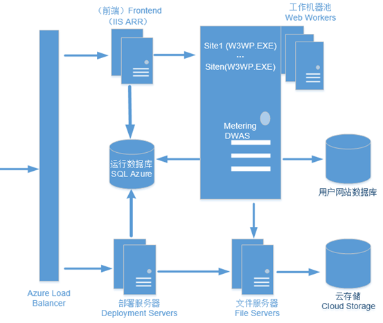
 
1.	**网站工作服务器 (Web Worker)**

	客户的网站运行在网站工作服务器。每个部署单元通常有上千台网站工作服务器。可以简单的认为一台网站工作服务器就是一台 IIS 服务器。每台服务器上可能同时运行很多客户的网站.客户也可以要求自己的网站同时运行几个实例，Azure 网站提供负载均衡服务。工作服务器上安装有运行客户网站必需的语言环境和各种框架。包括：

	* (1)	IIS
	* (2)	.Net Framework
	* (3)	PHP
	* (4)	Node.js
	* (5)	Python
	* (6)	WebDeploy/GIT
	* (7)	数据访问组件，比如 Microsoft Data Access Component 和 MySQL 的数据驱动程序

2.	**前端服务器 (Frontend)**

	前端服务器是 Azure 网站系统的入口服务器。每个部署单元通常有多台前端服务器。Azure 负载均衡设备负责把客户的请求分发到前端服务器。前端服务器上安装有扩展的 IIS Application Request Routing(ARR)。 IIS ARR 是一个工作在HTTP层的负载均衡组件，它是前端服务器的最重要的组件。建议您阅读下面的文章帮助您更好的理解前端服务器的工作原理。[http://www.iis.net/downloads/microsoft/application-request-routing](http://www.iis.net/downloads/microsoft/application-request-routing)

	前端服务器主要提供三个功能：

	* (1)	请求转发功能。将客户的请求转发到对应的工作服务器，并将工作服务器的响应转发给客户端。
	* (2)	负载均衡功能。如果客户网站有多个实例在运行，前端服务器根据配置的负载均衡算法将客户请求分发到各个网站实例。
	* (3)	分配工作服务器。当第一个请求到达时，前端服务器根据工作服务器的负载情况选择当前负载最低的工作服务器分配给客户。

3.	**部署服务器 (Publishing Server)**

	Azure 网站提供多种部署方式，比如 GIT，WebDeploy，FTP 等。只有 FTP 部署通过部署服务器完成。同时，FTP 提供了诊断日志下载功能。GIT 和WebDeploy 直接通过客户网站本身完成部署任务。

4.	**文件服务器 (File Server)**

	文件服务器通过 Azure 云存储提供文件服务，包括客户网站文件，配置文件，诊断日志和临时文件等。客户的网站文件保存在文件服务器，工作服务器通过UNC共享路径的方式访问网站文件。

5.	**运行时数据库 (Runtime Database)**

	运行时数据库存储有客户网站数据，配置等信息，同时保存客户资源使用情况。

### 3.5 Azure Web Apps 会话保持
在 [3.4 节](#section_3_4) 中，笔者已经介绍了，Azure 负载均衡设备负责把客户的请求分发到前端服务器。前端服务器上安装有扩展的 IIS Application Request Routing(ARR)。IIS ARR 默认提供 Sticky-Session 功能，保证会话的保持，实现方式是利用 Affinity Cookie。

具体参考：[https://azure.microsoft.com/en-us/blog/disabling-arrs-instance-affinity-in-windows-azure-web-sites/](https://azure.microsoft.com/en-us/blog/disabling-arrs-instance-affinity-in-windows-azure-web-sites/)

### 3.6 Azure Web Apps 文件同步
在 Azure IaaS Virtual Machine 中，VM 与 VM 之间文件是使用不同的 Azure VHD，所以 VM 与 VM 之间的同步问题需要用户自己解决。

在 Azure Web Apps 架构中，多个 Web Apps 实例是采用共享磁盘的方式 (XDrive)，所以用户无需考虑多个 Web Apps 实例之间的文件同步。

### 3.7 Azure Web Apps 如何解决大并发
我们建议使用多台 Azure Web Apps，利用横向扩展的方式来解决大量的并发。

单个节点向上扩展是有限的，这是因为受限于现有的 CPU 制造技术，我们无法将大量的计算资源都堆积到 1 台 300 Core 甚至 400 Core 的计算节点上。对于需要大量的计算资源的情况下，我们可以通过横向扩展的方法来解决。

所谓横向扩展，就是由 1 个计算节点，横向扩展到多个计算节点上并行计算，比如 50 个、100 个计算节点。比如一个互联网业务需要大量的计算资源，那可以将这些计算需求由 100 台 4 Core 的计算节点进行并行计算。

### 3.8 Azure Web Apps 单个实例大小
熟悉 Azure IaaS 平台的读者都知道，Azure 单个 Virtual Machine 计算能力分为：A 系列 (A0-A7) 和 D 系列 (D1-D14)，对应不同的 CPU 和内存的计算能力。

对于 Azure Web Apps 来说，单个计算实例分为三种不同的类型

* (1)	Small，配置为：单核心，1.75GB 内存
* (2)	Medium，配置为：双核心，3.5GB 内存
* (3)	Large，配置为：四核心，7GB 内存

<mark>如果读者开发的 Web Application，单个实例需要运行的最小计算单元大于 4Core/7GB (对应 Web Apps 单台最高配置 Large，4Core/7GB)，则这个 Web Application 不适合部署在 Azure Web Apps PaaS 平台。</mark>

### 3.9 Azure Web Apps 服务类型
Azure Web Apps 提供四种不同的服务类型，如下图：

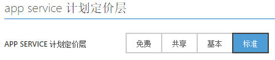
 
这四种不同的服务类型区别如下：

<table border="1">
<thead>
<tr>
<th></th>				<th>免费</th>			<th>共享</th>		<th>基本</th>				<th>标准</th>
</tr>
</thead>
<tbody>
<tr>
<td>网站</td>			<td>10</td>				<td>100</td>		<td>无限制</td>				<td>无限制</td>
</tr>
<tr>
<td>存储</td>			<td>1GB</td>			<td>1GB</td>		<td>10GB</td>				<td>50GB</td>
</tr>
<tr>
<td>出数据中心流量</td>	<td>每天最多 165MB</td>	<td>无限制</td>		<td>无限制</td>				<td>无限制</td>
</tr>
<tr>
<td>计算实例</td>		<td>共享</td>			<td>共享</td>		<td>专用</td>				<td>专用</td>
</tr>
<tr>
<td>自定义域支持</td>		<td>不支持</td>			<td>支持</td>		<td>支持</td>				<td>支持</td>
</tr>
<tr>
<td>自定义 SSL 支持</td>	<td>不支持</td>			<td>不支持</td>		<td></td>					<td>包含 5 个 SNI SSL 和 1 个 IP SSL 连接</td>
</tr>
<tr>
<td>横向扩展实例数</td>	<td>不支持</td>			<td>6 个共享实例</td>	<td>3 个专用实例</td>			<td>10 个专用实例</td>
</tr>
<tr>
<td>自动扩展</td>		<td>不支持</td>			<td>不支持</td>		<td>不支持</td>				<td>支持</td>
</tr>
<tr>
<td>服务级别</td>		<td>不支持</td>			<td>不支持</td>		<td><mark>99.9%</mark></td>	<td><mark>99.9%</mark></td>
</tr>
</tbody>
</table>

更详细的服务类型比较，请参考 Azure 官网文档：[http://www.windowsazure.cn/home/features/web-site/#price](http://www.windowsazure.cn/home/features/web-site/#price) 

这四种服务类型的区别如下：

1.	免费 (Free)

	* (1)	如果在免费 (Free) 模式下，<mark>客户的计算资源是和其他用户共享的，不是独享的</mark>。也就是说，Free Web Apps 的资源是和别的用户共享 CPU
	* (2)	一个 Azure 账户最多只能创建 10 个类型为 Free 的 Azure Web Apps
	* (3)	在 Free 模式下，一个 Azure Web Apps 每天仅有 60 分钟的 CPU 计算时间
	* (4)	在 Free 模式下，一个 Azure Web Apps 最多能使用的存储大小为 1GB
	* <mark>(5)	在 Free 模式下，Azure Web Apps 不支持横向扩展功能</mark>
	* <mark>(6)	在 Free 模式下，Azure Web Apps 是没有 SLA 保障的</mark>

2.	共享 (Shared)

	* (1)	如果在共享 (Shared) 模式下，<mark>客户的计算资源是和其他用户共享的，不是独享的</mark>。也就是说，Shared Web Apps 的资源是和别的用户共享 CPU。
	* (2)	一个 Azure 账户最多只能创建 100 个类型为 Shared 的 Azure Web Apps
	* (3)	在 Shared 模式下，一个 Azure Web Apps 最多能使用的存储大小为1GB
	* (4)	在 Shared 模式下，一个 Azure Web App 每天仅有 240 分钟的 CPU 计算时间
	* <mark>(5)	在 Shared 模式下，Azure Web Apps 支持横向扩展功能，且横向支持最多 6 个共享实例</mark>
	* <mark>(6)	在 Shared 模式下，Azure Web Apps 是没有 SLA 保障的</mark>

3.	基本 (Basic)

	* (1)	如果在基本 (Basic) 模式下，客户的计算资源是<mark>独享的</mark>
	* (2)	Basic 模式下，独享的计算资源有三种类型：Small, Medium, Large
	* (3)	一个 Azure 账户可以创建无限多个类型为 Basic 的 Azure Web Apps
	* (4)	在 Basic 模式下，一个 Azure Web Apps 最多能使用的存储大小为 10GB
	* (5)	在 Basic 模式下，Azure Web Apps 支持横向扩展功能，且横向支持最多 3 个独享的实例
	* <mark>(6)	在 Basic 模式下，Azure Web Apps 支持 99.9% 的 SLA</mark>

4.	标准 (Standard)

	* (1)	如果在标准 (Standard) 模式下，客户的计算资源是<mark>独享的</mark>
	* (2)	Standard 模式下，独享的计算资源有三种类型：Small, Medium, Large
	* (3)	一个 Azure 账户可以创建无限多个类型为 Standard 的 Azure Web Apps
	* (4)	在 Standard 模式下，一个 Azure Web Apps 最多能使用的存储大小为 50GB
	* (5)	在 Standard 模式下，Azure Web Apps 支持横向扩展功能，且横向支持最多 10 个独享的实例
	* <mark>(6)	在 Basic 模式下，Azure Web Apps 支持99.9%的 SLA</mark>

最后再强调一下，Azure Web Apps 的服务类型，只有基本和标准下，才有 SLA 保障。

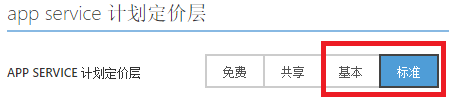
 
>[AZURE.IMPORTANT] 请注意：对于 Azure Web Apps 来说，需要把 App Service 配置为基本和标准，才能得到 99.9% 的 SLA 。但是只需要 1 个实例数就有 SLA 保障，并不需要 2 个或者 2 个以上的实例做 HA。

### 3.10 Azure Web Apps 使用静态资源
我遇到很多开发人员向我抱怨，即使 Azure Web Apps 标准 (Standard) 类型，存储只有 50GB。我的 Web 项目文件包含了很多视频内容，大概 1TB，超过 Azure Web Apps 最大 50GB 的限制，我应该怎么办？

我建议把 Web 项目文件的静态资源，比如图片、照片、视频等都保存在 Azure Storage 里，这样的好处有以下几点：

1.	加快网站部署速度

	去除掉静态资源(图片、照片、视频)的 Web 项目文件只包含了源代码信息，文件容量小了，上传速度就加快了

2.	静态资源可以直接访问 Azure Storage

	通过将静态内容请求发送到 Azure Storage，将动态内容的请求发送到 Azure 云主机，就可以大大减少云主机独享带宽的压力。

可以参考之前项目的案例分享：[http://www.cnblogs.com/threestone/p/4497625.html](http://www.cnblogs.com/threestone/p/4497625.html)

### 3.11 Azure Web Apps 公网 IP
熟悉 Azure 平台的读者都知道，Azure PaaS Cloud Service 和 Virtual Machine 都有独享的公网 IPV4 地址。

Azure Global 的 IP Rang 信息，可以参考:[http://www.microsoft.com/en-us/download/details.aspx?id=41653](http://www.microsoft.com/en-us/download/details.aspx?id=41653)

国内由世纪互联运维的 Azure China 的 IP Rang 信息，可以参考：[http://www.microsoft.com/en-us/download/details.aspx?id=42064](http://www.microsoft.com/en-us/download/details.aspx?id=42064)

但是我们在使用 Azure Web Apps 的时候，常常需要固定公网 IPV4 地址。在这种情况下，我们需要小心对待。

Azure Web Apps 是一个多租户的环境，每个部署单元有一个可以通过 Internet 访问的入口 IP (我们称之为 VIP)。

所有的网站的DNS都指向该 VIP（配置 IP SSL 除外，采用 IP SSL 可以获得单独的公网入口 IP）。客户端的所有HTTP请求都发往该 VIP，Azure 的网络设备/服务负责进行地址转换并将请求转发到 Azure 网站的前端服务器。然后，由前端服务器将 HTTP 请求转发到对应的工作服务器。

架构图同 [3.4 节](#section_3_4)，如下：

 
在不使用 IP SSL 的情况下，所有 Azure 用户的 Azure Web Apps Application 的入口公网 IP 地址 (Inbound VIP) 是共享的。

如果客户部署在 Azure 网站的 Web 应用需要调用外部的网络服务，比如 SQL Azure, MySQL，Bing MAPI API，等等。Azure 网站使用该 VIP 连接外部服务。部署在同一个部署单元的所有网站在调用外部网络服务时都使用该 VIP。随着网站数目的增加，单一的 VIP已经不能满足客户的需要。为此，我们增加了四个出口 VIP（入口 VIP 同时会作为出口 VIP）。具体信息如下。

1.	部署单元：BJB-001 (Azure 北京数据中心)

		Inbound VIP :42.159.5.43
		Outbound VIPs:
		42.159.4.73
		42.159.4.84
		42.159.4.211
		42.159.4.160

2.	部署单元：SHA-001 (Azure 上海数据中心)

		Inbound VIP: 42.159.132.179
		Outbound VIPs:
		42.159.135.109
		42.159.135.174
		42.159.135.208
		42.159.133.172

如果我们的应用程序有 IP 白名单的要求，那么就只需要把上面的部署单元的所有 VIP 加入到允许的 IP 地址列表中。

如何查看 Azure Web Apps 部署在 Azure 数据中心的信息。

比如笔者之前开发的 2 个应用程序，DNS 信息如下：

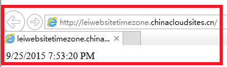
 
我们可以直接使用 ping 命令，如下：

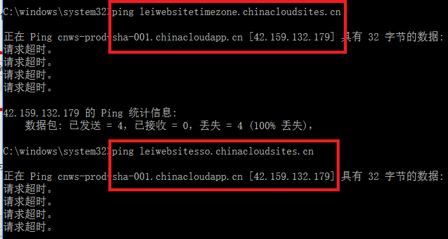
 
可以看到这 2 个 Azure Web Apps 的 Inbound VIP 都是 42.159.132.179。

根据上面的部署单元信息，可以查看到这 2 个 Azure Web Apps 是部署在上海数据中心的 SHA-001。

以上介绍的是国内由世纪互联运维的 Azure China Web Apps Inbound/Outbound VIP 信息。

如果读者使用的是国外的 Azure ([www.windowsazure.com](https://www.windowsazure.com/))，具体的 Azure Web Apps Inbound/Outbound IP 请参考下面的连接：[https://social.msdn.microsoft.com/Forums/azure/en-US/fd53afb7-14b8-41ca-bfcb-305bdeea413e/maintenance-notice-upcoming-changes-to-increase-capacity-for-outbound-network-calls?forum=windowsazurewebsitespreview](https://social.msdn.microsoft.com/Forums/azure/en-US/fd53afb7-14b8-41ca-bfcb-305bdeea413e/maintenance-notice-upcoming-changes-to-increase-capacity-for-outbound-network-calls?forum=windowsazurewebsitespreview)

### 3.12 Azure Web Apps 成本分析
Azure Web Apps 提供四种不同的服务类型：

 
1.	免费 (Free)

	* (1)	在 Free 模式下，客户的 Web Apps 是不收取费用的。但是每一个 Azure Web Apps 每天仅有60分钟的CPU计算时间。
	* (2)	在 Free 模式下，Azure Web Apps 是没有 SLA 保障的

2.	共享(Shared)

	* (1)	Shared 模式下，Azure Web Apps 支持横向扩展功能，且横向支持最多 6 个共享实例。
	* (2)	在 Shared 模式下，一个 Azure Web App 每天仅有 240 分钟的 CPU 计算时间
	* (3)	在 Shared 模式下，每一个 Web Apps 实例的标准价格是每小时￥0.15。
	* (4)	在 Shared 模式下，Azure Web Apps 是没有SLA保障的

3.	基本 (Basic) 和标准 (Standard) 收费如下：

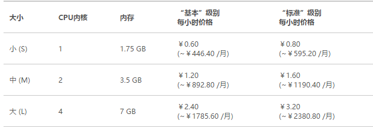

以上价格参考 Azure China 官方链接：[http://www.windowsazure.cn/home/features/web-site/#price](http://www.windowsazure.cn/home/features/web-site/#price)

* (1)	在 Basic 模式下，单个 Small, Medium, Large 的 Web Apps 实例价格分别为 0.6 元/小时，1.2 元/小时，2.4 元/小时。
* (2)	在 Basic 模式下，如果用多个实例进行横向扩展，则每小时单价会按照实例个数增加。

	比如 2 个 Web Apps Small 实例做负载均衡，每小时费用 = 0.6 元 × 2 个实例 = 1.2 元/小时

* (3)	在 Standard 模式下，单个 Small, Medium, Large 的 Web Apps 实例价格分别为 0.8 元/小时，1.6 元/小时，3.2 元/小时。
* (4)	在 Standard 模式下，如果用多个实例进行横向扩展，则每小时单价会按照实例个数增加。

	比如2个Web Apps Large实例做负载均衡，每小时费用 = 3.2 元 × 2 个实例 = 6.4 元/小时

* <mark>(5)	只有在 Basic 和 Standard 模式下，Azure Web Apps 才支持 99.9% 的 SLA</mark>

### 3.13 Azure Web Apps 停止计费(非常重要)
最后强调一下，当我们关闭Azure Web Apps的时候，还是会继续计费的。如下图：

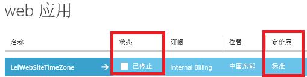

上图中，虽然 Azure Web Apps 状态变为”已停止”，但是因为定价层是”标准”，所以这个 Azure Web Apps 还是会继续计费。
为了避免继续产生费用，请将不再使用的网站实例删除，或将其更改为”免费”级别。如下图：

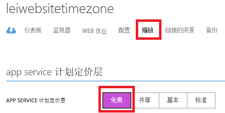
 
### 3.14 Azure Web Apps 限制
1.	单个 Web Apps 实例大小

	单个 Azure Web Apps 实例最大为 Large，配置是 4Core/7GB。如果读者开发的 Web Application，单个实例需要运行的最小计算单元大于 4Core/7GB，则这个 Web Application 不适合部署在 Azure Web Apps PaaS 平台。

2.	横向扩展能力

	在 Standard 模式下，Azure Web Apps 支持横向扩展功能，且横向支持最多 10 个独享的实例

3.	不支持安装软件

	因为无法通过 Windows Remote Desktop 或者 Linux SSH 管理 Azure Web Apps 的操作系统，所以 Azure Web Apps 不支持自定义安装软件

4.	不支持 Azure Virtual Network 虚拟网络

	在国内由世纪互联运维的 Azure China，Azure Web Apps 目前不支持加入到 Virtual Network 虚拟网络中，所以访问加入到 Virtual Network 的 Azure VM 虚拟机，必须通过 Azure VM 的公网 IP 或者 DNS 访问。为了保证安全性，还建议结合 Access Control List(ACL) 设置一起使用。

## 4. 开始创建 Azure Web Apps
### 4.1 规划好 Azure 订阅(非常重要)
订阅是进行 Azure 账单分拆的最小单位。

如果企业内部需要进行内部成本核算，例如 IT 部门、销售部门、市场部门均需要使用 Azure，并且根据不同的部门的 Azure 实际使用量进行内部成本核算，就需要实现规划好三个不同的 Azure 订阅。在创建 Azure IaaS 相关资源的时候，将这些资源创建在不同的订阅下。

笔者之前写了一篇 《Azure 企业门户管理手册》，具体请参考 [http://www.cnblogs.com/threestone/p/4627388.html](http://www.cnblogs.com/threestone/p/4627388.html)

### 4.2 选择订阅(非常重要)
我们登陆 Azure 管理界面 (http://manage.windowsazure.cn)，输入账户和密码。

点击右上角的订阅按钮，如下图:

 
### 4.3 模拟场景
Contoso 公司已经采购了 Azure China 服务，并且开发部门使用 Visual Studio 2013，开发 ASP.NET 应用程序。

在开始以下内容之前，请读者准备：

1.	Azure China 账户
2.	Visual Studio 2013

### 4.4 创建一个空的 Azure Web Apps
1.	我们登录 Azure 管理界面，地址是 [https://manage.windowsazure.cn](https://manage.windowsazure.cn)
2.	输入相应的用户名和密码
3.	点击 Azure 管理界面左下角的新建图标，如下图：

	

4.	点击计算-> Web 应用->自定义创建，如下图：

	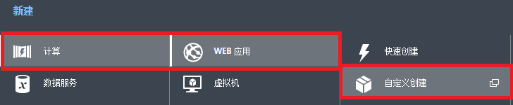

5.	在弹出的界面里，输入 Web Apps 的名称，命令为 LeiWebSite。如下图：

	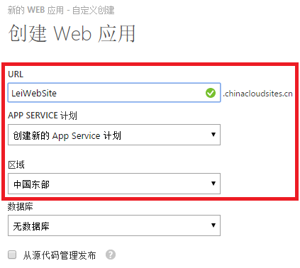

	注意上图中：
	* (1)	URL，输入我们需要的 DNS 名称
	* (2)	APP Service 计划，我们选择创建新的 App Service 计划
	* (3)	区域，我们选择中国东部的数据中心

6.	在弹出的界面里，输入 Web Apps 的名称，命令为 LeiWebSite。如下图：

	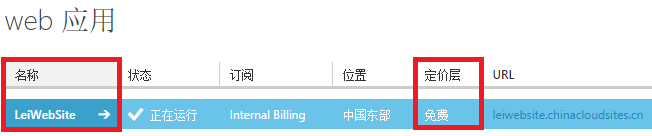

	注意上图中：
	* (1)	名称就是我们输入的DNS名称
	* (2)	定价层为免费，就是我们在服务类型中的免费 (Free) 模式

7.	然后我们在IE浏览器中输入创建成功的 Azure Web Apps DNS 地址：http://leiwebsite.chinacloudsites.cn/，就可以看到欢迎界面，如下图：

	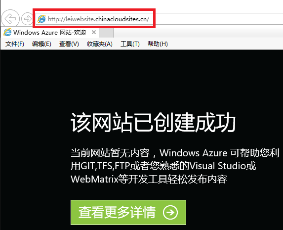

### 4.5 下载发布配置文件
1.	我们回到 Azure 管理界面：[https://manage.windowsazure.cn](https://manage.windowsazure.cn)
2.	点击之前创建的 Azure Web Apps 名称，如下图红色部分：

	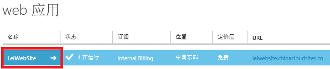

3.	页面跳转，我们点击仪表板页面，点击右下角的下载发布配置文件。如下图：

	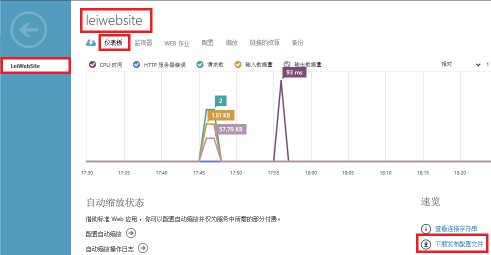

4.	把下载的文件保存在本地计算机的 D 盘。图略。

### 4.6 创建一个 Hello World 项目
在上一节中，我们创建了一个空的 Azure Web Apps。在本节中，我们在本地通过 Visual Studio 2013 创建一个 Web Application。

1.	首先我们以管理员身份，运行 Visual Studio 2013
2.	创建一个新的 Web Project，命名为 LeiWebSiteProject，如下图：

	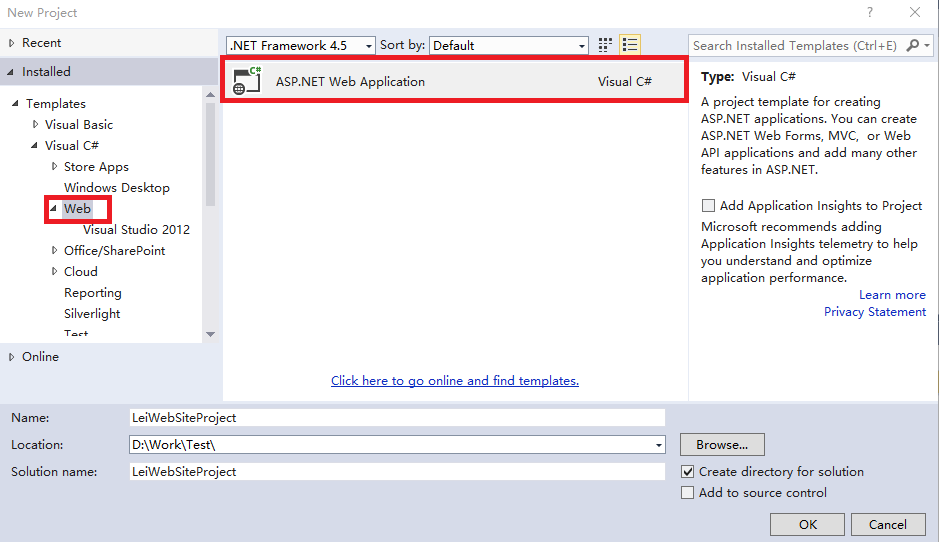

3.	选择一个 Web Application 的 Template，这里我们使用 Web Form，如下图：

	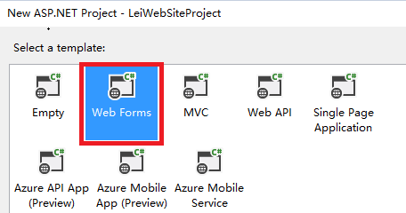

4.	修改 Project 中的 Default.aspx 页面逻辑，增加 Hello Azure Web Apps 逻辑，如下图：

	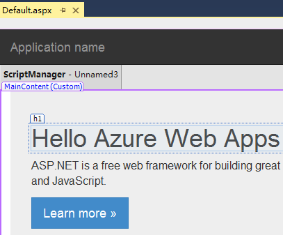

### 4.7 将网站代码通过 Visual Studio 部署
1.	我们点击 Visual Studio 2013，点击项目文件，右键 Publish。如下图：

	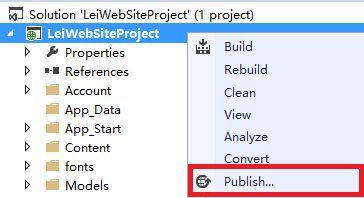

2.	在弹出的界面中，选择 Import

	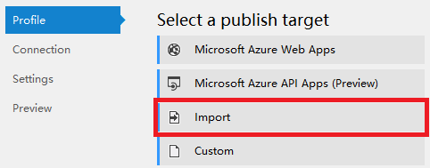

3.	在弹出的界面中，点击 Browse，选择我们在 [4.5 节](#section_4_5)中

	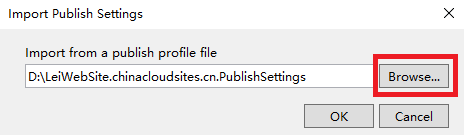

4.	选择完毕后，我们在 Setting 页面，可以选择需要发布的版本是 Debug 还是 Release，如下图：

	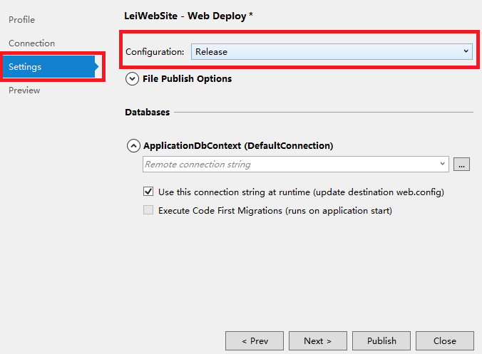

5.	最后在 Preview 页面，点击 Publish 即可。如下图：

	

6.	如果我们 Azure Web Application 最后在 Preview 页面，点击 Publish 即可。如下图：

	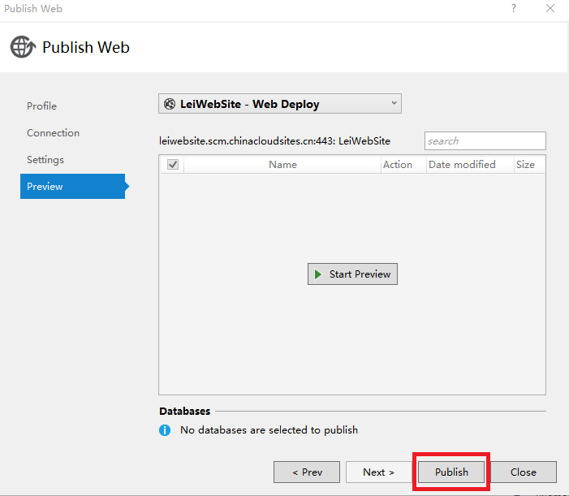

7.	等我们发布成功了以后，就可以通过访问成功的 Azure Web Apps 的 DNS 地址，如下图：

	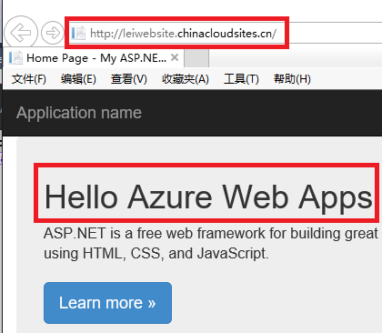

8.	Visual Studio 支持增量部署，假设我们修改某个页面内容，只需要右键 Publish，我们在步骤 "Preview" 中可以看到，系统会提示我更新的内容：

	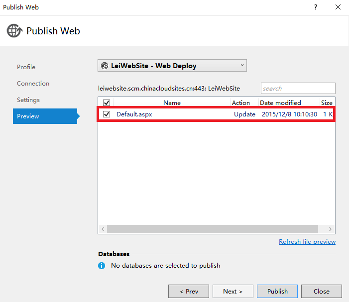

### 4.8 将网站代码通过 FTP 部署
1.	如果读者使用的是 Visual Studio，当通过以上两节内容，下载了发布配置文件并通过 Visual Studio Publish，也可以通过FTP进行发布，如下图：

	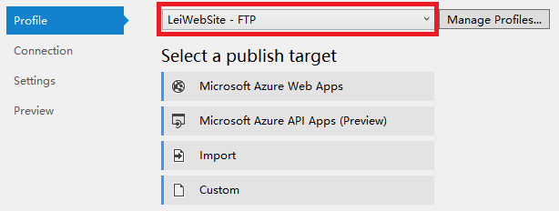

	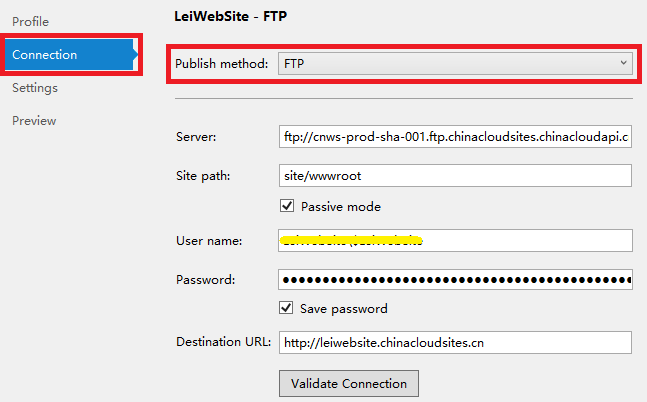

2.	笔者介绍一下通过Azure管理界面 ([https://manage.windowsazure.cn](https://manage.windowsazure.cn))，来发布 Azure Web Apps。

	我们点击创建成功的 Azure Web Apps，如下图红色区域：

	

3.	页面跳转，我们点击仪表板。如下图：

	

4.	在仪表板栏目中，点击下图中的”重置部署凭据”。如下图：

	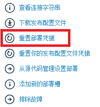

5.	在弹出的页面中，设置 FTP 的用户名和密码，如下图：

	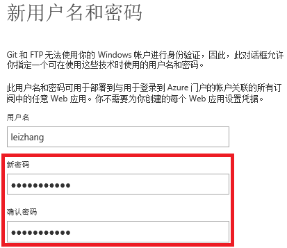

6.	重置 FTP 密码完成后，我们可以浏览到 FTP 的地址和登录名，如下图：

	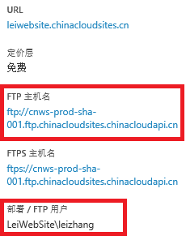

	>[AZURE.IMPORTANT] 注意：FTP 的登录名是包含 [DNS]\[UserName]
	> 虽然我在步骤 5 中设置了用户名是 leizhang，但是我们在登录 FTP 服务器的时候必须使用 LeiWebSite\leizhang

7.	打开 Windows 资源管理器，地址输入我们上图中的 FTP 主机名，用户名为 LeiWebSite\leizhang，密码为我在步骤 5 中设置的密码，如下图：

	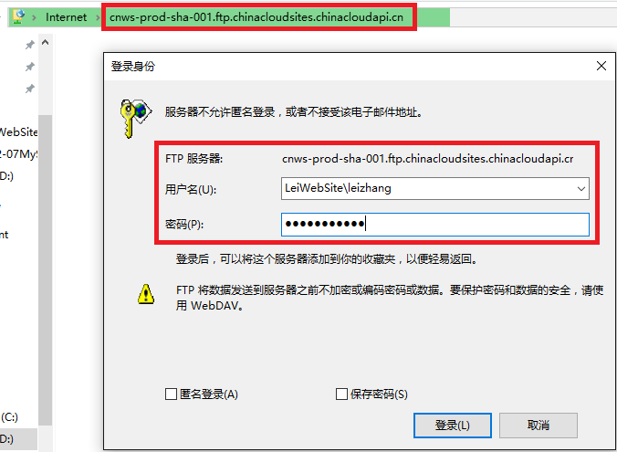

8.	登录成功后，将本地的项目文件保存到 FTP 中的 Site 目录下的 wwwroot 目录下，如下图：

	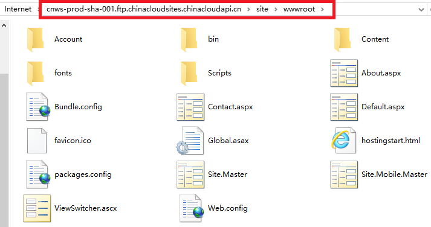

### 4.9 缩放 Azure Web Apps
#### 4.9.1 横向扩展 Azure Web Apps
在[第 3.8 节](#section_3_8)中，笔者已经介绍了 Azure Web Apps 单个实例大小，如下：

* (1)	Small，配置为：单核心，1.75GB内存
* (2)	Medium，配置为：双核心，3.5GB内存
* (3)	Large，配置为：四核心，7GB内存

在[第 3.9 节](#section_3_9)中，笔者介绍了 Azure Web Apps 提供不同的服务类型，如下图所示：

<table border="1">
<thead>
<tr>
<th></th>				<th>免费</th>	<th>共享</th>		<th>基本</th>				<th>标准</th>
</tr>
</thead>
<tbody>
<tr>
<td>横向扩展实例数</td>	<td>不支持</td>	<td>6个共享实例</td>	<td>3个专用实例</td>			<td>10 个专用实例</td>
</tr>
<tr>
<td>服务级别</td>		<td>不支持</td>	<td>不支持</td>		<td><mark>99.9%</mark></td>	<td><mark>99.9%</mark></td>
</tr>
</tbody>
</table>

1.	我们在 Azure 管理界面 https://manage.windowsazure.cn，点击缩放:

	

2.	我们点击 App Service 计划定价层，如下图。如果我们想把 Web Apps 设置为<mark>共享模式</mark>，并且有 6 个共享实例做横向扩展，请按照下图设置：

	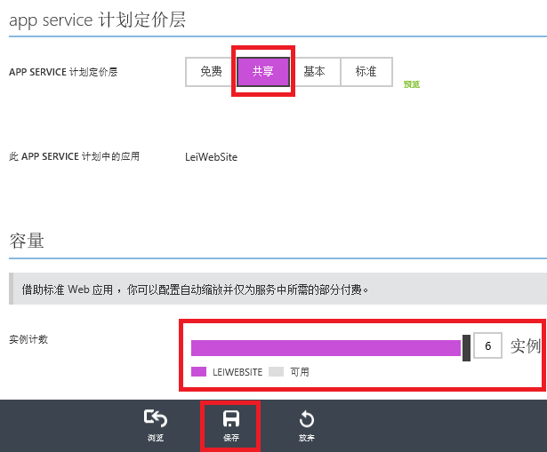

3.	如果我们想把 Web Apps 设置为<mark>基本模式</mark>，并且有 3 个基本实例做横向扩展，每个实例配置为 1Core/1.75GB，请按照下图设置：

	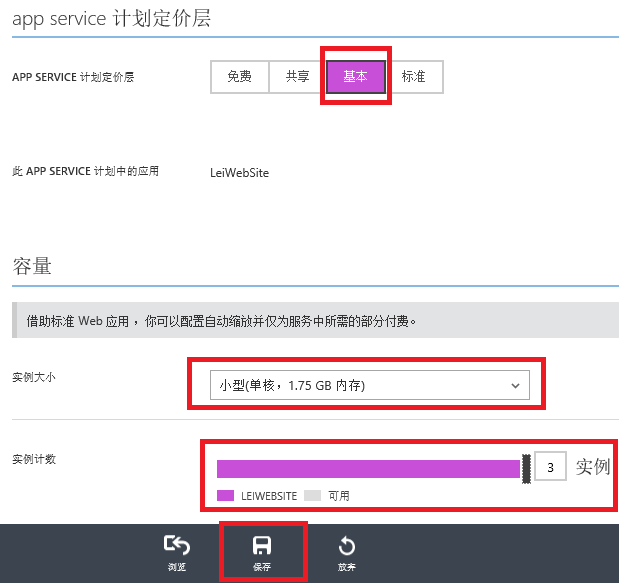

4.	如果我们想把 Web Apps 设置为<mark>标准模式</mark>，并且有 10 个标准实例做横向扩展，每个实例配置为 2Core/3.5GB，请按照下图设置：

	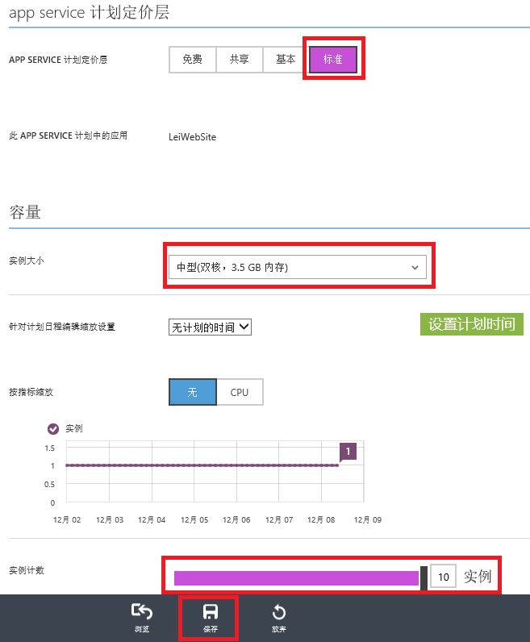

>[AZURE.NOTE] 请注意，本节中我们横向扩展的 Azure Web Apps，是按照固定的实例个数，24*7 静态响应客户端请求的。

#### 4.9.2 动态缩放 Azure Web Apps
微软 Azure 云计算还具有弹性扩展的优势，在访问量比较高的情况下，我们可以设置若干多台 Azure Web Apps 做负载均衡；在访问量比较低的情况下，我们可以减少 Azure Web Apps 的并发数量。

>[AZURE.NOTE] 注意，只有在 Azure Web Apps 标准模式下，才支持自动扩展功能。

我们假设一个场景，比如某个部署在 Azure Web Apps 的企业官网，访问量是固定的。

* (1)	在周 1-5 的工作日中，访问高峰期时间是 8:00:-23:00，我们横向扩展 10 台 2Core/3.5GB 的 Azure Web Apps 做负载均衡
* (2)	在周 1-5 的工作日中，访问低谷期时间 23:00-8:00，我们横向缩小为 2 台 2Core/3.5GB 的 Azure Web Apps 做负载均衡
* (3)	在<mark>周末全天</mark>是访问的高峰期，我们横向扩展 10 台 2Core/3.5GB 的 Azure Web Apps 做负载均衡

 

1.	首先我们点击 Azure Web Apps 的缩放选项，设置计划定价层为标准，然后点击设置计划时间，如下图：

	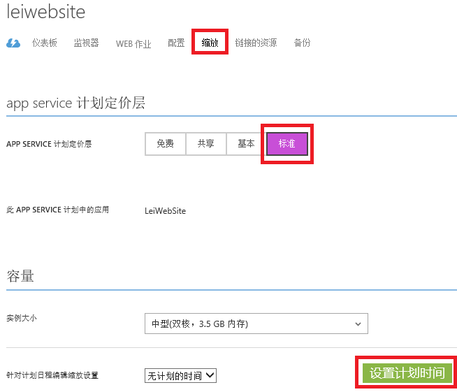

2.	在弹出的窗口中，进行如下设置：

	* (1)	勾选”日夜的缩放设置不同”和”工作日和周末的缩放设置不同”
	* (2)	设置开始时间和结束时间，8:00AM 和 11:00PM
	* (3)	时区使用默认的 UTC+8 时区

	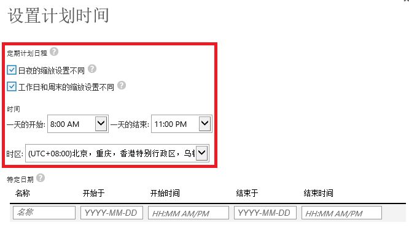

	设置完毕后请保存。

3.	先设置工作日白天的动态缩放策略，如下图：

	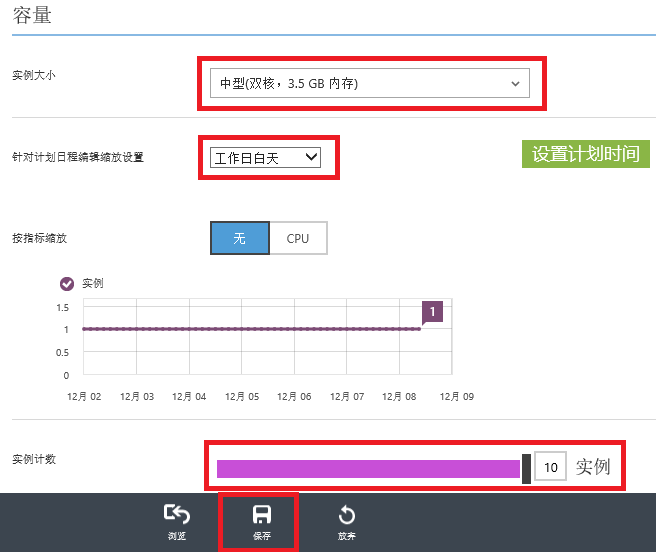

	**在周 1-5 的工作白天(之前定义的访问高峰时间 8:00:-23:00)，我们横向扩展 10 台 2Core/3.5GB 的 Azure Web Apps 做负载均衡**

4.	再设置工作日夜间的动态缩放策略，如下图：

	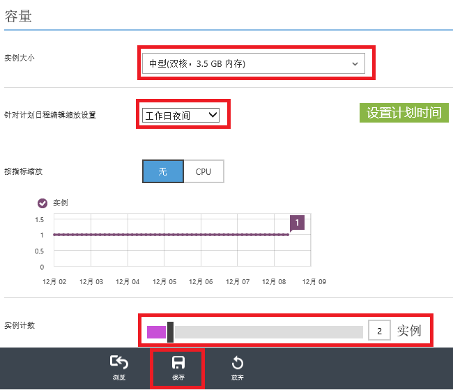

	**在周 1-5 的工作夜间(之前定义的访问低谷时间 23:00:-8:00 )，我们横向扩展 2 台 2Core/3.5GB 的 Azure Web Apps 做负载均衡**

5.	最后设置双休日的动态缩放策略，如下图：

	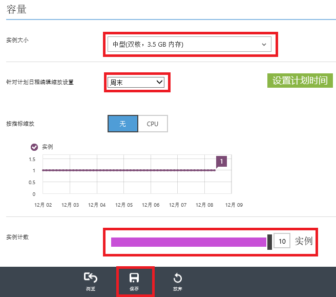

	**在周末全天，我们横向扩展 10 台 2Core/3.5GB 的 Azure Web Apps 做负载均衡。**

### 4.10 配置 Azure Web Apps
1.	我们还可以对于 Azure Web Apps 进行配置，如下图：

	

2.	配置 Web Apps 的运行环境，如下图：

	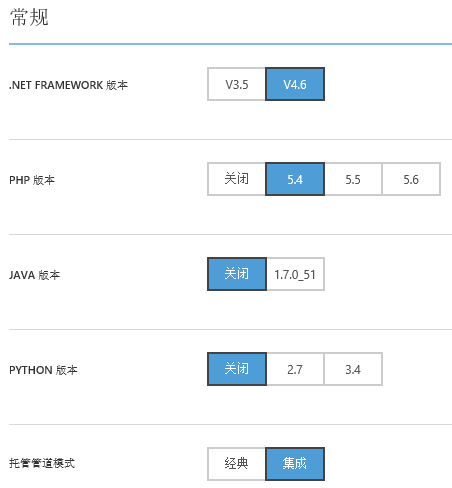

3.	配置默认页面：

	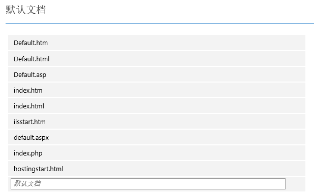

4.	配置虚拟目录：

	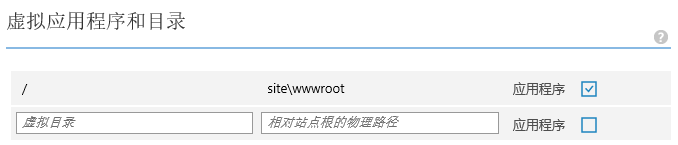

### 4.11 监控 Azure Web Apps
1.	我们点击监视器，如下图：

	

2.	我们可以显示过去 1 小时、24 小时、7 天内的 Azure Web Apps 监控指标

	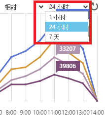

3.	或者根据需要，增加监控指标内容。如下图：

	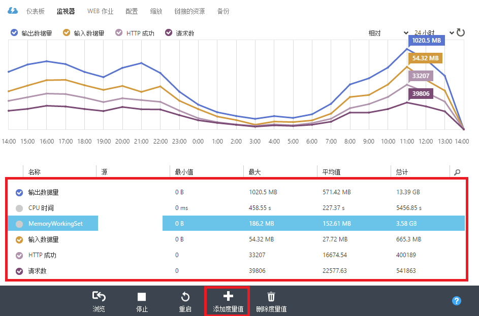

4.	注意，上图中关于 CPU 的监控指标是 CPU Time，而不是一般情况下的 CPU 利用率 (CPU Usage)。这是因为对于”免费”和”共享”级别，分别包括每天 60 分钟和 240 分钟的 CPU Time。

## 5. 高级内容
### 5.1 使用源代码管理器管理 Azure Web Apps
假设客户开发使用源代码管理器来管理项目代码，那如何通过 Azure Web Apps 来发布呢？这里我简单介绍一下。

为了之前的项目做区分，我们创建一个新的 Azure Web Apps，命名为 LeiWebSiteGit，DNS 地址为 http://leiwebsitegit.chinacloudsites.cn

1.	我们点击仪表板，详细信息，如下图：

	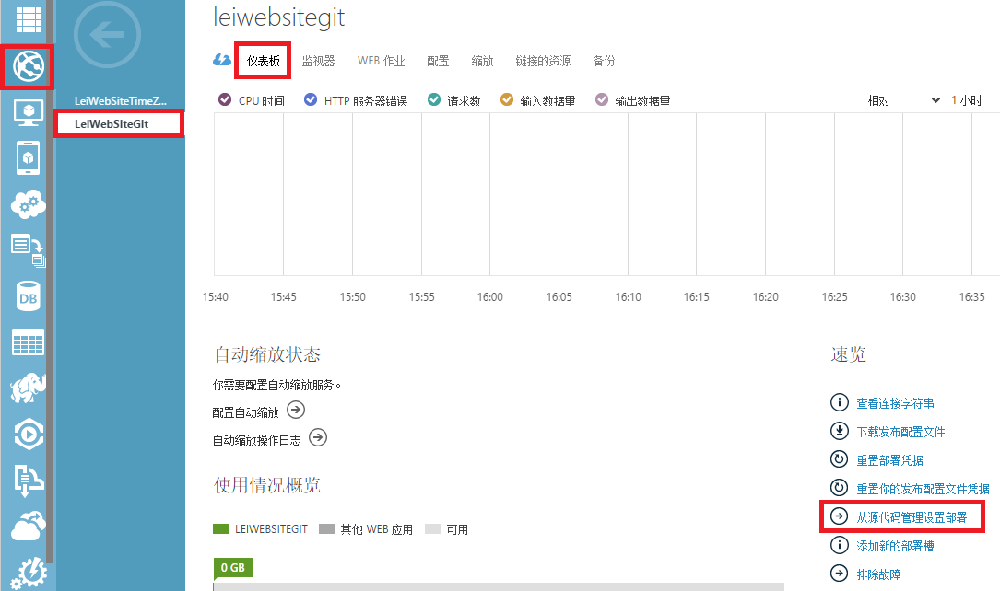

2.	在弹出的窗口中，根据需要选择本地 Git 或者外部 Git，如下图：

	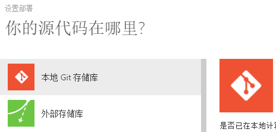

3.	我们选择上图的本地 Git 存储，等待页面刷新。然后点击部署：

	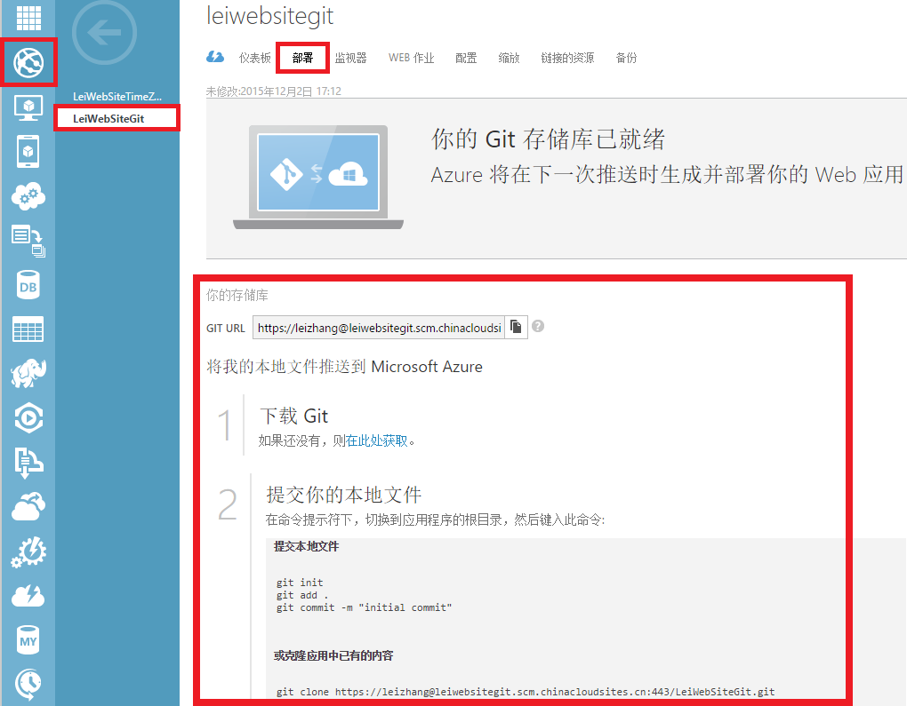

	上图红色区域，我们就可以在本地Git把代码库部署到 Azure Web Apps

4.	或者我们从外部 Git 来部署，如下图：

	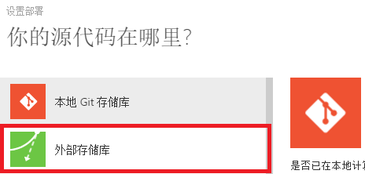

5.	最后设置 GitHub 的 URL，如下图：

	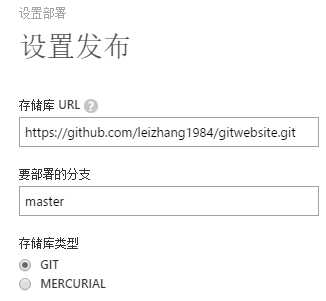

### 5.2 修改 Azure Web Apps 时区
1.	默认情况下，Azure Web Apps 默认的系统时间是 UTC 时区。

	比如我们在本地使用 Visual Studio 2013 创建 Web Apps 项目，在 Default.aspx.cs输入以下代码：

		Label1.Text = DateTime.Now.ToString();

	我们部署到 Azure Web Apps 之后，显示的是 UTC 时区。如下图：

	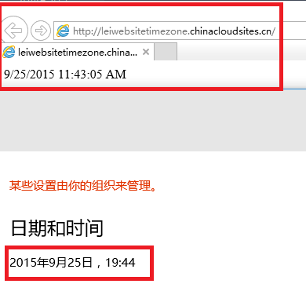

2.	其实我们可以通过 Web Apps 配置页面，来设置 Web Apps 的当前时间，如下图：

	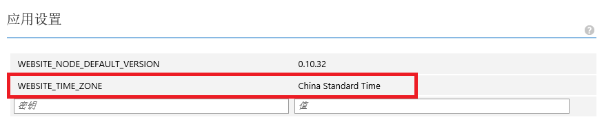

	设置 WEBSITE_TIME_ZONE，值设置为 China Standard Time。

	这样显示的系统时间就为 UTC+8 时区，如下图：

	

### 5.3 PHP 开发者必读
因为之前做项目经常遇到 PHP 开发人员，这里也简单介绍一下。

#### 5.3.1 在 Azure Web Apps 配置 PHP
在很多情况下，我们需要在 Azure Web Apps 里配置 PHP，例如：

* (1)	更改内置 PHP 版本
* (2)	在默认 PHP 运行时中启用扩展
* (3)	使用自定义 PHP 运行时

具体请参考：[http://www.windowsazure.cn/zh-cn/documentation/articles/web-sites-php-configure](http://www.windowsazure.cn/zh-cn/documentation/articles/web-sites-php-configure)

#### 5.3.2 PHP 使用 Azure Storage
在[第 3.10 节](#section_3_10)中，笔者建议把 Web 项目文件的静态资源，比如图片、照片、视频等都保存在 Azure Storage 里。

有关 PHP 使用 Azure Storage 的详细内容，请参考：[http://www.windowsazure.cn/zh-cn/documentation/articles/storage-php-how-to-use-blobs](http://www.windowsazure.cn/zh-cn/documentation/articles/storage-php-how-to-use-blobs)

### 5.4 Java 开发者必读
#### 5.4.1 Azure Web Apps Java 运行环境基本配置
1.	登入 Azure 的管理 portal，创建一个测试的 website 应用 myjavasite, 如下所示：

	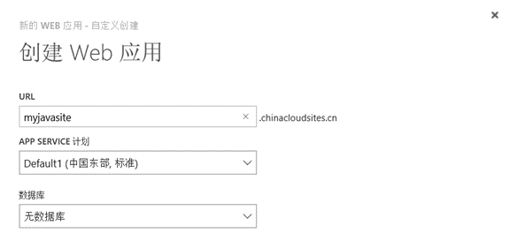

2.	进入你创建的站点 myjavasite，选择"仪表板"，因为后续我们主要通过 FTP 方式来更新网站，所以需要重置一下部署密码，选择右下角"重置部署凭据"，设置你的部署密码并牢记：

	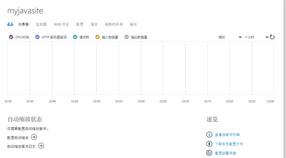

3.	选择"配置"界面，我们来配置 Java 运行环境，默认情况下 PHP 运行环境是打开的，但我们测试 Java 不需要，选择关闭；Java 版本我们选择 1.7.0_51, Tomcat 选择 7.0.50，目前这些版本是在 Azure 站点上提供的也是唯一的版本：

	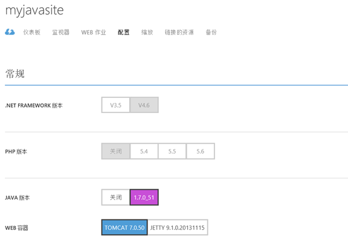

4.	最后平台部分，请选择 64 位，32 位平台对于 JVM 大小会有 2GB 限制，所以并不推荐，正常情况下选择选择 64 位。

	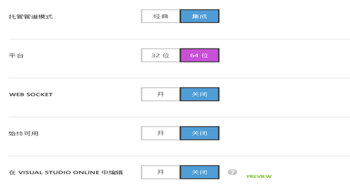

5.	Azure 的网站也支持用户自定义 SSL，可以上传自己的 pfx 文件并进行设置，也支持自定义域名，可以通过 cName 将你的域名指向 Azure 的网站，在此不再详述：

	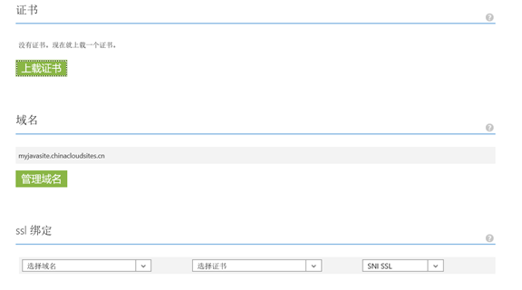

6.	可以在界面上配置您的网站的默认 welcome 文件，即在默认情况下 /site/wwwroot 下哪个文件为 welcome 文件，并且你可以添加，修改默认文档的名字和搜索顺序，设置完成点击保存配置：

	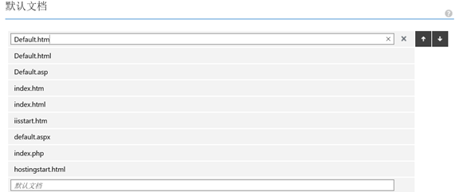

7.	回到"仪表板"界面，在右下角可以看到你的 website 的 URL，上传文件的 FTP 地址，FTP 的用户名密码，点击你的站点 URL，可以看到默认的主页，代表你的网站是配置创建成功的：

	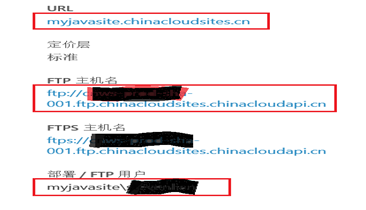

	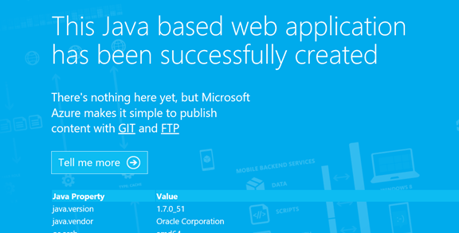

#### 5.4.2 Azure Web Apps 发布 Java Web 应用
在 Azure 站点上发布 Java Web 应用非常简单，可以使用 git 从源代码发布，也可以使用 FTP/FTPs 直接发布，本节介绍 FTP 方式。

1.	准备好你的 Java web app 的 war 包，在本例中，使用 Eclipse 的导出功能，在你的项目上单击右键，选择 "Export"，将你的项目按照提示导出为 war 包

	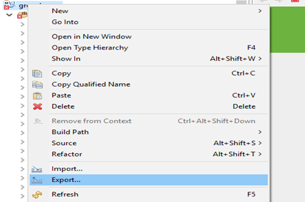

	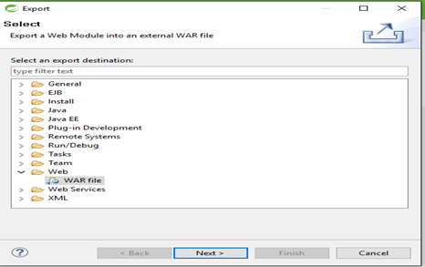

	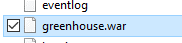

2.	选择一个合适的 FTP 工具，在本例中，使用免费的开源工具 FileZilla，下载并安装：[https://filezilla-project.org/](https://filezilla-project.org/)

3.	登录 Azure 的管理主页，在你的网站的"仪表板"界面，可以找到需要上传到你的 web 网站的 FTP 地址，用户名，密码是你在教程 1 中设置的部署密码：

	

4.	使用 FileZilla 连接到你的 web 站点，进入到根目录 /site/wwwroot 下，你会看到有一个 webapps 目录，如果你做过 Tomcat 上 web 应用的部署，那么这个 webapps 目录就是 tomcat webapps 的目录，进入 webapps 目录然后将你的 WAR 包上传到该目录：

	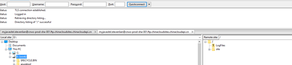

	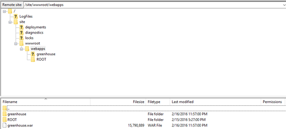

5.	WAR 包上传完成后，稍等几分钟，完成部署，然后使用你的 WEB 站点的 URL，加上你的 web 应用的 context，例如我的应用是 greenhouse，那么我的访问站点就是我的 URL+/greenhouse：

	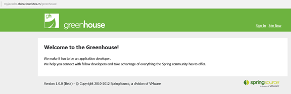

6.	到此为止，你会看到你的应用成功部署，并已经正确运行。

#### 5.4.3 定制化 Azure Web App 提供的默认的 Tomcat 和 JDK 环境
在我们之前的测试中，如果你访问你的 WEB 站点 URL 时不加任何上下文，实际上你看到的 web 界面是系统自带的测试页面 index.jsp,位于/ site/wwwroot/webapps/ROOT 目录下，是 Tomcat 默认的根目录。

1.	由于要检测 JVM 的 usage 信息以便确定，定制化修改的 Java 参数是否生效，所以我们需要写一些测试代码，打印出当前 JVM 的参数信息;首先使用 FileZilla 连接到你的网站，进入到 /site/wwwroot/webapps/ROOT 目录下，下载 index.jsp 文件到本地。
2.	我写了一个简单的测试程序，测试 Java 运行时 heap size 大小，使用 ManagmentBeans 获得的 JVM 参数，已经上传到了 github，请直接下载，或者你也可以打开 index.jsp 文件添加相关代码如下：[https://github.com/kingliantop/azurelabs/blob/master/Java/websites/index.jsp](https://github.com/kingliantop/azurelabs/blob/master/Java/websites/index.jsp)

		 1 <%@ page import="java.lang.management.*" %>
		 2 
		 3 <%
		 4 
		 5 ArrayList<String> mainPageProps = new ArrayList<String>();
		 6 
		 7 ……
		 8 
		 9      ……
		10 
		11 int MB=1024*1024;
		12 
		13 Runtime runtime = Runtime.getRuntime();
		14 
		15 out.print("<tr><td>Runtime Total memory:</td><td>" + runtime.totalMemory()/MB+"M</td></tr>");
		16 
		17 out.print("<tr><td>Runtime Free memory:</td><td>" + runtime.freeMemory()/MB+"M</td></tr>");
		18 
		19 out.print("<tr><td>Runtime Used memory:</td><td>" + (runtime.totalMemory() - runtime.freeMemory())/MB+"M</td></tr>");
		20 
		21 out.print("<tr><td>Runtime Max memory:</td><td>" + runtime.maxMemory()/MB+"M</td></tr>");
		22 
		23                 
		24 
		25 Iterator iter = ManagementFactory.getMemoryPoolMXBeans().iterator();
		26 
		27                 
		28 
		29 out.print("<tr><td><h3>Memory MXBean</h3></td></tr>");
		30 
		31 out.print("<tr><td>Heap Memory Usage:</td><td>" + ManagementFactory.getMemoryMXBean().getHeapMemoryUsage()+"</td></tr>");
		32 
		33 out.print("<tr><td>Non-Heap Memory Usage:</td><td>" + ManagementFactory.getMemoryMXBean().getNonHeapMemoryUsage()+"</td></tr>");
		34 
		35 out.print("<tr><td><h3>Memory Pool MXBeans</h3></td></tr>");
		36 
		37                     
		38 
		39 while (iter.hasNext()) {
		40 
		41     MemoryPoolMXBean item = (MemoryPoolMXBean) iter.next();
		42 
		43     out.print("<tr><td><b>"+item.getName()+"</b></td></tr>");
		44 
		45     out.print("<tr><td>Type:</td><td>" + item.getType()+"</td></tr>");
		46 
		47     out.print("<tr><td>Usage:</td><td>" + item.getUsage()+"</td></tr>");
		48 
		49     out.print("<tr><td>Peak Usage:</td><td>" + item.getPeakUsage()+"</td></tr>");
		50 
		51     out.print("<tr><td>Collection Usage:</td><td>" + item.getCollectionUsage()+"</td></tr>");
		52 
		53                 }
		54 
		55 %>    

3.	上传修改后的 index.jsp 文件到 ROOT 目录下，覆盖原来的文件，重新打开你的 web 站点主页，你可以看到测试程序会打印出当前运行环境下内存大小，heap size，non-heap size 大小等相关信息

	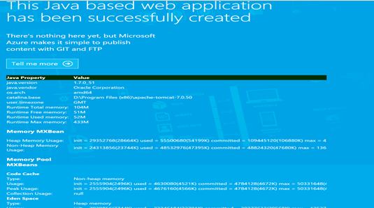

4.	我们可以看到默认运行环境下，初始 Heap 大小为 28664K，已经使用大约 54M，最大内容使用量是 433M，而当前测试环境使用的网站实例大小为小型，大约是一个 core，1.75G 内存：

	

	对于 PermGen 大小，初始大小为：

		init = 22020096(21504K) used = 41871616(40890K) committed = 41943040(40960K) max = 85983232(83968K)

5.	做个简单的实验，我们将 web 站点的实例升级，看看 Azure web app 是否会自动根据当前系统实例的大小来调整 JVM 相关参数，在"缩放"页面，我们将实例升级到中型实例，点击保存：

	

	这个时候你会看到默认的 heap size 也发生了变化：

	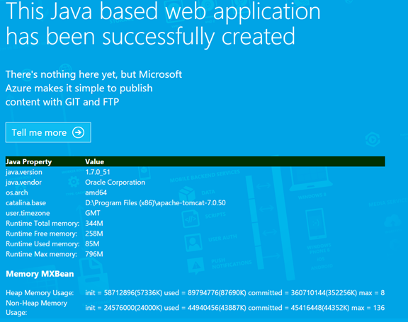

	那么 Azure 是如何调整 Tomcat 的运行环境和配置的呢？这样动态的调整是如何做到的呢？

	其实没有什么 magic，Azure 的 website 底层是 Windows Server，采用 IIS 来对其他第三方的服务器例如 Tomcat 进行管理。 IIS 有一个管理模块，叫做 HttpPlatformHandler，他会做这么几件事情：

	* (1)	所有以前直接处理 Http 请求的第三方应用服务器，如 Tomcat，Jetty，Node.JS 等等，HTTP 请求都交由 IIS 来进行接受。
	* (2)	由 IIS 接管的请求，都会被转发至后台真正处理的服务器，比如 Tomcat 等等，作用类似于 Nginx，apache http
	* (3)	管理第三方程序，启动第三方程序，设定启动参数，定制化相应环境等等，所有这些操作都通过一个叫做 web.config 的文件来配置实现。

	那么经由上述介绍你可以知道，在 Azure web app 这个 PAAS 平台上，如果我们需要做些定制化环境部署，需要使用这个机制，由 HttpPlatformHandler 通过 web.config 配置文件来实现。

	在本测试场景中，我们假定用户需要修改默认运行环境下的 heap size 和 PermGen 的大小，因为在常见的 Java 应用错误中，出现的 OutOfMemory 错误，有些就是由于 PermGen 大小设置过小引起的。

6.	首先我们需要准备一个 web.config 文件，在本示例中我们使用 Azure 站点提供的 Tomcat 和 JDK，我们需要配置的相关参数 -Xms512m -Xmx1024m -XX:PermSize=128m -XX:MaxPermSize=256m 放在 JAVA_OPTS 下：

		 1 <?xml version="1.0" encoding="UTF-8"?>
		 2 
		 3 <configuration>
		 4 
		 5 <system.webServer>
		 6 
		 7 <handlers>
		 8 
		 9 <add name="httpPlatformHandler" path="*" verb="*" modules="httpPlatformHandler" resourceType="Unspecified" />
		10 
		11 </handlers>
		12 
		13 <httpPlatform processPath="%AZURE_TOMCAT7_HOME%\bin\startup.bat"
		14 
		15 arguments="">
		16 
		17 <environmentVariables>
		18 
		19 <environmentVariable name="CATALINA_OPTS" value="-Dport.http=%HTTP_PLATFORM_PORT%" />
		20 
		21 <environmentVariable name="JAVA_OPTS" value="-Djava.net.preferIPv4Stack=true -Xms256m -Xmx1024m -XX:PermSize=128m -XX:MaxPermSize=256m" />
		22 
		23 </environmentVariables>
		24 
		25 </httpPlatform>
		26 
		27 </system.webServer>
		28 
		29 </configuration> 

	注意事项：

	* 默认的系统的 tomcat 路径是 "%AZURE_TOMCAT7_HOME%\bin\startup.bat"，需要注意正确设置
	* Java 相关的参数设置放在 JAVA_OPTS 里面如 -Xms，-Xmx 等

7.	我们先来记录一下，默认设置下的 Heap size，PermGen 等大小设置,刷新测试页面，可以看到：

	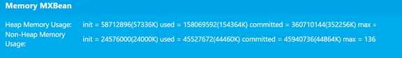

	<pre><code>Heap Size：Heap Memory Usage:    init = 58712896(<mark>57336K</mark>) used = 150252200(<mark>146730K</mark>) committed = 360710144(352256K) max = 835190784(<mark>815616K</mark>)</code></pre>

	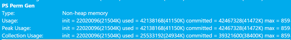

	<pre><code>Perm Gen：
	Usage:    init = 22020096(<mark>21504K</mark>) used = 42138168(<mark>41150K</mark>) committed = 42467328(41472K) max = 85983232(<mark>83968K</mark>)</code></pre>

8.	使用你的 FTP 工具，将 web.config 文件上传到你的 Azure 站点根目录 /site/wwwroot：

	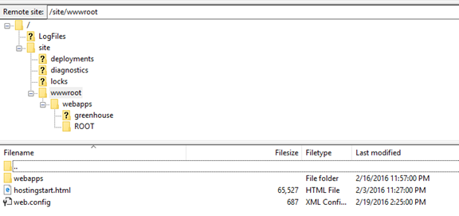

9.	重新刷新页面，你会看到相关 JVM 参数值已经发生了变化：

	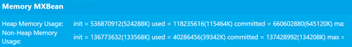

	<pre><code>Heap Memory Usage:    init = 536870912(<mark>524288K</mark>) used = 118235616(<mark>115464K</mark>) committed = 660602880(645120K) max = 954728448(<mark>932352K</mark>)</code></pre>

	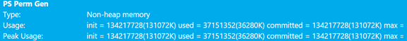

	<pre><code>Usage:    init = 134217728(<mark>131072K</mark>) used = 37151352(<mark>36280K</mark>) committed = 134217728(131072K) max = 268435456(<mark>262144K</mark>)</code></pre>

10.	可以看到，通过 web.config 和 HttpPlatformHandler 机制，可以对 Azure 的站点进行定制。

#### 5.4.4 定制化使用您自己的 Tomcat 版本和 JDK 环境
在上面章节中，介绍了如何通过 web.config，定制默认的 Azure web app 的 Java 运行环境，默认情况下，Azure 站点的 Tomcat 是 7.0.50，Java 版本是 1.7.0_51，但用户自己测试开发或者生产环境的 Tomcat 和 Java 版本有可能是更高版本的，那么在 Azure Web App 上是否可以深度定制化，使用用户自己的 Tomcat 和 Java 呢？

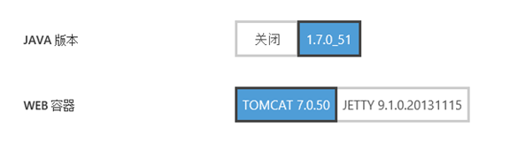

在本节中，我会介绍下在 Azure web app 的 PAAS 服务中，你如何深度定制使用你自己版本的 Tomcat，JDK，设置相关参数。

1.	首先在你的本地安装或者下载 JDK，此过程凡是有 Java开发经验的开发者应该已经可以闭着着眼睛做了吧：）我安装在 C 盘，使用的 Java 版本是 1.8.0_60 如下：

	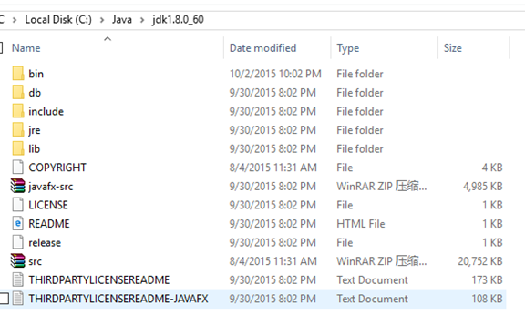

2.	使用你的 FTP 工具连接到你的 web 站点，在根目录下建一个 bin 子目录，并将你的本地 JDK 目录下的所有文件，包括 JDK 目录上传到 bin 目录下，上传完的目录结构如下：

	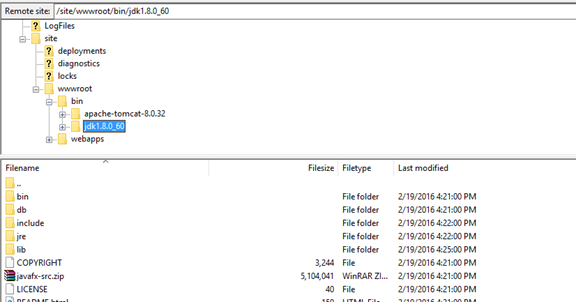

3.	JDK 上传完毕后，在 Apache 官网下载 Tomcat，由于 Azure 使用的是 Tomcat7.0.50，在本测试中，我们下载 Tomcat 8.0，解压缩到本地：

	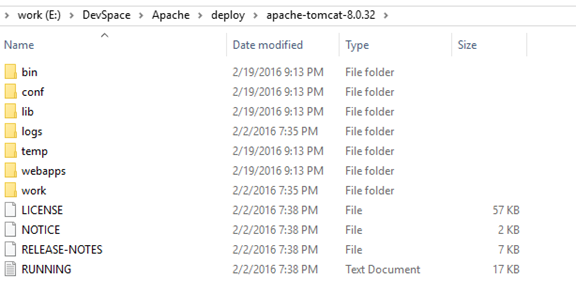

4.	在 Azure 的 website PAAS 服务中，你所定制化使用的 Tomcat 实际上是放到了一个托管环境，所以在你上传之前，需要做一些定制化修改，请打开本地你的 Tomcat 的 conf 目录下 server.xml 文件，打开进行编辑。

	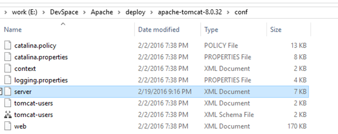

5.	找到 Server，Shutdown 这一行，将 port 的值改为 "-1"，如下图所示：

	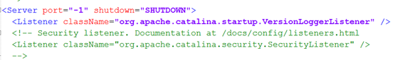

6.	找到 Connector port 这一行，将 port 值修改为 "${port.http}"

	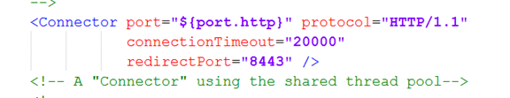

7.	注释掉 https，AJP 段：

	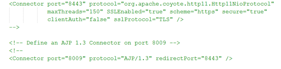

8.	打开当前目录下 web.xml，设置 <listings\>参数为 true:

	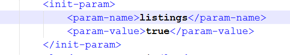

9.	打开当前目录下的 context.xml 文件，设置 context 的 reloadable 参数为"true"：

	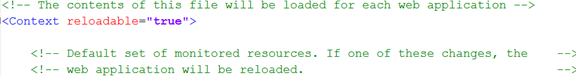

10.	保存并退出，然后使用 FTP 工具，将 Tomcat 所有文件上传到根目录的 bin 目录下，如下图所示：

	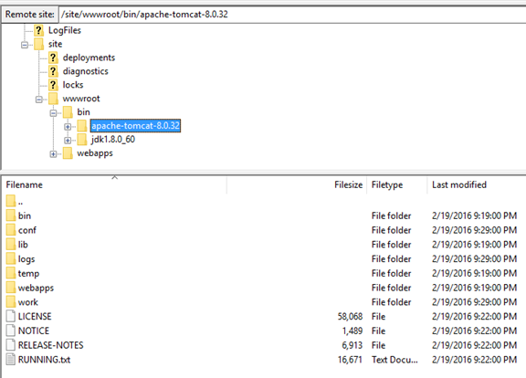

11.	最后我们需要创建自己的定制化的 web.config 文件，打开你的编辑器，将下面我下好的 web.config 文件内容拷贝粘贴，如果你的 JDK、tomcat 有所不同，请修改相关路径,你也可以直接从我的 github 直接下载：[https://github.com/kingliantop/azurelabs/blob/master/Java/websites/indepth/web.config](https://github.com/kingliantop/azurelabs/blob/master/Java/websites/indepth/web.config)

		 1 <?xml version="1.0" encoding="UTF-8"?>
		 2 
		 3 <configuration>
		 4 
		 5 <system.webServer>
		 6 
		 7 <handlers>
		 8 
		 9 <add name="httpPlatformHandler" path="*" verb="*" modules="httpPlatformHandler" resourceType="Unspecified" />
		10 
		11 </handlers>
		12 
		13 <httpPlatform processPath="%HOME%\site\wwwroot\bin\apache-tomcat-8.0.32\bin\startup.bat"
		14 
		15 arguments="">
		16 
		17 <environmentVariables>
		18 
		19 <environmentVariable name="CATALINA_OPTS" value="-Dport.http=%HTTP_PLATFORM_PORT%" />
		20 
		21 <environmentVariable name="CATALINA_HOME" value="%HOME%\site\wwwroot\bin\apache-tomcat-8.0.32" />
		22 
		23 <environmentVariable name="JRE_HOME" value="%HOME%\site\wwwroot\bin\jdk1.8.0_60" /> <environmentVariable name="JAVA_OPTS" value="-Djava.net.preferIPv4Stack=true -Dsun.java2d.d3d=false -Xms512m -Xmx1024m -XX:PermSize=128m -XX:MaxPermSize=256m" />
		24 
		25 </environmentVariables>
		26 
		27 </httpPlatform>
		28 
		29 </system.webServer>
		30 
		31 </configuration>

12.	最后一步，将 web.config 文件上传到你的 web 站点的根目录：

	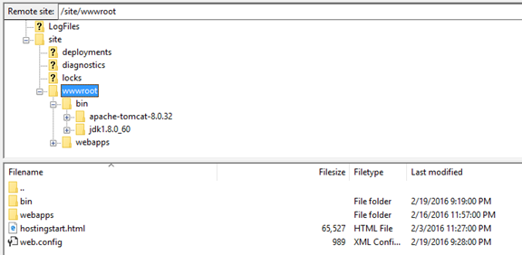

13.	这个时候 Tomcat 服务器会重启，PAAS 环境会重新部署，大约等 1 分钟左右，打开你的 website 站点，你会看到：

	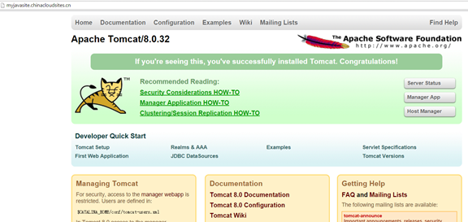

	证明你的 website 站点的确已经开始使用你自己的 Tomcat 8.0 作为容器了，但为什么显示的页面不是我们之前可以看到 Heap size 的页面呢？这是因为你部署了自己的 tomcat 后，工作目录变成了你的 tomcat 8 下面的 webapps 目录。

14.	打开 FTP 工具，连接到你的站点，上传之前修改过的 index.jsp 到 Tomcat 8 的 webapps 目录下的 ROOT 下：

	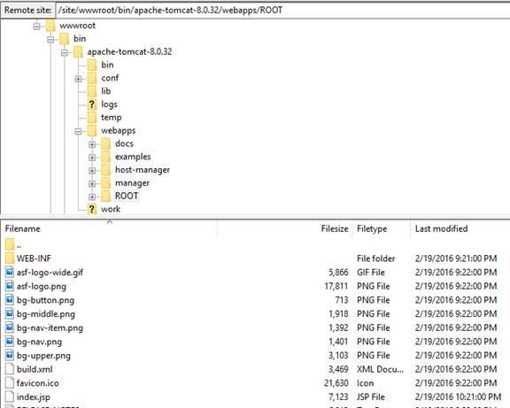

15.	打开你的 web 站点主页，可以看到显示的已经是我们之前修改过的 index.jsp 页面了，从页面可以看出，Java 使用的是我们定制的 Java 8，而 Tomcat 是我们定制的 Tomcat 8，深度定制化生效了：

	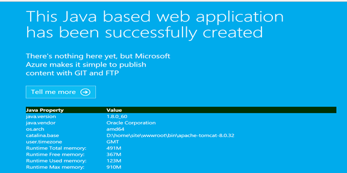

#### 5.4.5 Java 8 下PermGen 及参数设置
在上一章节中，我们定制化使用了 Java 8 环境，使用我们的测试页面打印出了 JVM 基本参数，但如果我们自己观察，会发现在 MXBeans 中，没有出现 PermGen 的使用数据，初始大小等信息，即使我们已经设置了大小：

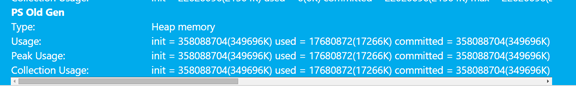

在 Java 7 及以前版本中，PermGen 主要存放加载的类和元数据信息，如果设置过小，类加载失败，可能会出现 OutOfMemory 的经典错误，在 Azure web app 里面的 Java 开发中，碰到的客户定制化设置的问题也会涉及到 PermGen 的大小定制化。

那么在 Java 8 里面，PermGen 去哪了呢？

我们可以先来看一下 JVM 的内存模型，JVM 的内存分为 Heap memory 和 Non-Heap memory，Heap memory 主要会存放一些 Java Object 对象信息，而 non-heap memory 如 PermGen 主要会存放一些加载的 Java classes 和元数据信息。

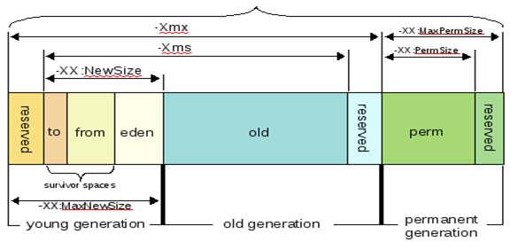

在 Java 8 之前的 Java 版本当中，Heap size 可以通过 MS, MX 进行大小设置，而 PermGen 可以通过 PermSize, MaxPerm 在 Java option 中进行大小设置。之前的 JVM 的一个明显问题是，你在启动的时候设置了 XX:MaxPermSize，那么一旦在运行过程中加载的类超过了这个大小限制，你就会马上碰到那个著名的 OOM（out of memory）错误，当然这种设计除了会出现 OOM，也会有无法动态调整，很难调优等缺点，也会导致一系列的 bug 和性能问题，例如：[http://bugs.java.com/view_bug.do?bug_id=6962931](http://bugs.java.com/view_bug.do?bug_id=6962931)

因此上，在 Java 8 的设计中，Oracle 和 Java 社区放弃了 PermGen 设置，从此之后不再有 PermGen 这样一个东西，但是元数据依然是需要保存的，所以在 Java 8 中，元数据移到了本地内存中，叫 Metaspace 的地方。

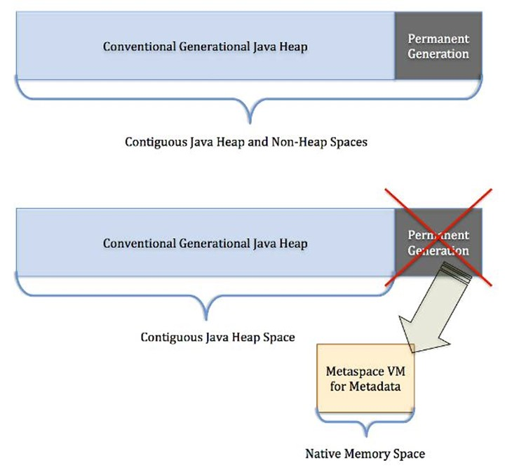

那么对于最终用户来讲有什么变化呢？你不会因为 PermGen 碰到 OOM 的问题，因为你所有的有效系统内存都可以做 Metaspace 了，所以你不需要单独设置 metaspace，在一个 64 位系统的机器中，默认的 Metaspace 初始大小是 21MB，那么最大呢？理论上如果你的元数据真的非常多，加载的类也很多，理论上最大可以用光你所有的有效系统内存。

那么有没有办法设置或者限制 Metaspace 的大小呢？可以，Java 提供了两个参数来让你在必要的情况下设置 Metaspace 的大小：

- XX:MetaspaceSize：64 微系统默认 21MB，你可以设置大一些避免频繁的 full GC
- XX:MaxMetaspaceSize：理论上大小没有限制，但你可以设置一个限制值

回到我们的 Azure web app 的 Java OPTS 的设置上，在 Java 8 的环境里面 PermSize 已经无用了，所以 web.config 中设置可简化为：

### 5.5 Azure Web Apps备份
我们在使用 Azure Web Apps 的时候，经常会遇到需要对 Web Apps 进行备份的情况。在这里笔者简单介绍一下相关的内容。

在本章中，我们准备的环境相对复杂一点，我们需要准备以下内容：

1.	部署一个新的 Azure Web Apps，并且配置为标准模式

	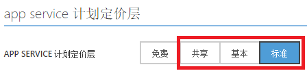

2.	创建一个新的 PaaS SQL Azure (现在改名叫 Azure SQL Database，但是笔者还是习惯老的 SQL Azure)。步骤略。截图如下：

	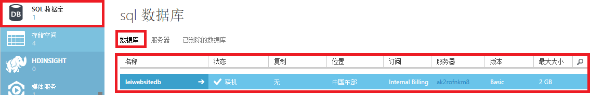

3.	在 Web Apps 里配置页面设置，如下图：

	

	增加 SQL Azure 的连接字符串，如下图：

	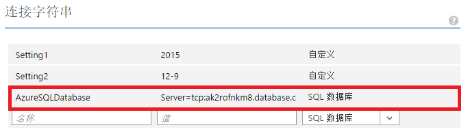

4.	创建一个空的存储账号 leiwebsitestorage，将来备份的 Web Apps 源代码和 SQL Azure bacpac 文件都会保存到这个存储账号里。
5.	这样我们准备好了 Azure Web Apps 和其对应的 SQL Azure 的连接字符串了。
6.	Azure Web Apps 在备份的时候，不仅仅备份了 Azure Web Apps 的项目文件，同时也会备份连接字符串对应的 SQL Azure 数据库服务。

接下来开始本章的内容：

1.	我们点击 Web Apps 的备份页面，如下图：

	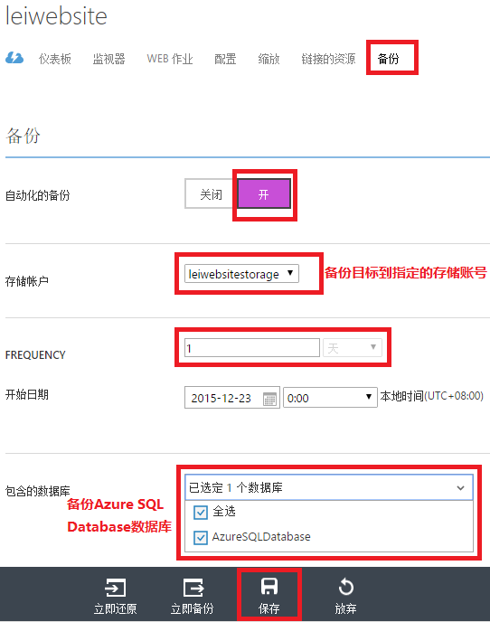

	上图中，我们设置了：
	* (1)	自动化备份 Azure Web Apps
	* (2)	备份的目标存储账户为 leiwebsitestorage
	* (3)	备份周期为每天
	* (4)	同时备份 Azure SQL Database 数据库
	* (5)	最后执行保存操作

2.	设置完毕后，我们可以点击上图的保存，或者立刻备份

	备份完毕后，我们可以在 leiwebsitestorage 这个存储账号里。

	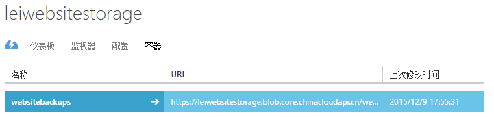

	点击上图中的 websitebackups，页面跳转

	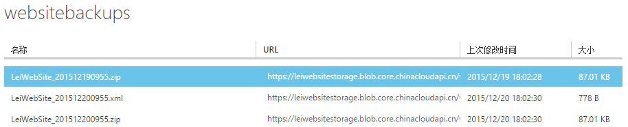

	上图中，LeiWebSite_201512200955.xml 描述了备份的内容，我们可以下载查看一下：

	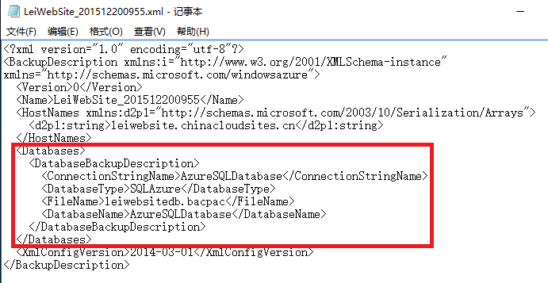

	上图的红色部分描述了备份 SQL Azure Database 的内容，leiwebsitedb.bacpac 就是备份的数据库信息

	我们还可以下载 zip 压缩包看看：

	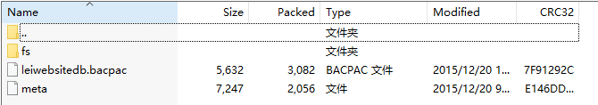

	上图中，既包含了 Azure Web Apps 的源代码，又包含了 SQL Azure Database 的数据库备份文件 leiwebsitedb.bacpac

3.	备份完毕后，我们还可以对 Web Apps 进行还原

	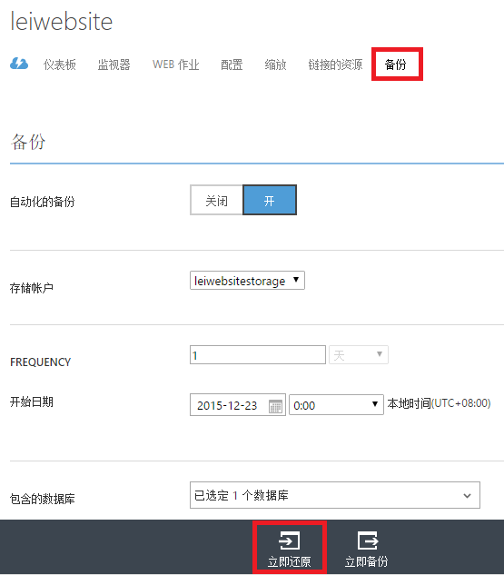

	选择需要的还原点即可，如下图：

	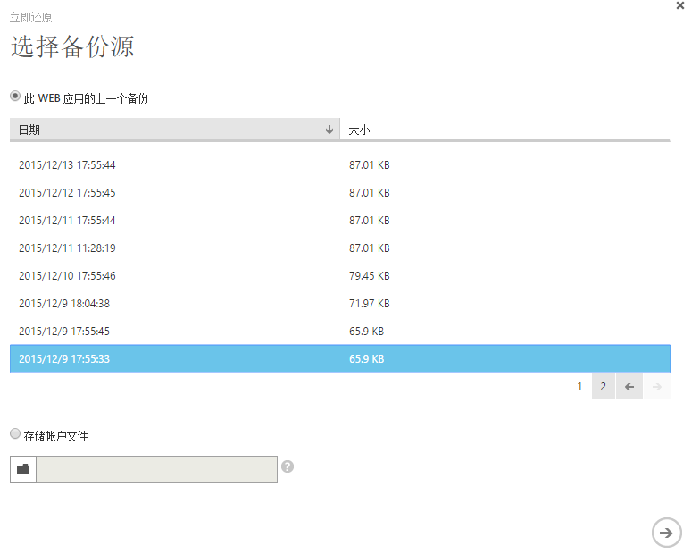

### 5.6 Azure Web Apps 设置 CNAME 解析
1.	我们在 Azure Web Apps 创建的新的 Web Apps，默认的 DNS 名称为 http://[xxxxxx].chinacloudsites.cn，这个 DNS 的根域名是世纪互联备案过的，如果客户只使用这个根域名，是不需要备案的。不过一般情况下，客户不会用微软 Azure 默认的 DNS 地址对外提供服务。

2.	如果客户不想使用 Azure 默认提供的 DNS 地址 http://[xxxxxx].chinacloudsites.cn，想使用自己的二级域名 (e.g. http://azure.contoso.com.cn) 做 A 记录(或者 CNAME )解析到 Azure 的公网 IP 地址，则需要用户把自己的域名所在的根域名 (e.g. contoso.com) 进行 ICP 备案。用户可以通过各种域名备案组织/代理，对自己的根域名 (contoso.com) 进行注册（国内的国外的），但如果指向了在国内的 IP 地址，就必须到工信部进行备案。

3.	如果客户的根域名 (contoso.com.cn) 在没有备案的情况下，做了 A 记录解析到 Azure 的公网 IP 上，(即 http://azure.contoso.com.cn 的 A 记录，指向到微软 Azure 的公网 IP 43.159.xxx.xxx)。

	<mark>工信部在进行审查的时候，这个根域名没有进行备案</mark>

	<mark>这时候工信部会要求世纪互联关停这个公网 IP 对应的 Azure 上的 Web App，会对客户的应用产生影响</mark>

在开始本节内容之前，请先确认：

* <mark>(1)	客户的根域名必须经过 ICP 备案</mark>
* <mark>(2)	客户拥有根域名或者一个二级域名，假设是 www.contoso.com.cn </mark>
* <mark>(3)	客户的 DNS 供应商也一起参与</mark>

我们本节实现的目标是：客户部署在 Azure Web Apps 上的网站 (http://contosowebapp.chinacloudsites.cn)，使用自己备案过的DNS地址。

1.	首先我们在缩放页面，把 Azure Web Apps 设置为<mark>共享、基本或者标准。这有这三种才支持自定义域名，</mark>如下图：

	

2.	让客户的 DNS 供应商创建 DNS 记录。比如，创建从 www.contoso.com.cn 指向到 Azure 云端的 http://contosowebapp.chinacloudsites.cn 的 CNAME 资源记录。

3.	选择 Azure Web Apps 配置页面，如下图：

	

4.	点击管理域名，如下图：

	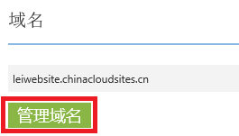

5.	在弹出的窗口中，输入用户已经经过 ICP 备案的根域名或者二级域名，如下图：

	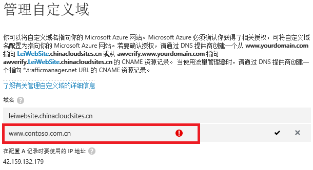

6.	<mark>在上图中，会发现增加完自定义域名之后，会有红色感叹号。考虑到 DNS 同步会有延迟，以笔者的经验来看，需要不停尝试以等待验证通过。</mark>

7.	验证通过后，上面的红色感叹号就会变成绿色图标，这就表示设置成功了。然后我们就可以通过用户的自定义域名 http://www.contoso.com.cn，来访问 Azure Web Apps 上的服务了。

## 6. 注意事项
1.	默认情况下，我们在创建的 Azure 服务，默认使用的 DNS 地址为: http://xxx.chinacloudapi.cn，这个 DNS 的根域名是世纪互联备案过的，如果客户只使用这个根域名，是不需要备案的

	不过一般情况下，客户不会用微软 Azure 默认的 DNS 地址对外提供服务

2.	如果客户不想使用 Azure 默认提供的 DNS 地址 http://[xxxxxx].chinacloudsites.cn，想使用自己的二级域名 (e.g. http://azure.contoso.com.cn) 做 A 记录解析到 Azure 的公网 IP 地址，则需要用户把自己的域名所在的根域名 (e.g. contoso.com.cn) 进行 ICP 备案。用户可以通过各种域名备案组织/代理，对自己的根域名 (contoso.com) 进行注册（国内的国外的）。

	<mark>但如果指向国内 Azure 的 IP 地址，需要用户到世纪互联备案网站 (<a href="http://icp.cloud.21vianet.com/">http://icp.cloud.21vianet.com/</a>) 提交备案信息</mark>

3.	如果客户的根域名 (contoso.com.cn) 在没有备案的情况下，做了 A 记录解析到 Azure 的公网 IP 上，(即 http://azure.contoso.com.cn 的 A 记录，指向到微软 Azure 的公网 IP 43.192.xxx.xxx)

	<mark>工信部在进行审查的时候，如果根域名没有进行备案，会要求世纪互联尽快关闭该网站。</mark>

	<mark>世纪互联目前的流程是，先通知用户在规定时间内按要求对网站进行关闭。如用户不能在规定时间内按要求完成，或世纪互联无法联系到用户时，会采取暂停用户部署或订阅服务。</mark>

4.	如果客户之前在 IDC 托管机房，或者其他网络接入商(如万网等)注册过顶级域名 (contoso.com.cn)，且该域名指向的公网IP地址不在微软 Azure 云平台。

	现在需要将 IP 指向到微软 Azure 云平台，根据现有的备案要求，需要用户到世纪互联提交备案信息，做新增接入操作。具体请联系世纪互联。

