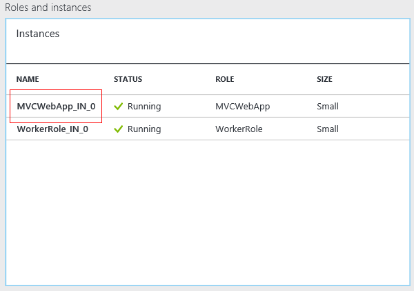
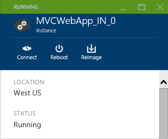
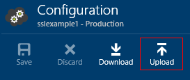

<properties 
	pageTitle="How to configure a cloud service (preview portal) | Windows Azure" 
	description="Learn how to configure cloud services in Azure. Learn to update the cloud service configuration and configure remote access to role instances. These examples use the Azure preview portal." 
	services="cloud-services" 
	documentationCenter="" 
	authors="Thraka" 
	manager="timlt" 
	editor=""/>

<tags 
	ms.service="cloud-services" 
	ms.date="09/22/2015"
	wacn.date=""/>

# How to Configure Cloud Services

> [AZURE.SELECTOR]
- [Azure Portal](/documentation/articles/cloud-services-how-to-configure)
- [Azure Portal](/documentation/articles/cloud-services-how-to-configure-portal)

You can configure the most commonly used settings for a cloud service in the Azure Management Portal. Or, if you like to update your configuration files directly, download a service configuration file to update, and then upload the updated file and update the cloud service with the configuration changes. Either way, the configuration updates are pushed out to all role instances.

You can also enable a Remote Desktop connection to one or all roles running in your cloud service.  Remote Desktop allows you to access the desktop of your application while it is running and troubleshoot and diagnose problems.  You can enable a Remote Desktop connection to your role even if you did not configure the service definition file (.csdef) for Remote Desktop during application development.  There is no need to redeploy your application in order to enable a Remote Desktop connection.

Azure can only ensure 99.95 percent service availability during the configuration updates if you have at least two role instances for every role. That enables one virtual machine to process client requests while the other is being updated. For more information, see [Service Level Agreements](http://azure.microsoft.com/support/legal/sla/).

## Change a cloud service

1. In the [Azure Portal](https://manage.windowsazure.cn), navigate to your cloud service.

2. Click on the **Settings** icon or the **Essentials/All settings** link to open up the **Settings** blade.

    
    
    From here you can view the **Properties**, change the **Configuration**, manage the **Certificates**, and manage the **Users** who have access to this cloud service.

3. Under the **Monitoring** section you can click on any tile to configure alerts. 

    
    
4. Under the **Roles and instances** section you can click on any cloud service role to manage the instance.

    
    
    You can remotely connect to, reboot, or reimage the cloud service from here.
    
    

>[AZURE.NOTE]
>The operating system used for the cloud service cannot be changed using the **Azure Portal**, you can only change this setting through the [Azure Portal](https://manage.windowsazure.cn). This is detailed [here](cloud-services-how-to-configure.md#update-a-cloud-service-configuration-file).

## Update a cloud service configuration file

1. First, download the existing cloud service configuration file (.cscfg).

    1. In the [Azure Portal](https://manage.windowsazure.cn), navigate to your cloud service.

    2. Click on the **Settings** icon or the **Essentials/All settings** link to open up the **Settings** blade.

        
    
    3. Click on the **Configuration** item.

        
    
    4. Click on the **Download** button.

        

2. After you update the service configuration file, upload and apply the configuration updates:

    1. Follow the first 3 steps from above to open up the **Configuration** blade for the cloud service.
    
    2. Click on the **Upload** button.

         
    
    3. Select the .cscfg file and click **OK**.

## Configure remote access to role instances

Remote access cannot be configured using the **Azure Preview Portal**, you can only change this setting through the [non-preview portal](http://manage.windowsazure.cn/). This is described [here](/documentation/articles/cloud-services-role-enable-remote-desktop).
			
## Next steps

* Learn how to [deploy a cloud service](/documentation/articles/cloud-services-how-to-create-deploy-portal).
* Configure a [custom domain name](/documentation/articles/cloud-services-custom-domain-name-portal).
* [Manage your cloud service](/documentation/articles/cloud-services-how-to-manage-portal).
* Configure [ssl certificates](/documentation/articles/cloud-services-configure-ssl-certificate-portal).