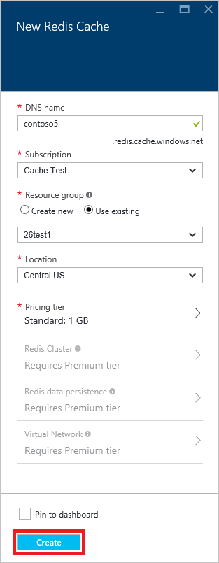

<properties
   pageTitle="How to use Azure Redis Cache with Java | Azure"
	description="Get started with Azure Redis Cache using Java"
	services="redis-cache"
	documentationCenter=""
	authors="steved0x"
	manager="douge"
	editor=""/>

<tags
	ms.service="cache"
	ms.date="05/31/2016"
	wacn.date=""/>

# How to use Azure Redis Cache with Java

> [AZURE.SELECTOR]
- [.NET](/documentation/articles/cache-dotnet-how-to-use-azure-redis-cache/)
- [ASP.NET](/documentation/articles/cache-web-app-howto/)
- [Node.js](/documentation/articles/cache-nodejs-get-started/)
- [Java](/documentation/articles/cache-java-get-started/)
- [Python](/documentation/articles/cache-python-get-started/)

Azure Redis Cache gives you access to a dedicated Redis cache, managed by Microsoft. Your cache is accessible from any application within Azure.

This topic shows you how to get started with Azure Redis Cache using Java.

## Prerequisites

[Jedis](https://github.com/xetorthio/jedis) - Java client for Redis

This tutorial uses Jedis, but you can use any Java client listed at [http://redis.io/clients](http://redis.io/clients).

## Create a Redis cache on Azure

To create a cache, first sign in to the [Azure Portal](https://portal.azure.cn), and click **New**, **Data + Storage**, **Redis Cache**.

>[AZURE.NOTE] If you don't have an Azure account, you can [Open an Azure account for free](/pricing/1rmb-trial/?WT.mc_id=redis_cache_hero) in just a couple of minutes.

>[AZURE.NOTE] In addition to creating caches in the Azure Portal, you can also create them using ARM templates, PowerShell, or Azure CLI.
>
>-	To create a cache using ARM templates, see [Create a Redis cache using a template](/documentation/articles/cache-redis-cache-arm-provision/).
>-	To create a cache using Azure PowerShell, see [Manage Azure Redis Cache with Azure PowerShell](/documentation/articles/cache-howto-manage-redis-cache-powershell/).
>-	To create a cache using Azure CLI, see [How to create and manage Azure Redis Cache using the Azure Command-Line Interface (Azure CLI)](/documentation/articles/cache-manage-cli/).

In the **New Redis Cache** blade, specify the desired configuration for the cache.

 

-	In **Dns name**, enter a cache name to use for the cache endpoint. The cache name must be a string between 1 and 63 characters and contain only numbers, letters, and the `-` character. The cache name cannot start or end with the `-` character, and consecutive `-` characters are not valid.
-	For **Subscription**, select the Azure subscription that you want to use for the cache. If your account has only one subscription, it will be automatically selected and the **Subscription** drop-down will not be displayed.
-	In **Resource group**, select or create a resource group for your cache. For more information, see [Using Resource groups to manage your Azure resources](/documentation/articles/resource-group-overview). 
-	Use **Location** to specify the geographic location in which your cache is hosted. For the best performance, Microsoft strongly recommends that you create the cache in the same region as the cache client application.
-	Use **Pricing Tier** to select the desired cache size and features.
-	**Redis cluster** allows you to create caches larger than 53 GB and to shard data across multiple Redis nodes. For more information, see [How to configure clustering for a Premium Azure Redis Cache](/documentation/articles/cache-how-to-premium-clustering/).
-	**Redis persistence** offers the ability to persist your cache to an Azure Storage account. For instructions on configuring persistence, see [How to configure persistence for a Premium Azure Redis Cache](/documentation/articles/cache-how-to-premium-persistence/).
-	**Virtual Network** provides enhanced security and isolation by restricting access to your cache to only those clients within the specified Azure Virtual Network. You can use all the features of VNet such as subnets, access control policies, and other features to further restrict access to Redis. For more information, see [How to configure Virtual Network support for a Premium Azure Redis Cache](/documentation/articles/cache-how-to-premium-vnet/).

Once the new cache options are configured, click **Create**. It can take a few minutes for the cache to be created. To check the status, you can monitor the progress on the startboard. After the cache has been created, your new cache has a **Running** status and is ready for use with default settings.

## Retrieve the host name and access keys

To connect to an Azure Redis Cache instance, cache clients need the host name, ports, and keys of the cache. Some clients may refer to these items by slightly different names. To retrieve these items, [browse](/documentation/articles/cache-configure/#configure-redis-cache-settings) to your cache in the [Azure portal](https://portal.azure.cn) and click **Settings** or **All settings**.

### Host name and ports

To access the host name and ports click **Properties**.

### Access keys

To retrieve the access keys, click **Access keys**.

## Enable the non-SSL endpoint

Some Redis clients don't support SSL, and by default the [non-SSL port is disabled for new Azure Redis Cache instances](/documentation/articles/cache-configure/#access-ports). At the time of this writing, the [Jedis](https://github.com/xetorthio/jedis) client doesn't support SSL. 

To enable the non-SSL port, [browse](/documentation/articles/cache-configure/#configure-redis-cache-settings) to your cache in the [Azure portal](https://portal.azure.cn) and click **Settings > Access Ports**. Click **No** to enable the non-SSL port, and click **Save**.

## Add something to the cache and retrieve it

	package com.mycompany.app;
	import redis.clients.jedis.Jedis;
	import redis.clients.jedis.JedisShardInfo;

	/* Make sure you turn on non-SSL port in Azure Redis using the Configuration section in the Azure Portal */
	public class App
	{
	  public static void main( String[] args )
	  {
        /* In this line, replace <name> with your cache name: */
	    JedisShardInfo shardInfo = new JedisShardInfo("<name>.redis.cache.chinacloudapi.cn", 6379);
	    shardInfo.setPassword("<key>"); /* Use your access key. */
	    Jedis jedis = new Jedis(shardInfo);
     	jedis.set("foo", "bar");
     	String value = jedis.get("foo");
	  }
	}

## Next steps

- [Enable cache diagnostics](https://msdn.microsoft.com/zh-cn/library/azure/dn763945.aspx#EnableDiagnostics) so you can [monitor](https://msdn.microsoft.com/zh-cn/library/azure/dn763945.aspx) the health of your cache.
- Read the official [Redis documentation](http://redis.io/documentation).

