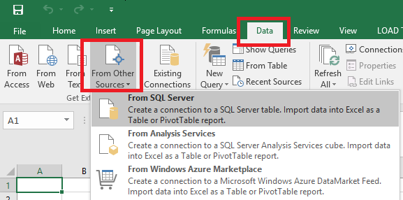

<properties
	pageTitle="Connect to an Azure SQL Database with Excel"
	description="Excel spreadsheet to Azure SQL Database for reporting and data exploration."
	services="sql-database"
	documentationCenter=""
	authors="joseidz"
	manager="jeffreyg"
	editor="jeffreyg"/>

<tags
	ms.service="sql-database"
	ms.date="10/09/2015"
	wacn.date=""/>

# Connect to an Azure SQL database with Excel

> [AZURE.SELECTOR]
- [C#](/documentation/articles/sql-database-connect-query)
- [SSMS](/documentation/articles/sql-database-connect-query-ssms)
- [Excel](/documentation/articles/sql-database-connect-excel)

This article shows you how to connect Excel to an Azure SQL database and create a report over the data in the database. You'll need a SQL database first. If you don't have one, see [Create your first SQL database](sql-database-get-started.md) to get a database with sample data up and running in a few minutes. This article is based on the sample data from that article, but you can follow similar steps on your own data.

You'll also need a copy of Excel. This article uses [Microsoft Excel 2016](https://products.office.com/en-US/).

## Connect and create a report

1.	Open Excel and then create a new workbook or open the workbook you want to connect.

2.	In the menu bar at the top of the page click **Data**, click **From Other Sources**, and then click **From SQL Server**.
	
	

	The Data Connection Wizard opens.

3.	In the **Connect to Database Server** dialog box, type the **Server name** that hosts the logical server you want to connect to in the form **<*servername*>.database.windows.net**. For example, **adventureserver.database.windows.net**.

4.	In the **Log on Credentials** section, click **Use the following User Name and Password**, type the **User Name** and **Password** you set up for the SQL Database server when you created it, and then click **Next**.

	> [AZURE.TIP] Both [PowerPivot](https://www.microsoft.com/download/details.aspx?id=102) and [Power Query](https://www.microsoft.com/download/details.aspx?id=39379) add-ins for Excel have similar experiences.

5. In the **Select Database and Table** dialog, select the **AdventureWorks** database from the pull-down menu and select **vGetAllCategories** from the list of tables and views, then click **Next**.

	![Select a database and table][5]

6. In the **Save Data Connection File and Finish** dialog, click **Finish**.

7. In the **Import Data** dialog, select **PivotChart** and click **OK**.

	![Select Import Data][2]

8. In the **PivotChart Fields** dialog, select the following configuration to create a report for the count of products per category.

	![Configuration][3]

	Success looks like this:

	![success][4]

## Next steps

If you are a Software as a Service (SaaS) developer, learn about [Elastic Database pools](/documentation/articles/sql-database-elastic-pool). You can easily manage large collections of databases using [Elastic Database jobs](/documentation/articles/sql-database-elastic-jobs-overview).

<!--Image references-->
[1]: ./media/sql-database-connect-excel/connect-to-database-server.png
[2]: ./media/sql-database-connect-excel/import-data.png
[3]: ./media/sql-database-connect-excel/power-pivot.png
[4]: ./media/sql-database-connect-excel/power-pivot-results.png
[5]: ./media/sql-database-connect-excel/select-database-and-table.png