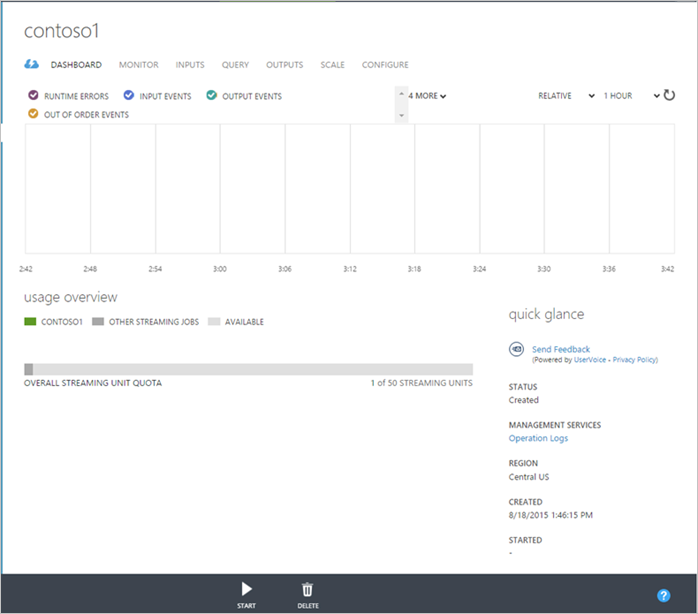
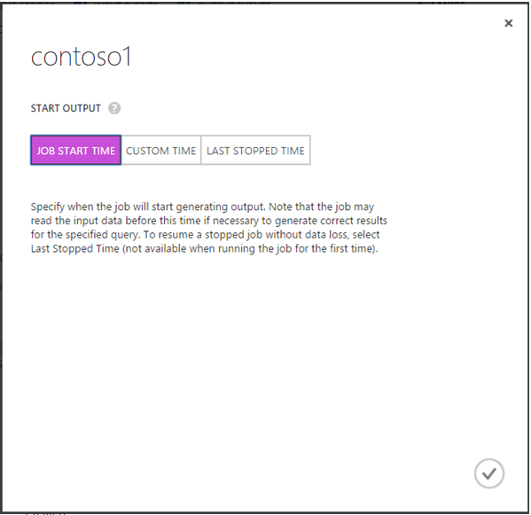
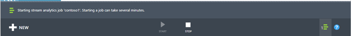

<properties 
	pageTitle="Run a Job | Windows Azure" 
	description="Run a Job learning path segment."
	documentationCenter=""
	services="stream-analytics"
	authors="jeffstokes72" 
	manager="paulettm" 
	editor="cgronlun"/>

<tags 
	ms.service="stream-analytics" 
	ms.date="09/09/2015" 
	wacn.date=""/>

# Run a job

When a job input, query, and output have all been specified you can start the Stream Analytics job.

To start your job:

1.	From the job dashboard, click Start at the bottom of the page.

      

2.	In the dialog box that appears, specify a **Start Output** value to determine when this job will start producing output. The default setting for jobs that have not previously been started is **Job Start Time**, which means that the job will immediately start processing data. You can also specify a **Custom** time in the past (for consuming historical data) or the future (to delay processing until a future time). For cases when a job has been previously started and stopped, the option **Last Stopped Time** is available in order to resume the job from the last output time and avoid data loss.  

      

3.	Click the check button on the bottom of the dialog box. The job status will change to Starting and will shortly move to Running once the job has started. You can monitor the progress of the Start operation in the Notification Hub:

      

## Get help
For further assistance, try our [Azure Stream Analytics forum](https://social.msdn.microsoft.com/Forums/en-US/home?forum=AzureStreamAnalytics)

## Next steps

- [Introduction to Azure Stream Analytics](/documentation/articles/stream-analytics-introduction)
- [Get started using Azure Stream Analytics](/documentation/articles/stream-analytics-get-started)
- [Scale Azure Stream Analytics jobs](/documentation/articles/stream-analytics-scale-jobs)
- [Azure Stream Analytics Query Language Reference](https://msdn.microsoft.com/library/azure/dn834998.aspx)
- [Azure Stream Analytics Management REST API Reference](https://msdn.microsoft.com/library/azure/dn835031.aspx)
