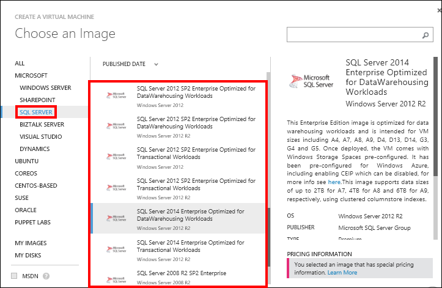
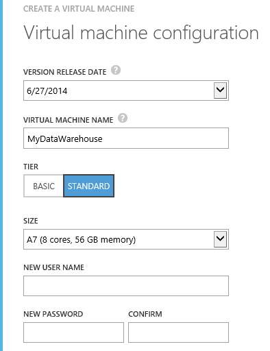

<!-- deleted in Global -->

<properties 
	pageTitle="SQL Server Data Warehousing and Transactional Workloads in Azure Virtual Machines"
	description="Describes the preconfigured and optimized SQL Server virtual machine images in Azure for data warehousing and OLTP workloads."
	services="virtual-machines"
	documentationCenter="na"
	authors="rothja"
	manager="jeffreyg"
	editor="monicar" />
<tags 
	ms.service="virtual-machines"
	ms.date="08/19/2015"
	wacn.date="" />

# SQL Server Data Warehousing and Transactional Workloads in Azure Virtual Machines

To use SQL Server for data warehousing or transactional workloads in an Azure Virtual Machine, we recommend using one of the preconfigured virtual machine images in the Azure Virtual Machines Gallery. These images have been optimized based on the recommendations in [Performance Best Practices for SQL Server in Azure Virtual Machines](https://msdn.microsoft.com/zh-cn/library/azure/dn133149.aspx).

This article focuses on running these workloads on Azure Virtual Machines (this is also known as Infrastructure-as-a-Service or IaaS). You can also run data warehousing and transactional workloads as a service in Azure. For more information, see [Azure SQL Data Warehouse Preview](/documentation/services/sql-data-warehouse/) and [Azure SQL Database](/documentation/services/sql-databases/).

## What Preconfigured VM Images are Available?

The following preconfigured VM images are available in the Azure VM Gallery:

- [SQL Server 2014 Enterprise Optimized for Transactional Workloads on Windows Server 2012 R2](http://azure.microsoft.com/marketplace/partners/microsoft/sqlserver2014fortransactionalworkloadswindowsserver2012r2/)

- [SQL Server 2014 Enterprise Optimized for DataWarehousing on Windows Server 2012 R2](http://azure.microsoft.com/marketplace/partners/microsoft/sqlserver2014datawarehousingwindowsserver2012r2/)

- [SQL Server 2012 SP2 Enterprise Optimized for Transactional Workloads on Windows Server 2012 R2](http://azure.microsoft.com/marketplace/partners/microsoft/sqlserver2012sp2fortransactionalworkloadswindowsserver2012r2)

- [SQL Server 2012 SP2 Enterprise Optimized for DataWarehousing Workloads on Windows Server 2012 R2](http://azure.microsoft.com/marketplace/partners/microsoft/sqlserver2012sp2datawarehousingworkloadswindowsserver2012r2)

- [SQL Server 2012 SP2 Enterprise Optimized for Transactional Workloads on Windows Server 2012](http://azure.microsoft.com/marketplace/partners/microsoft/sqlserver2012sp2fortransactionalworkloadswindowsserver2012/)

- [SQL Server 2012 SP2 Enterprise Optimized for DataWarehousing on Windows Server 2012](http://azure.microsoft.com/marketplace/partners/microsoft/sqlserver2012sp2datawarehousingworkloadswindowsserver2012/)

Currently we support these images on VM instances that allow up to 16 data disks attached to provide the highest throughput (or aggregate bandwidth). These instances are Standard Tier A4, A7, A8, A9, D4, D13, D14, F3, G4, and G5 and Basic tier A4. Please refer to [Virtual Machine Sizes in Azure](/documentation/articles/virtual-machines-linux-sizes/) for further details on the sizes and options.

>[AZURE.NOTE] Prior to September 2014, previous transactional and DW gallery images were available. However, those images required you to attach data disks to be usable. It is recommended to use the newer images above, because they are ready for use upon provisioning.

## Provisioning a SQL VM from the Gallery Using the Transactional/DW Images

1. Sign in to the [Azure Management Portal](http://manage.windowsazure.cn/).

1. Click **VIRTUAL MACHINE** in the Azure menu items in the left pane.

1. Click **NEW** in the bottom left corner, and then click **COMPUTE**, **VIRTUAL MACHINE**, and **FROM GALLERY**.

1. On the Virtual machine image selection page, select one of the SQL Server for transactional or Data Warehousing images.

	

1. On the **Virtual machine configuration** page, in the **SIZE** option, choose from the supported sizes.

	

	>[AZURE.NOTE] Only the Standard tier A4, A7, A8, A9, D4, D13, D14, G3, G4, and G5 and Basic Tier A4 are currently supported. Attempts to provision unsupported VM sizes will fail.

1. Wait for the provisioning to finish. While waiting, you can see the provisioning status on the virtual machines page (as in the picture below). When the provisioning is finished, the status will be **Running** with a checkmark.

	

## Using PowerShell to Create the Transactional/DW Images

You can also use the PowerShell Commandlet **New-AzureQuickVM** to create the VM. You must pass your cloud service name, VM name, image name, Admin user name and password, and similar information as parameters. A simple way is to obtain the image name is to use **Get-AzureVMImage** to list all the available VM images.

For example, the following PowerShell command returns the latest image that matches the image label **SQL Server 2012 SP2 Enterprise Optimized for DataWarehousing Workloads on Windows Server 2012 R2** from the list in the previous section.

	(Get-AzureVMImage | where {$_.Label -like "SQL Server 2012 SP2 Enterprise Optimized for DataWarehousing Workloads on Windows Server 2012 R2"} | sort PublishedDate -Descending)[0].ImageName

For more information about creating images with PowerShell, see [Use Azure PowerShell to create and preconfigure Windows-based Virtual Machines](/documentation/articles/virtual-machines-windows-classic-create-powershell/).

## Specific Configurations Included in the Transactional/DW Images

The optimizations included in the images are based on the [Performance Best Practices for SQL Server in Azure Virtual Machines](https://msdn.microsoft.com/zh-cn/library/azure/dn133149.aspx). Specifically, the configuration for these images include the following optimizations.

>[AZURE.NOTE] If you are bringing your own license and creating a Data Warehousing or Transactional virtual machine from scratch, you can base your optimizations on the performance article and the example of the optimizations in the preconfigured gallery images below.

### Disk Configurations

|---|---|
|Number of data disks attached|15|
|Storage spaces|Two storage pools: -- 1 data pool with 12 data disks; fixed size 12 TB; Column = 12 -- 1 log pool with 3 data disks; fixed size 3 TB; Column = 3  One data disk remaining for the user to attach and determine the usage.  **DW**: Stripe size = 256 KB **Transactional**: Stripe size = 64 KB|
|Disk sizes, caching, allocation size|1 TB each, HostCache=None, NTFS Allocation Unit Size = 64KB|

### SQL Server Configurations

|---|---|
|Startup Parameters|-T1117 to help keep data files the same size in case the database needs to autogrow  -T1118 to assist in tempdb scalability (For more information, see [SQL Server (2005 and 2008) Trace Flag 1118 (-T1118) Usage](http://blogs.msdn.com/b/psssql/archive/2008/12/17/sql-server-2005-and-2008-trace-flag-1118-t1118-usage.aspx?WT.mc_id=Blog_SQL_Announce_Announce).)|
|Recovery model|**DW**: Set to SIMPLE for model database using ALTER DATABASE **Transactional**: No change|
|Setup default locations|Move the SQL Server error log and trace file directories to data disks|
|Default locations for databases|System databases moved to data disks.  The location for creating user databases changed to data disks.|
|Instant File Initialization|Enabled|
|Lock pages in memory|Enabled (For more information, see [Enable the Lock Pages in Memory Option (Windows)](https://msdn.microsoft.com/zh-cn/library/ms190730.aspx).|

## FAQ

- Is there any price difference between the optimized images and the non-optimized ones?

	No. The optimized images follow the same pricing model (details [here](/pricing/details/virtual-machines/)) with no additional cost. Note that a higher cost is associated with the larger VM instance sizes.

- Any other performance fixes I should consider?

	Yes, consider applying relevant performance fixes for SQL Server:

	- [FIX: Poor performance on I/O when you execute select into temporary table operation in SQL Server 2012](https://support.microsoft.com/kb/2958012)

	- [FIX: "SQL Server performance counters are disabled" when you move the SQL Server resource in SQL Server 2014](http://support.microsoft.com/kb/2973444)

- How can I find more information on Storage Spaces?

	For further details on Storage Spaces, please refer to [Storage Spaces Frequently Asked Questions (FAQ)](http://social.technet.microsoft.com/wiki/contents/articles/11382.storage-spaces-frequently-asked-questions-faq.aspx)

- What is the difference between the new DW image and the previous one?

	The previous DW image requires customers to perform additional steps such as attaching the data disks after creating the VM while the new DW image is ready for use upon creation so it is available more quickly and has less chance of errors.

- What if I need to use the previous DW image? Is there any way I can access it?

	The previous VM images are still available, just not directly accessible from the gallery. Instead, you can continue using Powershell commandlets. For instance, you can use **Get-AzureVMImage** to list out all the images and when you locate the previous DW image based on the description and publish date, you can use **New-AzureVM** to provision.

## Next Steps

After installing any virtual machine with SQL Server, you will likely want to:

- [Migrate your data](/documentation/articles/virtual-machines-windows-migrate-sql/)
- [Setup connectivity](/documentation/articles/virtual-machines-windows-classic-sql-connect/)

For other topics related to running SQL Server in Azure VMs, see [SQL Server on Azure Virtual Machines](/documentation/articles/virtual-machines-windows-sql-server-iaas-overview/).
