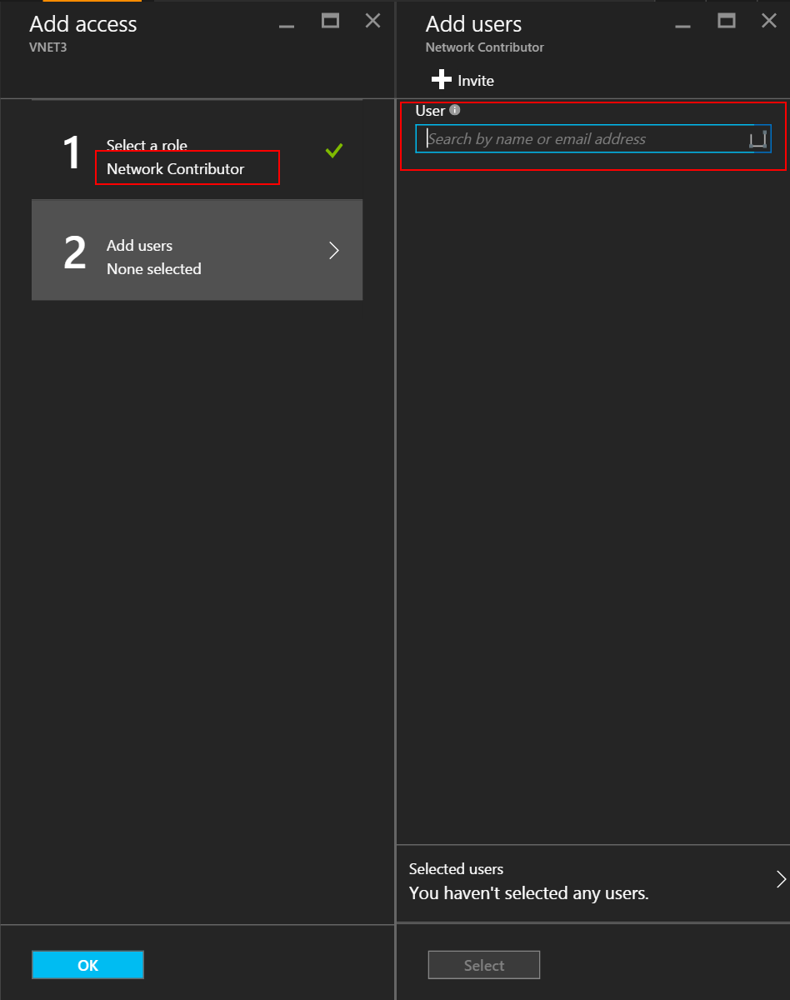
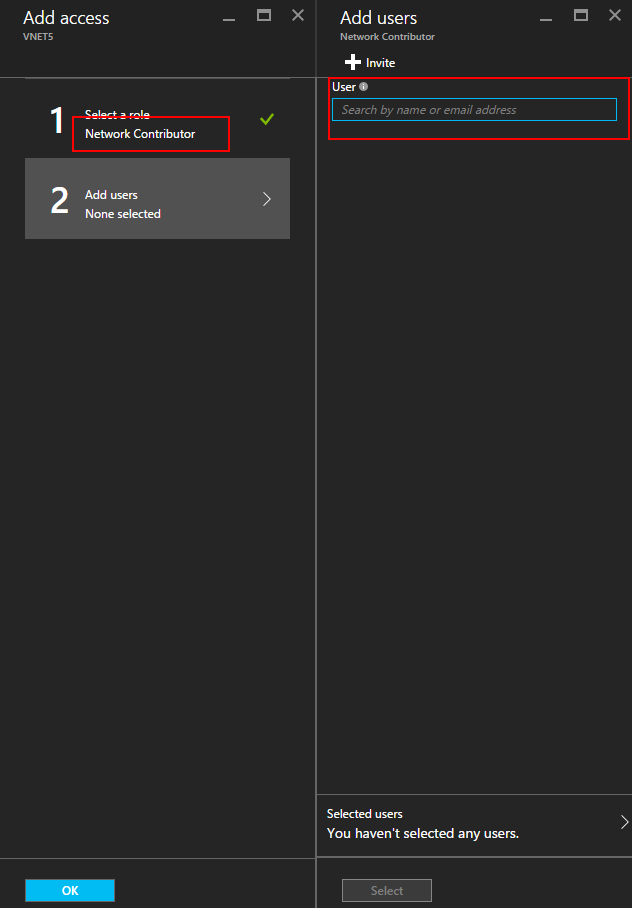
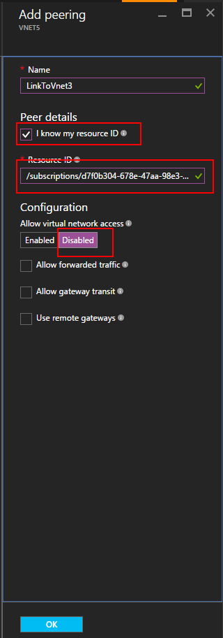

<!-- not suitable for Mooncake -->

<properties
   pageTitle="Create VNet Peering using the Azure portal | Azure"
   description="Learn how to create a virtual network using the Azure portal in Resource Manager."
   services="virtual-network"
   documentationCenter=""
   authors="narayanannamalai"
   manager="jefco"
   editor=""
   tags="azure-resource-manager"/>

<tags
	ms.service="virtual-network"
	ms.date="08/02/2016"
	wacn.date=""/>

# Create a virtual network peering using the Azure portal

<!-- not suitable for Mooncake -->

> [AZURE.SELECTOR]
- [Azure Portal](/documentation/articles/virtual-networks-create-vnetpeering-arm-portal/)
- [PowerShell](/documentation/articles/virtual-networks-create-vnetpeering-arm-ps/)
- [ARM template](/documentation/articles/virtual-networks-create-vnetpeering-arm-template-click/)

<!-- not suitable for Mooncake -->

VNet Peering is a mechanism to connect two Virtual Networks in the same region through the Azure backbone network. Once peered, the two Virtual Networks will appear like a single Virtual Network for all connectivity purposes. Read the [VNet Peering overview](/documentation/articles/virtual-network-peering-overview/) if you are not familiar with VNet Peering.

VNet Peering is in public preview, to be able to use it you must register using the below commands:

    Register-AzureRmProviderFeature -FeatureName AllowVnetPeering -ProviderNamespace Microsoft.Network

    Register-AzureRmResourceProvider -ProviderNamespace Microsoft.Network

<!-- not suitable for Mooncake -->

## Peering VNets in the same subscription

In this scenario you will create a peering between two VNets named **VNet1** and **VNet2** belonging to the same subscription. 

VNet peering will allow full connectivity between the entire address space of peered virtual networks.

To create a VNet peering based on the scenario above by using the Azure portal, follow the steps below.

1. From a browser, navigate to http://portal.azure.cn and, if necessary, sign in with your Azure account.
2. To establish VNET peering, you need to create two links, one for each direction, between two VNets. You can create VNET peering link for VNET1 to VNET2 first. On the portal, 
Click **Browse** > **choose Virtual Networks** 

	

3. In Virtual Networks blade, choose VNET1, click Peerings, then click Add

	

4. In the Add Peering blade, give a peering link name LinkToVnet2, choose the subscription and the peer Virtual Network VNET2, click OK.

	

5. Once this VNET peering link is created. You can see the link state as following:

	

6. Next create the VNET peering link for VNET2 to VNET1. In Virtual Networks blade, choose VNET2, click Peerings, then click Add 

	

7. In the Add Peering blade, give a peering link name LinkToVnet1, choose the subscription and the peer Virtual Network, Click OK.

	

8. Once this VNET peering link is created. You can see the link state as following:

	

9. Check the state for LinkToVnet2 and it now changes to Connected as well.  

	

10. NOTE: VNET peering is only established if both links are connected. 

There are a few configurable properties for each link:

|Option|Description|Default|
|:-----|:----------|:------|
|AllowVirtualNetworkAccess|Whether address space of Peer VNet to be included as part of the Virtual_network Tag|Yes|
|AllowForwardedTraffic|Allows traffic not originated from peered VNet is accepted or dropped|No|
|AllowGatewayTransit|Allows the peer VNet to use your VNet gateway|No|
|UseRemoteGateways|Use your peer's VNet gateway. The peer VNet must have a gateway configured and AllowGatewayTransit is selected. You cannot use this option if you have a gateway configured|No|

Each link in VNet peering has a set of above properties. From portal, you can click the VNet Peering Link and change any available options, click Save to make the change effect.

<!-- not suitable for Mooncake -->

## Peering across subscriptions

In this scenario you will create a peering between two VNets belonging to different subscriptions.

VNet peering relies on Role based access control (RBAC) for authorization. For cross-subscriptions scenario, you first need to grant sufficient permission to users who will create the peering link:
NOTE: if the same user has the privilege over both subscriptions, then you can skip step1-4 below.

1. From a browser, navigate to http://portal.azure.cn and, if necessary, sign in with your Azure account.
2. In this example we will use two subscriptions A and B and two users UserA and UserB with privileges in the subscriptions respectively
3. On the portal, Click Browse, choose Virtual Networks. Click the VNET and click Add.

    

4. On the Add access blade, click select a role and choose Network Contributor, click Add Users, type the UserB sign in name, and click OK.

    

    This is not a requirement, peering can be established even if users individually raise peering requests for thier respective Vnets as long as the requests match. Adding privileged user of the other VNet as users in the local VNet makes it easier to do setup in portal. 

5. Then login to Azure portal with UserB who is the privilege user for SubscriptionB. Follow above steps to add UserA as Network Contributor.

    

    NOTE: You can log off and log on both user sessions in browser to ensure the authorization is enabled successfully.

6. Login to the portal as UserA, navigate to the VNET3 blade, click Peering, check 'I Know my resource ID" checkbox and type the resource ID for VNET5 in below format.

    /subscriptions/<Subscription- ID>/resourceGroups/<ResourceGroupName>/providers/Microsoft.Network/VirtualNetwork/<VNET name>

    

7. Login to the portal as UserB and follow above step to create peering link from VNET5 to VNet3. 

    

8. Peering will be established and any Virtaul machine in VNet3 should be able to communicate with any virtual machine in VNet5

<!-- not suitable for Mooncake -->

## Service Chaining - Transit through peered VNet

Although the use of system routes facilitates traffic automatically for your deployment, there are cases in which you want to control the routing of packets through a virtual appliance.
In this scenario, there are two VNets in a subscription, HubVNet and VNet1 as described in below diagram. You deploy Network Virtual Appliance(NVA) in VNet HubVNet. After establishing VNet peering between HubVNet and VNet1, you can set up User Defined Routes and specify the next hop to NVA in the HubVNet.

NOTE: For the simplicity, assume all VNets here are in the same subscription. But it also works for cross-subscription scenario. 

The key property to enable Transit routing is the "Allow Forwarded Traffic" parameter. This allows accepting and sending trafic from/to the NVA in the peered VNet.

1. As a first step, VNET peering links from HubVnet to VNET1. Please note Allow Forwarded Traffic option is not selected for the link.

    

2. As a next step, peering links from VNET1 to HubVnet can be created. Please note 'Allow forwarded traffic' option is selected. 

    

3. After peering is established, you can refer to this [article](/documentation/articles/virtual-network-create-udr-arm-ps/) and define User Defined Route(UDR) to redirect VNet1 traffic through a virtual appliance to use its capabilities. When you specify the Next Hop address in route, you can set it to the IP address of virtual appliance in peer VNet HubVNet

## Remove VNet Peering

1.	From a browser, navigate to http://portal.azure.cn and, if necessary, sign in with your Azure account.
2.	Go to virtual network blade, click Peerings, click the Link you want to remove, click button Delete. 

    

3. Once you remove one link in VNET peering, the  peer link state will go to disconnected.

    

4. In this state, you cannot re-create the link until the peer link state changes to Initiated. We recommend you remove the both links before you re-create the VNET peering. 
