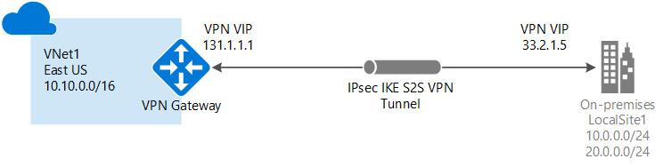
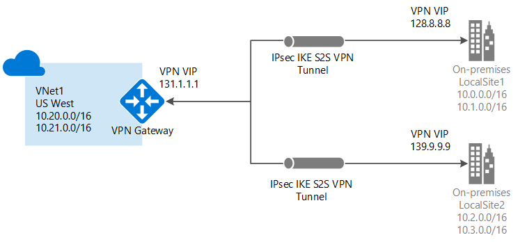
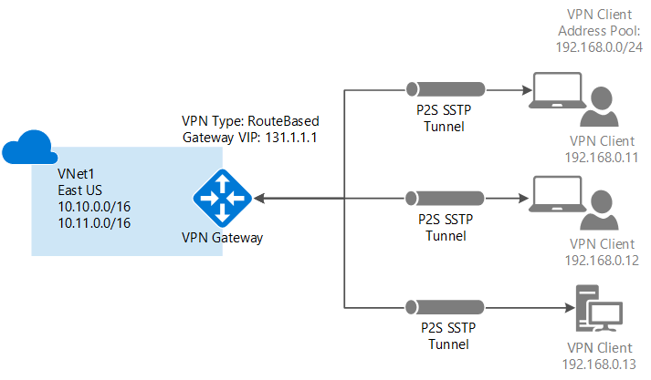
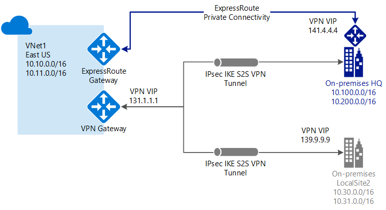

<properties 
   pageTitle="About VPN Gateway| Azure"
   description="Learn about VPN Gateway connections for Azure Virtual Networks."
   services="vpn-gateway"
   documentationCenter="na"
   authors="cherylmc"
   manager="carmonm"
   editor=""
   tags="azure-resource-manager,azure-service-management"/>
<tags 
   ms.service="vpn-gateway"
   ms.devlang="na"
   ms.topic="get-started-article"
   ms.tgt_pltfrm="na"
   ms.workload="infrastructure-services"
   ms.date="10/06/2016"
   wacn.date=""
   ms.author="cherylmc" />

# About VPN Gateway

A virtual network gateway is used to send network traffic between Azure virtual networks and on-premises locations and also between virtual networks within Azure (VNet-to-VNet). When you configure a VPN gateway, you must create and configure a virtual network gateway and a virtual network gateway connection.

In the Resource Manager deployment model, when you create a virtual network gateway resource, you specify several settings. One of the required settings is '-GatewayType'. There are two virtual network gateway types: Vpn and ExpressRoute. 

When network traffic is sent on a dedicated private connection, you use the gateway type 'ExpressRoute'. This is also referred to as an ExpressRoute gateway. When network traffic is sent encrypted across a public connection, you use the gateway type 'Vpn'. This is referred to as a VPN gateway. Site-to-Site, Point-to-Site, and VNet-to-VNet connections all use a VPN gateway.

Each virtual network can have only one virtual network gateway per gateway type. For example, you can have one virtual network gateway that uses -GatewayType ExpressRoute, and one that uses -GatewayType Vpn. This article focuses primarily on VPN Gateway. For more information about ExpressRoute, see the [ExpressRoute Technical Overview](/documentation/articles/expressroute-introduction/).

## Pricing

You pay for two things: the hourly compute costs for the virtual network gateway, and the egress data transfer from the virtual network gateway. Pricing information can be found on the [Pricing](/pricing/details/vpn-gateway/) page.

**Virtual network gateway compute costs** Each virtual network gateway has an hourly compute cost. The price is based on the gateway SKU that you specify when you create a virtual network gateway. The cost is for the gateway itself and is in addition to the data transfer that flows through the gateway.

**Data transfer costs** Data transfer costs are calculated based on egress traffic from the source virtual network gateway.

- If you are sending traffic to your on-premises VPN device, it will be charged with the Internet egress data transfer rate.
- If you are sending traffic between virtual networks in different regions, the pricing is based the region.
- If you are sending traffic only between virtual networks that are in the same region, there are no data costs. Traffic between VNets in the same region is free. 

##  Gateway SKUs

When you create a virtual network gateway, you need to specify the gateway SKU that you want to use. When you select a higher gateway SKU, more CPUs and network bandwidth are allocated to the gateway, and as a result, the gateway can support higher network throughput to the virtual network.

VPN Gateway can use the following SKUs:

- Basic
- Standard
- HighPerformance

When selecting a SKU, consider the following limitations:

- If you want to use a PolicyBased VPN type, you must use the Basic gateway SKU. PolicyBased VPNs (previously called Static Routing) are not supported on any other SKU.
- BGP is not supported on the Basic SKU.
- ExpressRoute-VPN Gateway coexist configurations are not supported on the Basic SKU.

PolicyBased VPNs can only be created for gateways using the Basic SKU.
For more information about gateway SKUs, see [Gateway SKUs](/documentation/articles/vpn-gateway-about-vpn-gateway-settings/#gwsku).

The following table shows the gateway types and the estimated aggregate throughput. This table applies to both the Resource Manager and classic deployment models.

|    | **VPN Gateway throughput (1)** | **VPN Gateway max IPsec tunnels (2)** | **ExpressRoute Gateway throughput** | **VPN Gateway and ExpressRoute coexist**|
|--- |----------------------------|-----------------------------------|-------------------------------------|-----------------------------------------|
| **Basic SKU (3)**              |  100 Mbps | 10                         |  500 Mbps                           | No   |
| **Standard SKU (4)**           |  100 Mbps | 10                         | 1000 Mbps                           | Yes  |
| **High Performance SKU (4)**   | 200 Mbps  | 30                         | 2000 Mbps                           | Yes  |

- (1) The VPN throughput is a rough estimate based on the measurements between VNets in the same Azure region. It is not a guaranteed throughput for cross-premises connections across the Internet. It is the maximum possible throughput measurement.
- (2) The number of tunnels refer to RouteBased VPNs. A PolicyBased VPN can only support one Site-to-Site VPN tunnel.
- (3) BGP is not supported for the Basic SKU.
- (4) PolicyBased VPNs are not supported for this SKU. They are supported for the Basic SKU only. 

## Configuring a VPN Gateway

When you configure a VPN gateway, the instructions you use depend on the deployment model that you used to create your virtual network. For example, if you created your VNet using the classic deployment model, you use the guidelines and instructions for the classic deployment model to create and configure your VPN gateway settings. For more information about deployment models, see [Understanding Resource Manager and classic deployment models](/documentation/articles/resource-manager-deployment-model/).

A VPN gateway connection relies on multiple resources that are configured with specific settings. Most of the resources can be configured separately, although they must be configured in a certain order in some cases. You can start out creating and configuring resources using one configuration tool, such as the Azure portal Preview. You can then later decide to switch to another tool, such as PowerShell, to configure additional resources, or to modify existing resources when applicable. Currently, you can't configure every resource and resource setting in the Azure portal Preview. The instructions in the articles for each connection topology specify when a specific configuration tool is needed. For information about individual resources and settings for VPN Gateway, see [About VPN Gateway settings](/documentation/articles/vpn-gateway-about-vpn-gateway-settings/).

The following sections contain tables that list:

- available deployment model
- available configuration tools
- links that take you directly to an article, if available

Use the diagrams and descriptions to help select the connection topology to match your requirements. The diagrams show the main baseline topologies, but it's possible to build more complex configurations using the diagrams as a guideline.

## Site-to-Site and Multi-Site

### Site-to-Site

A Site-to-Site (S2S) VPN gateway connection is a connection over IPsec/IKE (IKEv1 or IKEv2) VPN tunnel. This type of connection requires a VPN device located on-premises that has a public IP address assigned to it and is not located behind a NAT. S2S connections can be used for cross-premises and hybrid configurations.   

### Multi-Site

You can create and configure a VPN gateway connection between your VNet and multiple on-premises networks. When working with multiple connections, you must use a RouteBased VPN type (dynamic gateway for classic VNets). Because a VNet can only have one VPN gateway, all connections through the gateway share the available bandwidth. This is often called a "multi-site" connection.
 

### Deployment models and methods for Site-to-Site and Multi-Site

|  | **Classic Deployment**  | **Resource Manager Deployment** |
|----------------------------------------|--------------|----------------------|
| **Classic Management Portal**                     |[Article*](/documentation/articles/vpn-gateway-site-to-site-create/) |  Not Supported |
| **Azure Portal Preview** | Supported**              | [Article](/documentation/articles/vpn-gateway-howto-site-to-site-resource-manager-portal/)|
| **PowerShell**               |[Article+](/documentation/articles/vpn-gateway-multi-site/) | [Article](/documentation/articles/vpn-gateway-create-site-to-site-rm-powershell/)| 

(*) denotes that the Classic Management Portal can only support creating one S2S VPN connection.

(**) denotes that an end-to-end scenario is not yet available for the Azure portal Preview.

(+) denotes that this article is written for multi-site connections.

 

## VNet-to-VNet

Connecting a virtual network to another virtual network (VNet-to-VNet) is similar to connecting a VNet to an on-premises site location. Both connectivity types use a VPN gateway to provide a secure tunnel using IPsec/IKE. You can even combine VNet-to-VNet communication with multi-site connection configurations. This lets you establish network topologies that combine cross-premises connectivity with inter-virtual network connectivity.

The VNets you connect can be:

- in the same or different regions
- in the same or different subscriptions 
- in the same different deployment models

#### Connections between deployment models

Azure currently has two deployment models: classic and Resource Manager. If you have been using Azure for some time, you probably have Azure VMs and instance roles running in a classic VNet. Your newer VMs and role instances may be running in a VNet created in Resource Manager. You can create a connection between the VNets to allow the resources in one VNet to communicate directly with resources in another.

### Deployment models and methods for VNet-to-VNet

| **Deployment Model/Method** | **Azure Portal Preview** | **Classic Management Portal** | **PowerShell** |
|---|---|---|---|
|**Classic** | Not Supported | [Article](/documentation/articles/virtual-networks-configure-vnet-to-vnet-connection/) | Supported |
|**Resource Manager** | Not Supported |Supported+ | [Article](/documentation/articles/vpn-gateway-vnet-vnet-rm-ps/)|
|**Connections between different deployment models** | [Article*](/documentation/articles/vpn-gateway-connect-different-deployment-models-portal/) | [Article*](/documentation/articles/vpn-gateway-connect-different-deployment-models-portal/) |[Article](/documentation/articles/vpn-gateway-connect-different-deployment-models-powershell/)|

(+) denotes this deployment method is available only for VNets in the same subscription. 
(*) denotes that this deployment method also requires PowerShell.

 

##  Point-to-Site

A Point-to-Site (P2S) VPN gateway connection allows you to create a secure connection to your virtual network from an individual client computer. P2S is a VPN connection over SSTP (Secure Socket Tunneling Protocol). P2S connections do not require a VPN device or a public-facing IP address to work. You establish the VPN connection by starting it from the client computer. This solution is useful when you want to connect to your VNet from a remote location, such as from home or a conference, or when you only have a few clients that need to connect to a VNet. P2S connections can be used in conjunction with S2S connections through the same VPN gateway, provided that all of the configuration requirements for both connections are compatible.

### Deployment models and methods for Point-to-Site

|**Deployment Model/Method**|**Azure Portal Preview**| **Classic Management Portal** | **PowerShell**|
|-------------------------------------|-----------------|---------------------|---------------|
|**Classic** |  [Article](/documentation/articles/vpn-gateway-howto-point-to-site-classic-azure-portal/)| [Article](/documentation/articles/vpn-gateway-point-to-site-create/)  | Supported |
|**Resource Manager** |Not Supported| Not Supported   | [Article](/documentation/articles/vpn-gateway-howto-point-to-site-rm-ps/)  |

 

## ExpressRoute

Microsoft Azure ExpressRoute lets you extend your on-premises networks into the Microsoft cloud over a dedicated private connection facilitated by a connectivity provider. With ExpressRoute, you can establish connections to Microsoft cloud services, such as Microsoft Azure, Office 365, and CRM Online. Connectivity can be from an any-to-any (IP VPN) network, a point-to-point Ethernet network, or a virtual cross-connection through a connectivity provider at a co-location facility. ExpressRoute connections do not go over the public Internet. This allows ExpressRoute connections to offer more reliability, faster speeds, lower latencies, and higher security than typical connections over the Internet.  

In an ExpressRoute connection, a virtual network gateway is configured with the gateway type 'ExpressRoute', rather than 'Vpn'. For more information about ExpressRoute, see the [ExpressRoute technical overview](/documentation/articles/expressroute-introduction/).

## Site-to-Site and ExpressRoute coexisting connections

ExpressRoute is a direct, dedicated connection from your WAN (not over the public Internet) to Microsoft Services, including Azure. Site-to-Site VPN traffic travels encrypted over the public Internet. Being able to configure Site-to-Site VPN and ExpressRoute connections for the same virtual network has several advantages.

You can configure a Site-to-Site VPN as a secure failover path for ExpressRoute, or use Site-to-Site VPNs to connect to sites that are not part of your network, but that are connected through ExpressRoute. Notice that this requires two virtual network gateways for the same virtual network, one using -GatewayType Vpn, and the other using -GatewayType ExpressRoute.

### Deployment models and methods for S2S and ExpressRoute

|  | **Classic Deployment**  | **Resource Manager Deployment**|
|-----------------------------|-------------|---------------------|
| **Classic Management Portal**          | Not Supported          | Not Supported                  |
| **Azure Portal Preview** | Not Supported         | Not Supported                  |
| **PowerShell** | [Article](/documentation/articles/expressroute-howto-coexist-classic/) | [Article](/documentation/articles/expressroute-howto-coexist-resource-manager/) |
 

## Next steps

Plan your VPN gateway configuration. See [VPN Gateway Planning and Design](/documentation/articles/vpn-gateway-plan-design/).

 
