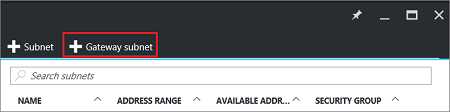
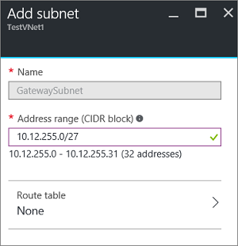
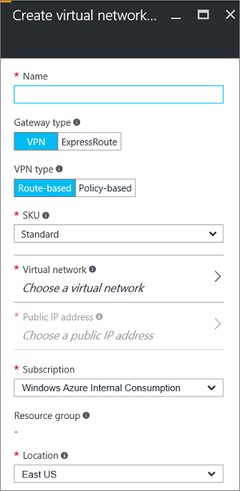

<properties 
   pageTitle="How to connect classic virtual networks to Resource Manager virtual networks in the portal  | Azure"
   description="Learn how to create a VPN connection between classic VNets and Resource Manager VNets using VPN Gateway and the portal"
   services="vpn-gateway"
   documentationCenter="na"
   authors="cherylmc"
   manager="carmonm"
   editor=""
   tags="azure-service-management,azure-resource-manager"/>
<tags 
   ms.service="vpn-gateway"
   ms.devlang="na"
   ms.topic="article"
   ms.tgt_pltfrm="na"
   ms.workload="infrastructure-services"
   ms.date="10/03/2016"
   wacn.date=""
   ms.author="cherylmc" />

# Connect virtual networks from different deployment models in the portal

> [AZURE.SELECTOR]
- [Portal](/documentation/articles/vpn-gateway-connect-different-deployment-models-portal/)
- [PowerShell](/documentation/articles/vpn-gateway-connect-different-deployment-models-powershell/)

Azure currently has two management models: classic and Resource Manager (RM). If you have been using Azure for some time, you probably have Azure VMs and instance roles running in a classic VNet. Your newer VMs and role instances may be running in a VNet created in Resource Manager. This article walks you through connecting classic VNets to Resource Manager VNets to allow the resources located in the separate deployment models to communicate with each other over a gateway connection. 

You can create a connection between VNets that are in different subscriptions and in different regions. You can also connect VNets that already have connections to on-premises networks, as long as the gateway that they have been configured with is dynamic or route-based. For more information about VNet-to-VNet connections, see the [VNet-to-VNet FAQ](#faq) at the end of this article.

### Deployment models and methods for VNet-to-VNet connections

It's important to know that Azure currently works with two deployment models: Resource Manager and classic. Before you begin your configuration, make sure that you understand the deployment models and tools. You'll need to know which model that you want to work in. Not all networking features are supported yet for both models. For information about the deployment models, see [Understanding Resource Manager deployment and classic deployment](/documentation/articles/resource-manager-deployment-model/).
 

We update the following table as new articles and additional tools become available for this configuration. When an article is available, we link directly to it from the table.  

**VNet-to-VNet**

| **Deployment Model/Method** | **Azure Portal Preview** | **Classic Management Portal** | **PowerShell** |
|---|---|---|---|
|**Classic** | Not Supported | [Article](/documentation/articles/virtual-networks-configure-vnet-to-vnet-connection/) | Supported |
|**Resource Manager** | Not Supported |Supported+ | [Article](/documentation/articles/vpn-gateway-vnet-vnet-rm-ps/)|
|**Connections between different deployment models** | [Article*](/documentation/articles/vpn-gateway-connect-different-deployment-models-portal/) | [Article*](/documentation/articles/vpn-gateway-connect-different-deployment-models-portal/) |[Article](/documentation/articles/vpn-gateway-connect-different-deployment-models-powershell/)|

(+) denotes this deployment method is available only for VNets in the same subscription. 
(*) denotes that this deployment method also requires PowerShell.

 

#### VNet peering

<!-- not suitable for Mooncake -->

It's also possible to connect VNets without using a VPN gateway. If your VNets are in the same region, you may want to consider connecting them by using VNet peering. For more information, see the [VNet peering](/documentation/articles/virtual-network-peering-overview/) article.

## Before beginning

The following steps walk you through the settings necessary to configure a dynamic or route-based gateway for each VNet and create a VPN connection between the gateways. This configuration does not support static or policy-based gateways. 

In this article, we use the Classic Management Portal, the Azure portal Preview, and PowerShell. Currently, it's not possible to create this configuration using only the Azure portal Preview.

### Prerequisites

 - Both VNets have already been created.
 - The address ranges for the VNets do not overlap with each other, or overlap with any of the ranges for other connections that the gateways may be connected to.
 - You have installed the latest PowerShell cmdlets (1.0.2 or later). See [How to install and configure Azure PowerShell](/documentation/articles/powershell-install-configure/) for more information. Make sure you install both the Service Management (SM) and the Resource Manager (RM) cmdlets. 

### Example settings

You can use the example settings as reference.

**Classic VNet settings**

VNet Name = ClassicVNet  
Location = China North  
Virtual Network Address Spaces = 10.0.0.0/24  
Subnet-1 = 10.0.0.0/27  
GatewaySubnet = 10.0.0.32/29  
Local Network Name = RMVNetLocal  

**Resource Manager VNet settings**

VNet Name = RMVNet  
Resource Group = RG1  
Virtual Network IP Address Spaces = 192.168.0.0/16  
Subnet-1 = 192.168.1.0/24  
GatewaySubnet = 192.168.0.0/26  
Location = China East  
Virtual network gateway name = RMGateway  
Gateway public IP name = gwpip  
Gateway type = VPN  
VPN type = Route-based  
Local network gateway = ClassicVNetLocal  

## Section 1: Configure classic VNet settings

In this section, we create the local network and the gateway for your classic VNet. The instructions in this section use the Classic Management Portal. Currently, the Azure Portal Preview does not offer all the settings that pertain to a classic VNet.

### Part 1 - Create a new local network

Open the [Classic Management Portal](https://manage.windowsazure.cn) and sign in with your Azure account.

1. On the bottom left corner of the screen, click **NEW** > **Network Services** > **Virtual Network** > **Add local network**.

2. In the **Specify your local network details** window, type a name for the RM VNet you want to connect to. In the **VPN device IP address (optional)** box, type any valid public IP address. This is just a temporary placeholder. You change this IP address later. On the bottom right corner of the window, click the arrow button.
 
3. On the **Specify the address space** page, in the **Starting IP** text box, type the network prefix and CIDR block for the Resource Manager VNet you want to connect to. This setting is used to specify the address space to route to the RM VNet.

### Part 2 - Associate the local network to your VNet

1. Click **Virtual Networks** at the top of the page to switch to the Virtual Networks screen, then click to select your classic VNet. On the page for your VNet, click **Configure** to navigate to the configuration page.

2. Under the **site-to-site connectivity** connection section, select the **Connect to the local network** checkbox. Then select the local network that you created. If you have multiple local networks that you created, be sure to select the one that you created to represent your Resource Manager VNet from the dropdown.

3. Click **Save** at the bottom of the page.

### Part 3 - Create the gateway

1. After saving the settings, click **Dashboard** at the top of the page to change to the Dashboard page. On the bottom of the Dashboard page, click **Create Gateway**, then click **Dynamic Routing**. Click **Yes** to begin creating your gateway. A Dynamic Routing gateway is required for this configuration.

2. Wait for the gateway to be created. This can sometimes take 45 minutes or more to complete.

### Part 4 - View the gateway public IP address

After the gateway has been created, you can view the gateway IP address on the **Dashboard** page. This is the public IP address of your gateway. Write down or copy the public IP address. You use it in later steps when you create the local network for your Resource Manager VNet configuration.

## Section 2: Configure Resource Manager VNet settings

In this section, we create the virtual network gateway and the local network for your Resource Manager VNet. Don't start the following steps until after you have retrieved the public IP address for the classic VNet's gateway.

The screenshots are provided as examples. Be sure to replace the values with your own. If you are creating this configuration as an exercise, refer to these [values](#values).

### Part 1 - Create a gateway subnet

Before connecting your virtual network to a gateway, you first need to create the gateway subnet for the virtual network to which you want to connect. Create a gateway subnet with CIDR count of /28 or larger (/27, /26, etc.)

>[AZURE.IMPORTANT] When working with gateway subnets, avoid associating a network security group (NSG) to the gateway subnet. Associating a network security group to this subnet may cause your VPN gateway to stop functioning as expected. For more information about network security groups, see [What is a network security group?](/documentation/articles/virtual-networks-nsg/)

From a browser, navigate to the [Azure portal Preview](http://portal.azure.cn) and sign in with your Azure account.

1. In the portal, navigate to the virtual network to which you want to connect a gateway.

2. In the **Settings** section of your VNet blade, click **Subnets** to expand the Subnets blade.

3. On the **Subnets** blade, click **+Gateway subnet** at the top. This will open the **Add subnet** blade. 

	

4. The **Name** for your subnet will automatically be filled in with the value 'GatewaySubnet'. This value is required in order for Azure to recognize the subnet as the gateway subnet. Adjust the auto-filled **Address range** values to match your configuration requirements.

	

6. Click **OK** at the bottom of the blade to create the subnet.

### Part 2 - Create a virtual network gateway

1. In the portal, go to **New**. Type "Virtual Network Gateway" in search. Locate **Virtual network gateway** in the search return and click the entry. This opens the **Create virtual network gateway** blade.
2. Click **Create** at the bottom of the **Virtual network gateway** blade. The **Create virtual network gateway** blade will open. Fill in the values for your virtual network gateway.

	

3. **Name**: Name your gateway. This is not the same as naming a gateway subnet. It's the name of the gateway object you are creating.

4. **Gateway type**: Select **VPN**. VPN gateways use the virtual network gateway type **VPN**. 

5. **VPN type**: Select the VPN type that is specified for your configuration. Most configurations require a Route-based VPN type.

6. **SKU**: Select the gateway SKU from the dropdown. The SKUs listed in the dropdown depend on the VPN type you select.

7. **Location**: Adjust the **Location** field to point to the location where your virtual network is located.
 
8. Choose the virtual network to which you want to add this gateway. Click **Virtual network** to open the **Choose a virtual network** blade. Select the VNet. If you don't see your VNet, make sure the **Location** field is pointing to the region in which your virtual network is located.

9. Choose a public IP address. Click **Public IP address** to open the **Choose public IP address** blade. Click **+Create New** to open the **Create public IP address blade**. Input a name for your public IP address. This blade creates a public IP address object to which a public IP address will be dynamically assigned. Click **OK** to save your changes to this blade.

10. **Subscription**: Verify that the correct subscription is selected.

11. **Resource group**: This setting is determined by the Virtual Network that you select. 

12. Don't adjust the **Location** after you've specified the previous settings.

13. Verify the settings. You can select **Pin to dashboard** at the bottom of the blade if you want your gateway to appear on the dashboard.

14. Click **Create** to begin creating the gateway. The settings will be validated and you'll see the "Deploying Virtual network gateway" tile on the dashboard. Creating a gateway can take up to 45 minutes. You may need to refresh your portal page to see the completed status.

	

11. After the gateway is created, you can view the IP address that has been assigned to it by looking at the virtual network in the portal. The gateway will appear as a connected device. You can click the connected device (your virtual network gateway) to view more information.

### Part 3 - Create a local network gateway

The 'local network gateway' typically refers to your on-premises location. It tells Azure which IP address ranges to route to the location and the public IP address of the device for that location. However, in this case, it refers to the address range and public IP address associated with your classic VNet and virtual network gateway.

Give the local network gateway a name by which Azure can refer to it. You can create your local network gateway while your virtual network gateway is being created. For this configuration, you use the public IP address that was assigned to your classic VNet gateway in the [previous section](#ip).

1. In the portal Preview, from **All resources**, click **+Add**. In the **Everything** blade search box, type **Local network gateway**, then click to search. This will return a list. Click **Local network gateway** to open the blade, then click **Create** to open the **Create local network gateway** blade.

	

2. On the **Create local network gateway blade**, specify a **Name** for your local network gateway object.
 
3. Specify a valid public **IP address** for the VPN device or virtual network gateway to which you want to connect. If this local network represents an on-premises location, this is the public IP address of the VPN device that you want to connect to. It cannot be behind NAT and has to be reachable by Azure. If this local network represents another VNet, you will specify the public IP address that was assigned to the virtual network gateway for that VNet. 

4. **Address Space** refers to the address ranges for the network that this local network represents. You can add multiple address space ranges. Make sure that the ranges you specify here do not overlap with ranges of other networks that you want to connect to.
 
5. For **Subscription**, verify that the correct subscription is showing.

6. For **Resource Group**, select the resource group that you want to use. You can either create a new resource group, or select one that you have already created.

7. For **Location**, select the location that this object will be created in. You may want to select the same location that your VNet resides in, but you are not required to do so.

8. Click **Create** to create the local network gateway.

### Part 4 - Copy the public IP address

Once the virtual network gateway has finished creating, copy the public IP address that is associated with the gateway. You use it when you configure the local network settings for your classic VNet. 

## Section 3: Modify the local network for the classic VNet

Open the [Classic Management Portal](https://manage.windowsazure.cn).

2. In the Classic Management Portal, scroll down on the left side and click **Networks**. On the **networks** page, click **Local Networks** at the top of the page. 

3. Click to select the local network that you configured in Part 1. At the bottom of the page, click **Edit**.

4. On the **Specify your local network details** page, replace the placeholder IP address with the public IP address for the Resource Manager gateway that you created in the previous section. Click the arrow to move to the next section. Verify that the **Address Space** is correct, and then click the checkmark to accept the changes.

## Section 4: Create the connection

In this section, we create the connection between the VNets. The steps for this require PowerShell. You cannot create this connection in either of the portals. Make sure you have downloaded and installed both the classic (SM) and Resource Manager (RM) PowerShell cmdlets.

1. Log in to your Azure account in the PowerShell console. The following cmdlet prompts you for the login credentials for your Azure Account. After logging in, your account settings are downloaded so that they are available to Azure PowerShell.

		Login-AzureRmAccount -EnvironmentName AzureChinaCloud

 	Get a list of your Azure subscriptions if you have more than one subscription.

		Get-AzureRmSubscription

	Specify the subscription that you want to use. 

		Select-AzureRmSubscription -SubscriptionName "Name of subscription"

2. Add your Azure Account to use the classic PowerShell cmdlets. To do so, you can use the following command:

		Add-AzureAccount -Environment AzureChinaCloud

3. Set your shared key by running the following sample. In this sample, `-VNetName` is the name of the classic VNet and `-LocalNetworkSiteName` is the name you specified for the local network when you configured it in the Classic Management Portal. The `-SharedKey` is a value that you can generate and specify. The value you specify here must be the same value that you specify in the next step when you create your connection.

		Set-AzureVNetGatewayKey -VNetName ClassicVNet `
		-LocalNetworkSiteName RMVNetLocal -SharedKey abc123

4. Create the VPN connection by running the following commands:
	
	**Set the variables**

		$vnet01gateway = Get-AzureRMLocalNetworkGateway -Name ClassicVNetLocal -ResourceGroupName RG1
		$vnet02gateway = Get-AzureRmVirtualNetworkGateway -Name RMGateway -ResourceGroupName RG1

	**Create the connection**  Note that the `-ConnectionType` is 'IPsec', not 'Vnet2Vnet'. In this sample, `-Name` is the name that you want to call your connection. The following sample creates a connection named '*rm-to-classic-connection*'.
		
		New-AzureRmVirtualNetworkGatewayConnection -Name rm-to-classic-connection -ResourceGroupName RG1 `
		-Location "China East" -VirtualNetworkGateway1 `
		$vnet02gateway -LocalNetworkGateway2 `
		$vnet01gateway -ConnectionType IPsec -RoutingWeight 10 -SharedKey 'abc123'

## Verify your connection

You can verify your connection by using the Classic Management Portal, the Azure portal Preview, or PowerShell. You can use the following steps to verify your connection. Replace the values with your own.

### To verify your connection by using PowerShell

You can verify that your connection succeeded by using the `Get-AzureRmVirtualNetworkGatewayConnection` cmdlet, with or without `-Debug`. 

1. Use the following cmdlet example, configuring the values to match your own. If prompted, select 'A' in order to run 'All'. In the example, `-Name` refers to the name of the connection that you created and want to test.

		Get-AzureRmVirtualNetworkGatewayConnection -Name MyGWConnection -ResourceGroupName MyRG

2. After the cmdlet has finished, view the values. In the example below, the connection status shows as 'Connected' and you can see ingress and egress bytes.

		Body:
		{
		  "name": "MyGWConnection",
		  "id":
		"/subscriptions/086cfaa0-0d1d-4b1c-94544-f8e3da2a0c7789/resourceGroups/MyRG/providers/Microsoft.Network/connections/MyGWConnection",
		  "properties": {
		    "provisioningState": "Succeeded",
		    "resourceGuid": "1c484f82-23ec-47e2-8cd8-231107450446b",
		    "virtualNetworkGateway1": {
		      "id":
		"/subscriptions/086cfaa0-0d1d-4b1c-94544-f8e3da2a0c7789/resourceGroups/MyRG/providers/Microsoft.Network/virtualNetworkGa
		teways/vnetgw1"
		    },
		    "localNetworkGateway2": {
		      "id":
		"/subscriptions/086cfaa0-0d1d-4b1c-94544-f8e3da2a0c7789/resourceGroups/MyRG/providers/Microsoft.Network/localNetworkGate
		ways/LocalSite"
		    },
		    "connectionType": "IPsec",
		    "routingWeight": 10,
		    "sharedKey": "abc123",
		    "connectionStatus": "Connected",
		    "ingressBytesTransferred": 33509044,
		    "egressBytesTransferred": 4142431
		  }

### To verify your connection by using the Azure Portal Preview

In the Azure Portal Preview, you can view the connection status by navigating to the connection. There are multiple ways to do this. The following steps show one way to navigate to your connection and verify.

1. In the [Azure Portal Preview](http://portal.azure.cn), click **All resources** and navigate to your virtual network gateway.
2. On the blade for your virtual network gateway, click **Connections**. You can see the status of each connection.
3. Click the name of the connection that you want to verify to open **Essentials**. In Essentials, you can view more information about your connection. The **Status** is 'Succeeded' and 'Connected' when you have made a successful connection.

	
 

## VNet-to-VNet FAQ

View the FAQ details for additional information about VNet-to-VNet connections.

- The virtual networks can be in the same or different Azure regions (locations).

- A cloud service or a load balancing endpoint CANNOT span across virtual networks, even if they are connected together.

- Connecting multiple Azure virtual networks together doesn't require any on-premises VPN gateways unless cross-premises connectivity is required.

- VNet-to-VNet supports connecting virtual networks. It does not support connecting virtual machines or cloud services NOT in a virtual network.

- VNet-to-VNet requires Azure VPN gateways with RouteBased (previously called Dynamic Routing) VPN types. 

- Virtual network connectivity can be used simultaneously with multi-site VPNs, with a maximum of 10 (Default/Standard Gateways) or 30 (High Performance Gateways) VPN tunnels for a virtual network VPN gateway connecting to either other virtual networks or on-premises sites.

- The address spaces of the virtual networks and on-premises local network sites must not overlap. Overlapping address spaces will cause the creation of VNet-to-VNet connections to fail.

- Redundant tunnels between a pair of virtual networks are not supported.

- All VPN tunnels of the virtual network share the available bandwidth on the Azure VPN gateway and the same VPN gateway uptime SLA in Azure.

- VNet-to-VNet traffic travels across the Microsoft Network, not the Internet.

- VNet-to-VNet traffic within the same region is free for both directions; cross region VNet-to-VNet egress traffic is charged with the outbound inter-VNet data transfer rates based on the source regions. Please refer to the [pricing page](/pricing/details/vpn-gateway/) for details. 

