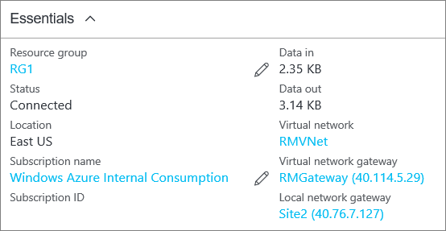

<properties
   pageTitle="Create a virtual network with a Site-to-Site VPN connection using Azure Resource Manager and PowerShell | Azure"
   description="This article walks you through creating a VNet using the Resource Manager deployment model and connecting it to your local on-premises network using a S2S VPN gateway connection."
   services="vpn-gateway"
   documentationCenter="na"
   authors="cherylmc"
   manager="carmonm"
   editor=""
   tags="azure-resource-manager"/>

<tags
   ms.service="vpn-gateway"
   ms.devlang="na"
   ms.topic="hero-article"
   ms.tgt_pltfrm="na"
   ms.workload="infrastructure-services"
   ms.date="10/14/2016"
   wacn.date=""
   ms.author="cherylmc"/>

# Create a VNet with a Site-to-Site connection using PowerShell

> [AZURE.SELECTOR]
- [Azure Portal Preview](/documentation/articles/vpn-gateway-howto-site-to-site-resource-manager-portal/)
- [Classic - Classic Management Portal](/documentation/articles/vpn-gateway-site-to-site-create/)

This article walks you through creating a virtual network and a Site-to-Site VPN gateway connection to your on-premises network using the Azure Resource Manager deployment model. Site-to-Site connections can be used for cross-premises and hybrid configurations.

 

### Deployment models and methods for Site-to-Site connections

It's important to understand that Azure currently works with two deployment models: Resource Manager and classic. Before you begin your configuration, verify that you are using the instructions for the deployment model that you want to work in.

For example, if you are working with a virtual network that was created using the classic deployment model, you would use the classic deployment model configuration steps and tools, not the Resource Manager steps and tools. You can't add Resource Manager resources and configure settings for a virtual network that was created using the classic deployment model and vice versa.

For information about the deployment models, see [Understanding Resource Manager deployment and classic deployment](/documentation/articles/resource-manager-deployment-model/). 

The following table shows the currently available deployment models and methods for Site-to-Site configurations. When an article with configuration steps is available, we link directly to it from this table. 

|  | **Classic Deployment**  | **Resource Manager Deployment** |
|----------------------------------------|--------------|----------------------|
| **Classic Management Portal**                     |[Article*](/documentation/articles/vpn-gateway-site-to-site-create/) |  Not Supported |
| **Azure Portal Preview** | Supported**              | [Article](/documentation/articles/vpn-gateway-howto-site-to-site-resource-manager-portal/)|
| **PowerShell**               |[Article+](/documentation/articles/vpn-gateway-multi-site/) | [Article](/documentation/articles/vpn-gateway-create-site-to-site-rm-powershell/)| 

(*) denotes that the Classic Management Portal can only support creating one S2S VPN connection.

(**) denotes that an end-to-end scenario is not yet available for the Azure portal Preview.

(+) denotes that this article is written for multi-site connections.

 

If you want to connect VNets together, but are not creating a connection to an on-premises location, see [Configure a VNet-to-VNet connection](/documentation/articles/vpn-gateway-vnet-vnet-rm-ps/).

If you want to add a Site-to-Site connection to a VNet that already has a connection, see [this article](/documentation/articles/vpn-gateway-howto-multi-site-to-site-resource-manager-portal/).

## Before you begin

Verify that you have the following items before beginning configuration.

- A compatible VPN device and someone who is able to configure it. See [About VPN Devices](/documentation/articles/vpn-gateway-about-vpn-devices/). If you aren't familiar with configuring your VPN device, or are unfamiliar with the IP address ranges located in your on-premises network configuration, you need to coordinate with someone who can provide those details for you.

- An externally facing public IP address for your VPN device. This IP address cannot be located behind a NAT.
	
- An Azure subscription. If you don't already have an Azure subscription, you can sign up for a [Trial](/pricing/1rmb-trial).
	
- The latest version of the Azure Resource Manager PowerShell cmdlets. See [How to install and configure Azure PowerShell](/documentation/articles/powershell-install-configure/) for more information about installing the PowerShell cmdlets.

## 1. Connect to your subscription 

Make sure you switch to PowerShell mode to use the Resource Manager cmdlets. For more information, see [Using Windows PowerShell with Resource Manager](/documentation/articles/powershell-azure-resource-manager/).

Open your PowerShell console and connect to your account. Use the following sample to help you connect:

	Login-AzureRmAccount -EnvironmentName AzureChinaCloud

Check the subscriptions for the account.

	Get-AzureRmSubscription 

Specify the subscription that you want to use.

	Select-AzureRmSubscription -SubscriptionName "Replace_with_your_subscription_name"

## 2. Create a virtual network and a gateway subnet

The examples use a gateway subnet of /28. While it is possible to create a gateway subnet as small as /29, we recommend that you create a larger subnet that includes more addresses by selecting at least /28 or /27. This will allow for enough addresses to accommodate possible additional configurations that you may want in the future.

If you already have a virtual network with a gateway subnet that is /29 or larger, you can jump ahead to [Add your local network gateway](#localnet).

>[AZURE.IMPORTANT] When working with gateway subnets, avoid associating a network security group (NSG) to the gateway subnet. Associating a network security group to this subnet may cause your VPN gateway to stop functioning as expected. For more information about network security groups, see [What is a network security group?](/documentation/articles/virtual-networks-nsg/)

  

### To create a virtual network and a gateway subnet

Use the following sample to create a virtual network and a gateway subnet. Substitute the values for your own. 

First, create a resource group:
	
	New-AzureRmResourceGroup -Name testrg -Location 'China North'

Next, create your virtual network. Verify that the address spaces you specify don't overlap any of the address spaces that you have on your on-premises network.

The following sample creates a virtual network named *testvnet* and two subnets, one called *GatewaySubnet* and the other called *Subnet1*. It's important to create one subnet named specifically *GatewaySubnet*. If you name it something else, your connection configuration will fail. 

Set the variables.

	$subnet1 = New-AzureRmVirtualNetworkSubnetConfig -Name 'GatewaySubnet' -AddressPrefix 10.0.0.0/28
	$subnet2 = New-AzureRmVirtualNetworkSubnetConfig -Name 'Subnet1' -AddressPrefix '10.0.1.0/28'

Create the VNet.

	New-AzureRmVirtualNetwork -Name testvnet -ResourceGroupName testrg `
	-Location 'China North' -AddressPrefix 10.0.0.0/16 -Subnet $subnet1, $subnet2

### To add a gateway subnet to a virtual network you have already created

This step is required only if you need to add a gateway subnet to a VNet that you previously created.

You can create your gateway subnet by using the following sample. Be sure to name the gateway subnet 'GatewaySubnet'. If you name it something else, you create a subnet, but Azure won't treat it as a gateway subnet.

Set the variables.

	$vnet = Get-AzureRmVirtualNetwork -ResourceGroupName testrg -Name testvnet

Create the gateway subnet.

	Add-AzureRmVirtualNetworkSubnetConfig -Name 'GatewaySubnet' -AddressPrefix 10.0.3.0/28 -VirtualNetwork $vnet

Set the configuration. 

	Set-AzureRmVirtualNetwork -VirtualNetwork $vnet

## 3. Add your local network gateway

In a virtual network, the local network gateway typically refers to your on-premises location. You give the site a name by which Azure can refer to it, and also specify the address space prefix for the local network gateway. 

Azure uses the IP address prefix you specify to identify which traffic to send to your on-premises location. This means that you have to specify each address prefix that you want to be associated with your local network gateway. You can easily update these prefixes if your on-premises network changes. 

When using the PowerShell examples, note the following:
	
- The *GatewayIPAddress* is the IP address of your on-premises VPN device. Your VPN device cannot be located behind a NAT. 
- The *AddressPrefix* is your on-premises address space.

To add a local network gateway with a single address prefix:

	New-AzureRmLocalNetworkGateway -Name LocalSite -ResourceGroupName testrg `
	-Location 'China North' -GatewayIpAddress '23.99.221.164' -AddressPrefix '10.5.51.0/24'

To add a local network gateway with multiple address prefixes:

	New-AzureRmLocalNetworkGateway -Name LocalSite -ResourceGroupName testrg `
	-Location 'China North' -GatewayIpAddress '23.99.221.164' -AddressPrefix @('10.0.0.0/24','20.0.0.0/24')

### To modify IP address prefixes for your local network gateway

Sometimes your local network gateway prefixes change. The steps you take to modify your IP address prefixes depend on whether you have created a VPN gateway connection. See the [Modify IP address prefixes for a local network gateway](#modify) section of this article.

## 4. Request a public IP address for the VPN gateway

Next, request a public IP address to be allocated to your Azure VNet VPN gateway. This is not the same IP address that is assigned to your VPN device; rather it's assigned to the Azure VPN gateway itself. You can't specify the IP address that you want to use. It is dynamically allocated to your gateway. You use this IP address when configuring your on-premises VPN device to connect to the gateway.

The Azure VPN gateway for the Resource Manager deployment model currently only supports public IP addresses by using the Dynamic Allocation method. However, this does not mean the IP address will change. The only time the Azure VPN gateway IP address changes is when the gateway is deleted and re-created. The gateway public IP address won't change across resizing, resetting, or other internal maintenance/upgrades of your Azure VPN gateway.

Use the following PowerShell sample:

	$gwpip= New-AzureRmPublicIpAddress -Name gwpip -ResourceGroupName testrg -Location 'China North' -AllocationMethod Dynamic

## 5. Create the gateway IP addressing configuration

The gateway configuration defines the subnet and the public IP address to use. Use the following sample to create your gateway configuration.

	$vnet = Get-AzureRmVirtualNetwork -Name testvnet -ResourceGroupName testrg
	$subnet = Get-AzureRmVirtualNetworkSubnetConfig -Name 'GatewaySubnet' -VirtualNetwork $vnet
	$gwipconfig = New-AzureRmVirtualNetworkGatewayIpConfig -Name gwipconfig1 -SubnetId $subnet.Id -PublicIpAddressId $gwpip.Id 

## 6. Create the virtual network gateway

In this step, you create the virtual network gateway. Creating a gateway can take a long time to complete. Often 45 minutes or more. 

Use the following values:

- The *-GatewayType* for a Site-to-Site configuration is *Vpn*. The gateway type is always specific to the configuration that you are implementing. For example, other gateway configurations may require -GatewayType ExpressRoute. 

- The *-VpnType* can be *RouteBased* (referred to as a Dynamic Gateway in some documentation), or *PolicyBased* (referred to as a Static Gateway in some documentation). For more information about VPN gateway types, see [About VPN Gateways](/documentation/articles/vpn-gateway-about-vpngateways/#vpntype).
- The *-GatewaySku* can be *Basic*, *Standard*, or *HighPerformance*. 	

		New-AzureRmVirtualNetworkGateway -Name vnetgw1 -ResourceGroupName testrg `
		-Location 'China North' -IpConfigurations $gwipconfig -GatewayType Vpn `
		-VpnType RouteBased -GatewaySku Standard

## 7. Configure your VPN device

At this point, you need the public IP address of the virtual network gateway for configuring your on-premises VPN device. Work with your device manufacturer for specific configuration information. You can refer to the [VPN Devices](/documentation/articles/vpn-gateway-about-vpn-devices/) for more information.

To find the public IP address of your virtual network gateway, use the following sample:

	Get-AzureRmPublicIpAddress -Name gwpip -ResourceGroupName testrg

## 8. Create the VPN connection

Next, create the Site-to-Site VPN connection between your virtual network gateway and your VPN device. Be sure to replace the values with your own. The shared key must match the value you used for your VPN device configuration. Notice that the `-ConnectionType` for Site-to-Site is *IPsec*. 

Set the variables.

	$gateway1 = Get-AzureRmVirtualNetworkGateway -Name vnetgw1 -ResourceGroupName testrg
	$local = Get-AzureRmLocalNetworkGateway -Name LocalSite -ResourceGroupName testrg

Create the connection.

	New-AzureRmVirtualNetworkGatewayConnection -Name localtovon -ResourceGroupName testrg `
	-Location 'China North' -VirtualNetworkGateway1 $gateway1 -LocalNetworkGateway2 $local `
	-ConnectionType IPsec -RoutingWeight 10 -SharedKey 'abc123'

After a short while, the connection will be established. 

## To verify a VPN connection

There are a few different ways to verify your VPN connection.

### To verify your connection by using PowerShell

You can verify that your connection succeeded by using the `Get-AzureRmVirtualNetworkGatewayConnection` cmdlet, with or without `-Debug`. 

1. Use the following cmdlet example, configuring the values to match your own. If prompted, select 'A' in order to run 'All'. In the example, `-Name` refers to the name of the connection that you created and want to test.

		Get-AzureRmVirtualNetworkGatewayConnection -Name MyGWConnection -ResourceGroupName MyRG

2. After the cmdlet has finished, view the values. In the example below, the connection status shows as 'Connected' and you can see ingress and egress bytes.

		Body:
		{
		  "name": "MyGWConnection",
		  "id":
		"/subscriptions/086cfaa0-0d1d-4b1c-94544-f8e3da2a0c7789/resourceGroups/MyRG/providers/Microsoft.Network/connections/MyGWConnection",
		  "properties": {
		    "provisioningState": "Succeeded",
		    "resourceGuid": "1c484f82-23ec-47e2-8cd8-231107450446b",
		    "virtualNetworkGateway1": {
		      "id":
		"/subscriptions/086cfaa0-0d1d-4b1c-94544-f8e3da2a0c7789/resourceGroups/MyRG/providers/Microsoft.Network/virtualNetworkGa
		teways/vnetgw1"
		    },
		    "localNetworkGateway2": {
		      "id":
		"/subscriptions/086cfaa0-0d1d-4b1c-94544-f8e3da2a0c7789/resourceGroups/MyRG/providers/Microsoft.Network/localNetworkGate
		ways/LocalSite"
		    },
		    "connectionType": "IPsec",
		    "routingWeight": 10,
		    "sharedKey": "abc123",
		    "connectionStatus": "Connected",
		    "ingressBytesTransferred": 33509044,
		    "egressBytesTransferred": 4142431
		  }

### To verify your connection by using the Azure Portal Preview

In the Azure Portal Preview, you can view the connection status by navigating to the connection. There are multiple ways to do this. The following steps show one way to navigate to your connection and verify.

1. In the [Azure Portal Preview](http://portal.azure.cn), click **All resources** and navigate to your virtual network gateway.
2. On the blade for your virtual network gateway, click **Connections**. You can see the status of each connection.
3. Click the name of the connection that you want to verify to open **Essentials**. In Essentials, you can view more information about your connection. The **Status** is 'Succeeded' and 'Connected' when you have made a successful connection.

	

## To modify IP address prefixes for a local network gateway

If you need to change the prefixes for your local network gateway, use the following instructions. Two sets of instructions are provided. The instructions you choose depend on whether you have already created your gateway connection. 

### How to add or remove prefixes - no gateway connection

- **To add** additional address prefixes to a local network gateway that you created, but that doesn't yet have a gateway connection, use the example below. Be sure to change the values to your own.

		$local = Get-AzureRmLocalNetworkGateway -Name MyLocalNetworkGWName -ResourceGroupName MyRGName `
		Set-AzureRmLocalNetworkGateway -LocalNetworkGateway $local `
		-AddressPrefix @('10.0.0.0/24','20.0.0.0/24','30.0.0.0/24')

- **To remove** an address prefix from a local network gateway that doesn't have a VPN connection, use the example below. Leave out the prefixes that you no longer need. In this example, we no longer need prefix 20.0.0.0/24 (from the previous example), so we will update the local network gateway and exclude that prefix.

		$local = Get-AzureRmLocalNetworkGateway -Name MyLocalNetworkGWName -ResourceGroupName MyRGName `
		Set-AzureRmLocalNetworkGateway -LocalNetworkGateway $local `
		-AddressPrefix @('10.0.0.0/24','30.0.0.0/24')

### How to add or remove prefixes - existing gateway connection

If you have created your gateway connection and want to add or remove the IP address prefixes contained in your local network gateway, you'll need to do the following steps in order. This will result in some downtime for your VPN connection. When updating your prefixes, you'll first remove the connection, modify the prefixes, and then create a new connection. In the examples below, be sure to change the values to your own.

>[AZURE.IMPORTANT] Don't delete the VPN gateway. If you do so, you'll have to go back through the steps to recreate it, as well as reconfigure your on-premises router with the new settings.
 
1. Remove the connection.

		Remove-AzureRmVirtualNetworkGatewayConnection -Name MyGWConnectionName -ResourceGroupName MyRGName

2. Modify the address prefixes for your local network gateway.

	Set the variable for the LocalNetworkGateway.

		$local = Get-AzureRmLocalNetworkGateway -Name MyLocalNetworkGWName -ResourceGroupName MyRGName

	Modify the prefixes.

		Set-AzureRmLocalNetworkGateway -LocalNetworkGateway $local `
		-AddressPrefix @('10.0.0.0/24','20.0.0.0/24','30.0.0.0/24')

4. Create the connection. In this example, we are configuring an IPsec connection type. When you recreate your connection, use the connection type that is specified for your configuration. For additional connection types, see the [PowerShell cmdlet](https://msdn.microsoft.com/zh-cn/library/mt603611.aspx) page.

 	Set the variable for the VirtualNetworkGateway.

		$gateway1 = Get-AzureRmVirtualNetworkGateway -Name RMGateway  -ResourceGroupName MyRGName

	Create the connection. Note that this sample uses the variable $local that you set in the preceding step.

		New-AzureRmVirtualNetworkGatewayConnection -Name MyGWConnectionName `
		-ResourceGroupName MyRGName -Location 'China North' `
		-VirtualNetworkGateway1 $gateway1 -LocalNetworkGateway2 $local `
		-ConnectionType IPsec `
		-RoutingWeight 10 -SharedKey 'abc123'

## To modify the gateway IP address for a local network gateway

To modify the gateway IP address, use the `New-AzureRmVirtualNetworkGatewayConnection` cmdlet. As long as you keep the name of the local network gateway exactly the same as the existing name, the settings will overwrite. At this time, the "Set" cmdlet does not support modifying the gateway IP address.

### How to modify the gateway IP address - no gateway connection

To update the gateway IP address for your local network gateway that doesn't yet have a connection, use the example below. You can also update the address prefixes at the same time. The settings you specify will overwrite the existing settings. Be sure to use the existing name of your local network gateway. If you don't, you'll be creating a new local network gateway, not overwriting the existing one.

Use the following example, replacing the values for your own.

	New-AzureRmLocalNetworkGateway -Name MyLocalNetworkGWName `
	-Location "China North" -AddressPrefix @('10.0.0.0/24','20.0.0.0/24','30.0.0.0/24') `
	-GatewayIpAddress "5.4.3.2" -ResourceGroupName MyRGName

### How to modify the gateway IP address - existing gateway connection

If a gateway connection already exists, you'll first need to remove the connection. Then, you can modify the gateway IP address and recreate a new connection. This will result in some downtime for your VPN connection.

>[AZURE.IMPORTANT] Don't delete the VPN gateway. If you do so, you'll have to go back through the steps to recreate it, as well as reconfigure your on-premises router with the IP address that will be assigned to the newly created gateway.
 

1. Remove the connection. You can find the name of your connection by using the `Get-AzureRmVirtualNetworkGatewayConnection` cmdlet.

		Remove-AzureRmVirtualNetworkGatewayConnection -Name MyGWConnectionName `
		-ResourceGroupName MyRGName

2. Modify the GatewayIpAddress value. You can also modify your address prefixes at this time, if necessary. Note that this will overwrite the existing local network gateway settings. Use the existing name of your local network gateway when modifying so that the settings will overwrite. If you don't, you'll be creating a new local network gateway, not modifying the existing one.

		New-AzureRmLocalNetworkGateway -Name MyLocalNetworkGWName `
		-Location "China North" -AddressPrefix @('10.0.0.0/24','20.0.0.0/24','30.0.0.0/24') `
		-GatewayIpAddress "104.40.81.124" -ResourceGroupName MyRGName

3. Create the connection. In this example, we are configuring an IPsec connection type. When you recreate your connection, use the connection type that is specified for your configuration. For additional connection types, see the [PowerShell cmdlet](https://msdn.microsoft.com/zh-cn/library/mt603611.aspx) page.  To obtain the VirtualNetworkGateway name, you can run the `Get-AzureRmVirtualNetworkGateway` cmdlet.

	Set the variables:

		$local = Get-AzureRMLocalNetworkGateway -Name MyLocalNetworkGWName -ResourceGroupName MyRGName `
		$vnetgw = Get-AzureRmVirtualNetworkGateway -Name RMGateway -ResourceGroupName MyRGName

	Create the connection:
	
		New-AzureRmVirtualNetworkGatewayConnection -Name MyGWConnectionName -ResourceGroupName MyRGName `
		-Location "China North" `
		-VirtualNetworkGateway1 $vnetgw `
		-LocalNetworkGateway2 $local `
		-ConnectionType IPsec -RoutingWeight 10 -SharedKey 'abc123'

## Next steps

- You can add virtual machines to your virtual networks. See [Create a Virtual Machine](/documentation/articles/virtual-machines-windows-hero-tutorial/) for steps.

- For information about BGP, see the [BGP Overview](/documentation/articles/vpn-gateway-bgp-overview/) and [How to configure BGP](/documentation/articles/vpn-gateway-bgp-resource-manager-ps/).

