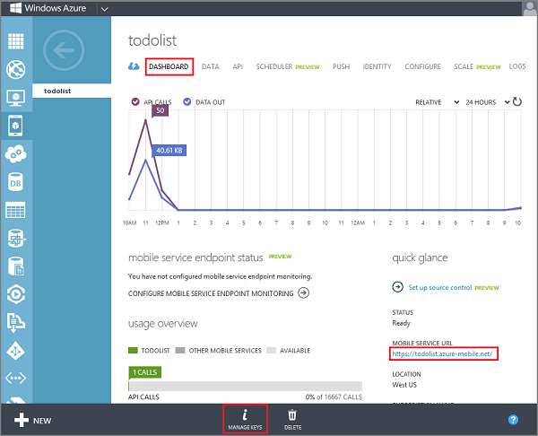

Now that your mobile service is ready, you can update the app to store items in Mobile Services instead of the local collection. 

1. If you don't already have the [Mobile Services Android SDK], download it now and expand the compressed files.

2. Copy the `.jar` files from the `mobileservices` folder of the SDK into the `libs` folder of the GetStartedWithData project.

3. In Package Explorer in Eclipse, right-click the `libs` folder, click **Refresh**, and the copied jar files will appear

  	This adds the Mobile Services SDK reference to the workspace.

4. Open the AndroidManifest.xml file and add the following line, which enables the app to access Mobile Services in Azure.

		<uses-permission android:name="android.permission.INTERNET" />

5. From Package Explorer, Open the TodoActivity.java file located in the com.example.getstartedwithdata package, and uncomment the following lines of code: 

		import java.net.MalformedURLException;
		import android.os.AsyncTask;
		import com.google.common.util.concurrent.FutureCallback;
		import com.google.common.util.concurrent.Futures;
		import com.google.common.util.concurrent.ListenableFuture;
		import com.microsoft.windowsazure.mobileservices.MobileServiceClient;
		import com.microsoft.windowsazure.mobileservices.MobileServiceList;
		import com.microsoft.windowsazure.mobileservices.http.NextServiceFilterCallback;
		import com.microsoft.windowsazure.mobileservices.http.ServiceFilter;
		import com.microsoft.windowsazure.mobileservices.http.ServiceFilterRequest;
		import com.microsoft.windowsazure.mobileservices.http.ServiceFilterResponse;
		import com.microsoft.windowsazure.mobileservices.table.MobileServiceTable;

 
6. Comment out the following lines:

		import java.util.ArrayList;
		import java.util.List;

7. We will remove the in-memory list currently used by the app, so we can replace it with a mobile service. In the **ToDoActivity** class, comment out the following line of code, which defines the existing **toDoItemList** list.

		public List<ToDoItem> toDoItemList = new ArrayList<ToDoItem>();

8. Save the file, and the project will indicate build errors. Search for the three remaining locations where the `toDoItemList` variable is used and comment out the sections indicated. This fully removes the in-memory list. 

9. We now add our mobile service. Uncomment the following lines of code:

		private MobileServiceClient mClient;
		private private MobileServiceTable<ToDoItem> mToDoTable;

10. Find the *ProgressFilter* class at the bottom of the file and uncomment it. This class displays a 'loading' indicator while *MobileServiceClient* is running network operations.

11. In the Management Portal, click **Mobile Services**, and then click the mobile service you just created.

12. Click the **Dashboard** tab and make a note of the **Site URL**, then click **Manage keys** and make a note of the **Application key**.

   	

  	You will need these values when accessing the mobile service from your app code.

13. In the **onCreate** method, uncomment the following lines of code that define the **MobileServiceClient** variable:

		try {
		// Create the Mobile Service Client instance, using the provided
		// Mobile Service URL and key
			mClient = new MobileServiceClient(
					"MobileServiceUrl",
					"AppKey", 
					this).withFilter(new ProgressFilter());

			// Get the Mobile Service Table instance to use
			mToDoTable = mClient.getTable(ToDoItem.class);
		} catch (MalformedURLException e) {
			createAndShowDialog(new Exception("There was an error creating the Mobile Service. Verify the URL"), "Error");
		}

  	This creates a new instance of *MobileServiceClient* that is used to access your mobile service. It also creates the *MobileServiceTable* instance that is used to proxy data storage in the mobile service.

14. In the code above, replace `MobileServiceUrl` and `AppKey` with the URL and application key from your mobile service, in that order.

15. Uncommment these lines of the **checkItem** method:

	    new AsyncTask<Void, Void, Void>() {
	        @Override
	        protected Void doInBackground(Void... params) {
	            try {
	                mToDoTable.update(item).get();
	                runOnUiThread(new Runnable() {
	                    public void run() {
	                        if (item.isComplete()) {
	                            mAdapter.remove(item);
	                        }
	                        refreshItemsFromTable();
	                    }
	                });
	            } catch (Exception exception) {
	                createAndShowDialog(exception, "Error");
	            }
	            return null;
	        }
	    }.execute();

   	This sends an item update to the mobile service and removes checked items from the adapter.
    
16. Uncommment these lines of the **addItem** method:
	
		// Insert the new item
		new AsyncTask<Void, Void, Void>() {
	        @Override
	        protected Void doInBackground(Void... params) {
	            try {
	                mToDoTable.insert(item).get();
	                if (!item.isComplete()) {
	                    runOnUiThread(new Runnable() {
	                        public void run() {
	                            mAdapter.add(item);
	                        }
	                    });
	                }
	            } catch (Exception exception) {
	                createAndShowDialog(exception, "Error");
	            }
	            return null;
	        }
	    }.execute();
		

  	This code creates a new item and inserts it into the table in the remote mobile service.

18. Uncommment these lines of the **refreshItemsFromTable** method:

		// Get the items that weren't marked as completed and add them in the adapter
	    new AsyncTask<Void, Void, Void>() {
	        @Override
	        protected Void doInBackground(Void... params) {
	            try {
	                final MobileServiceList<ToDoItem> result = mToDoTable.where().field("complete").eq(false).execute().get();
	                runOnUiThread(new Runnable() {
	                    @Override
	                    public void run() {
	                        mAdapter.clear();

	                        for (ToDoItem item : result) {
	                            mAdapter.add(item);
	                        }
	                    }
	                });
	            } catch (Exception exception) {
	                createAndShowDialog(exception, "Error");
	            }
	            return null;
	        }
	    }.execute();

	This queries the mobile service and returns all items that are not marked as complete. Items are added to the adapter for binding.
		

<!-- URLs. -->
[Mobile Services Android SDK]: https://zumo.blob.core.windows.net/sdk/azuresdk-android-2.0.2-beta2.zip
