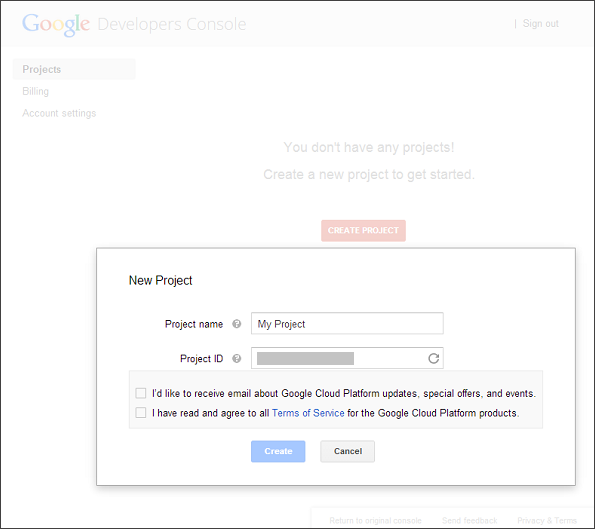
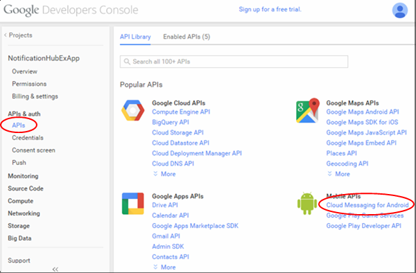
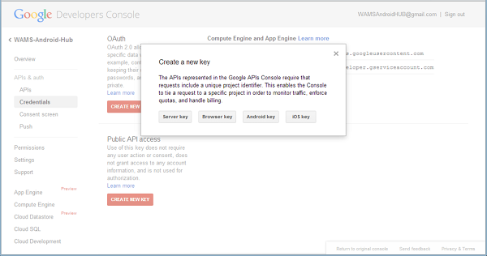
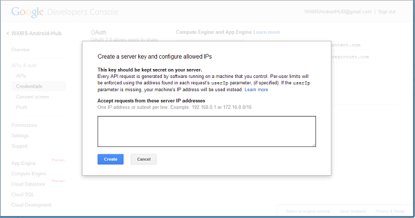
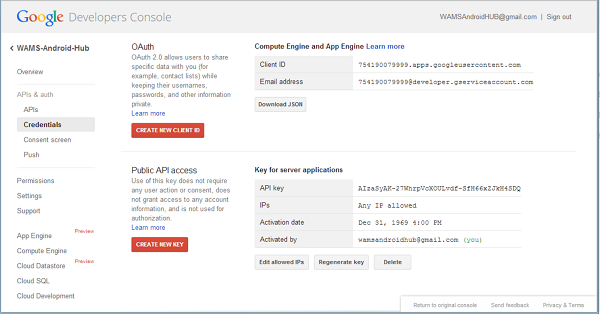

>[AZURE.NOTE]To complete this procedure, you must have a Google account that has a verified email address. To create a new Google account, go to <a href="http://go.microsoft.com/fwlink/p/?LinkId=268302" target="_blank">accounts.google.com</a>.

1. Navigate to the <a href="http://cloud.google.com/console" target="_blank">Google Cloud Console</a> website, sign-in with your Google account credentials, and then click **CREATE PROJECT**.

   	   

	>[AZURE.NOTE]When you already have an existing project, you are directed to the <strong>Projects</strong> page after login. To create a new project from the Dashboard, expand <strong>API Project</strong>, click <strong>Create...</strong> under <strong>Other projects</strong>, then enter a project name and click <strong>Create project</strong>.

2. Enter a project name, accept the terms of service, and click **Create**. If requested, carry out the SMS Verification, and click **Create** again.

3. Make a note of the project number in the **Projects** section. 

	Later in the tutorial you set this value as the PROJECT_ID variable in the client.

4. In the left column, expand **APIs & auth**, click **APIs** then scroll down and click **Cloud Messaging for Android**. Then on the next page click **Enable API** and accept the terms of service. 

	

5. Click **Credentials**, and then click **Create new Key** 

   	

6. In **Create a new key**, click **Server key**. In the next window click **Create**.

   	

7. Make a note of the **API KEY** value.

   	 

	You will use this API key value to enable Azure to authenticate with GCM and send push notifications on behalf of your app.

