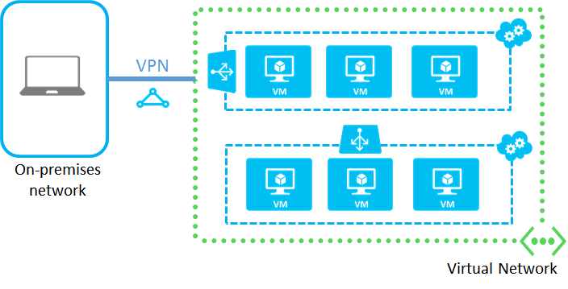
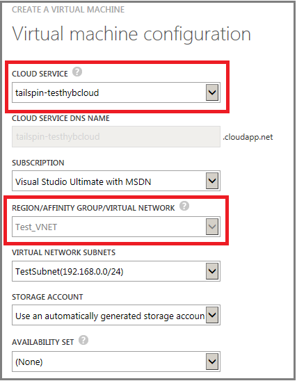
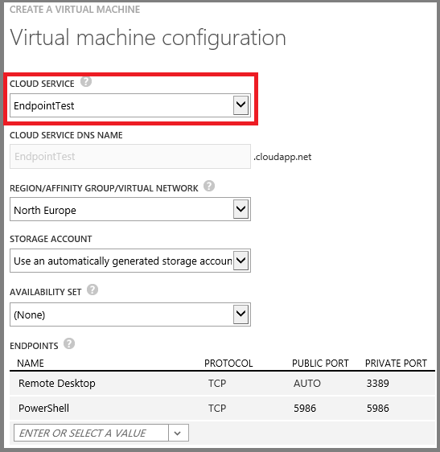

If you place your virtual machines in a virtual network, you can decide how many cloud services you want to use for load balancing and availability sets. Additionally, you can organize the virtual machines on subnets in the same way as your on-premises network and connect the virtual network to your on-premises network. Here's an example:

Virtual networks are the recommended way to connect virtual machines in Azure. The best practice is to configure each tier of your application in a separate cloud service. However, you may need to combine some virtual machines from different application tiers into the same cloud service to remain within the maximum of 200 cloud services per subscription. To review this and other limits, see [Azure Subscription and Service Limits, Quotas, and Constraints](/documentation/articles/azure-subscription-service-limits/).

## Connect VMs in a virtual network
To connect virtual machines in a virtual network:

1.	Create the virtual network in the [Azure portal Preview](/documentation/articles/virtual-networks-create-vnet-classic-pportal/).
2. Create the set of cloud services for your deployment to reflect your design for availability sets and load balancing. In the Azure Classic Management Portal, click **New > Compute > Cloud Service > Custom Create** for each cloud service.
3. To create each new virtual machine, click **New > Compute > Virtual Machine > From Gallery**. Choose the correct cloud service and virtual network for the VM. If the cloud service is already joined to a virtual network, its name will already be selected for you.

##  Connect VMs in a standalone cloud service
To connect virtual machines in a standalone cloud service:

1. Create the cloud service in the [Azure Classic Management Portal](http://manage.windowsazure.cn). Click **New > Compute > Cloud Service > Custom Create**. Or, you can create the cloud service for your deployment when you create your first virtual machine.
2. When you create the virtual machines, choose the name of cloud service created in the previous step.
   
   

