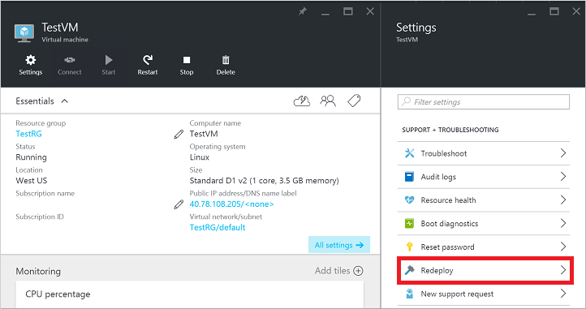
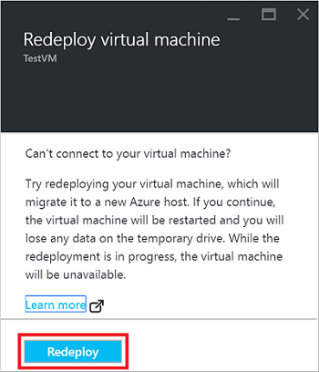
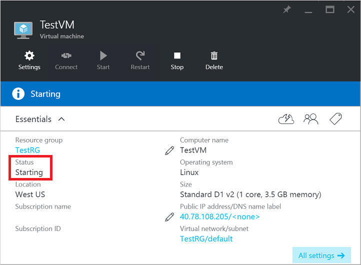

## Using Azure portal Preview 
1. Select the VM you wish to redeploy, and click the 'Redeploy' button in the 'Settings' blade. Scroll down to see the **Support and Troubleshooting** section that contains the 'Redeploy' button as in the following example:
   
    
2. To confirm the operation, click the 'Redeploy' button:
   
    
3. The **Status** of the VM changes to *Updating* as the VM prepares to redeploy, as in the following example:
   
    
4. The **Status** then changes to *Starting* as the VM boots up on a new Azure host, as in the following example:
   
    
5. After the VM finishes the boot process, the **Status** then returns to *Running*, indicating the VM has been successfully redeployed:
   
    

